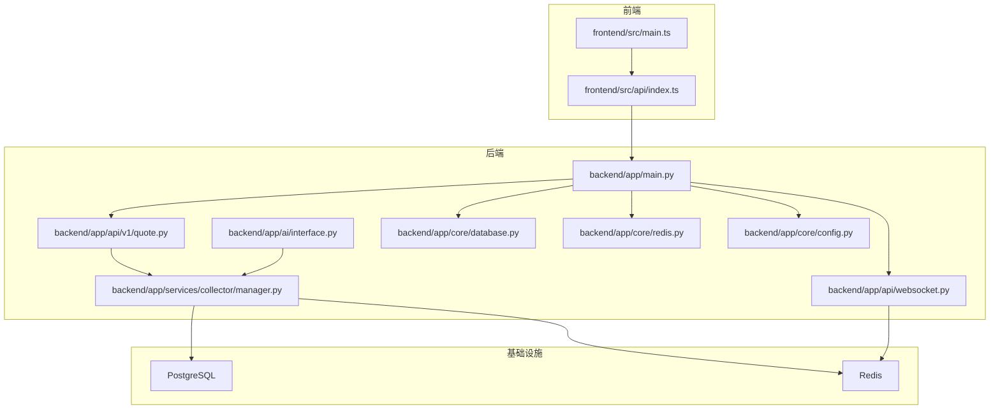
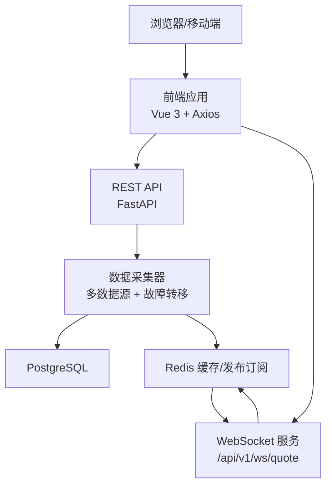
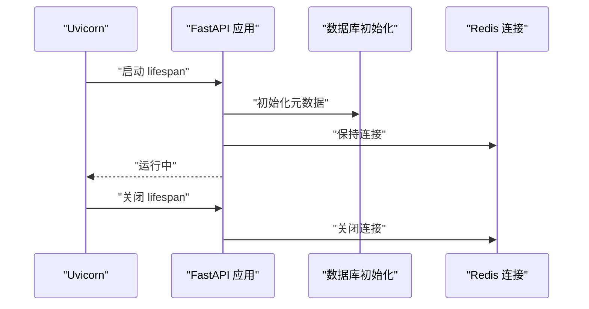
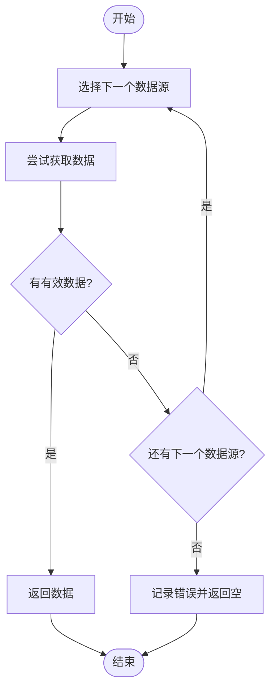
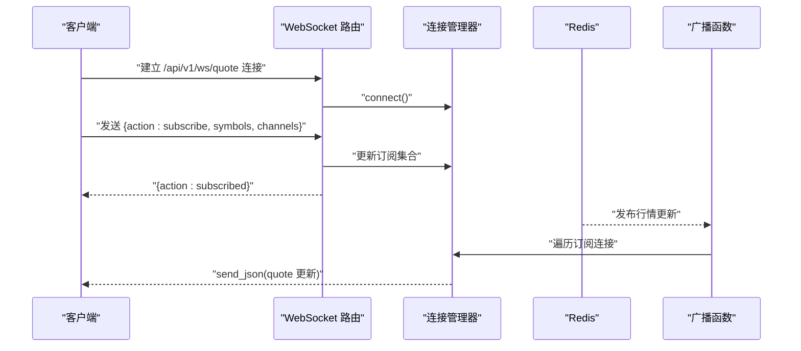
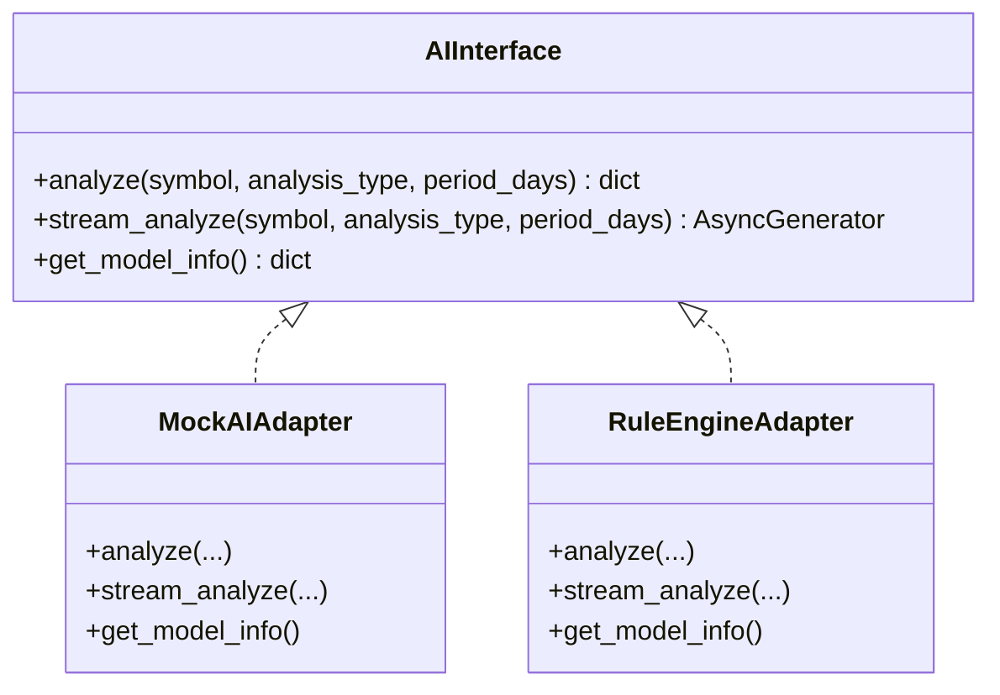
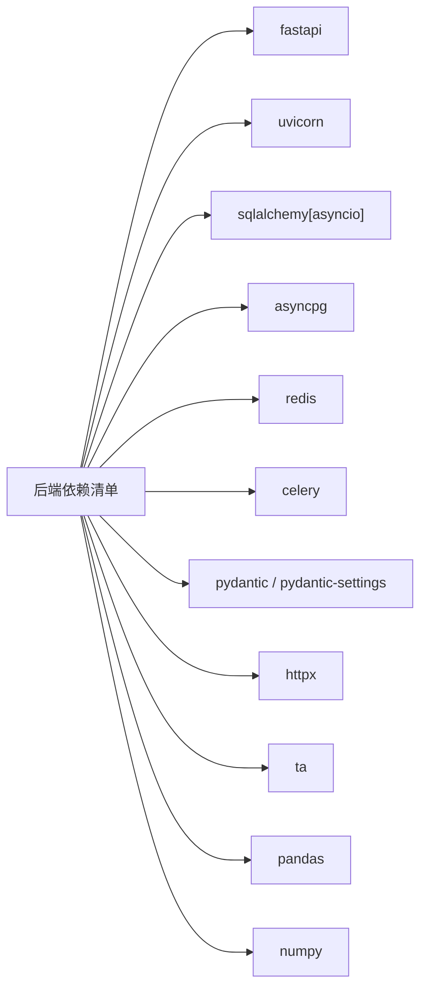

# 系统架构

<cite>
**本文引用的文件**
- [backend/app/main.py](file://backend/app/main.py)
- [backend/app/core/config.py](file://backend/app/core/config.py)
- [backend/app/core/database.py](file://backend/app/core/database.py)
- [backend/app/core/redis.py](file://backend/app/core/redis.py)
- [backend/app/api/websocket.py](file://backend/app/api/websocket.py)
- [backend/app/api/v1/quote.py](file://backend/app/api/v1/quote.py)
- [backend/app/services/collector/manager.py](file://backend/app/services/collector/manager.py)
- [backend/app/ai/interface.py](file://backend/app/ai/interface.py)
- [backend/Dockerfile](file://backend/Dockerfile)
- [backend/requirements.txt](file://backend/requirements.txt)
- [frontend/src/main.ts](file://frontend/src/main.ts)
- [frontend/src/api/index.ts](file://frontend/src/api/index.ts)
- [frontend/Dockerfile](file://frontend/Dockerfile)
- [docker-compose.yml](file://docker-compose.yml)
</cite>

## 目录
1. [引言](#引言)
2. [项目结构](#项目结构)
3. [核心组件](#核心组件)
4. [架构总览](#架构总览)
5. [详细组件分析](#详细组件分析)
6. [依赖分析](#依赖分析)
7. [性能考量](#性能考量)
8. [故障排查指南](#故障排查指南)
9. [结论](#结论)
10. [附录](#附录)

## 引言
本系统采用前后端分离架构，后端基于 FastAPI 提供高性能 API 与事件驱动的 WebSocket 实时推送能力；前端使用 Vue.js 3 + TypeScript 构建现代化用户界面；数据层采用 PostgreSQL + Redis 缓存；通过 Docker Compose 实现容器化编排与部署。系统具备高可用的数据采集与故障转移能力，并支持可插拔的 AI 分析适配器（Mock/Rules），便于后续接入真实 AI 服务。

## 项目结构
- 后端（Python/Async）：FastAPI 应用、API 路由、WebSocket、数据采集与 AI 适配器、数据库与 Redis 连接、配置管理。
- 前端（Vue 3 + TypeScript）：Axios 封装的 API 客户端、页面与组件、状态管理与路由。
- 部署（Docker + Compose）：PostgreSQL、Redis、后端、前端 Nginx 镜像，统一编排与端口映射。

图表来源
- [backend/app/main.py:1-48](file://backend/app/main.py#L1-L48)
- [backend/app/api/websocket.py:1-79](file://backend/app/api/websocket.py#L1-L79)
- [backend/app/api/v1/quote.py:1-65](file://backend/app/api/v1/quote.py#L1-L65)
- [backend/app/services/collector/manager.py:1-94](file://backend/app/services/collector/manager.py#L1-L94)
- [backend/app/ai/interface.py:1-196](file://backend/app/ai/interface.py#L1-L196)
- [backend/app/core/database.py:1-25](file://backend/app/core/database.py#L1-L25)
- [backend/app/core/redis.py:1-25](file://backend/app/core/redis.py#L1-L25)
- [backend/app/core/config.py:1-43](file://backend/app/core/config.py#L1-L43)
- [frontend/src/main.ts:1-12](file://frontend/src/main.ts#L1-L12)
- [frontend/src/api/index.ts:1-33](file://frontend/src/api/index.ts#L1-L33)

章节来源
- [backend/app/main.py:1-48](file://backend/app/main.py#L1-L48)
- [frontend/src/main.ts:1-12](file://frontend/src/main.ts#L1-L12)
- [docker-compose.yml:1-54](file://docker-compose.yml#L1-L54)

## 核心组件
- 后端入口与生命周期：FastAPI 应用初始化、CORS 中间件、路由注册、数据库初始化与 Redis 清理。
- 配置中心：集中管理数据库、Redis、AI 服务、限流与缓存策略等配置。
- 数据访问层：异步 SQLAlchemy 引擎与会话工厂，统一数据库连接池。
- 缓存层：Redis 异步客户端，用于行情缓存与 WebSocket 广播。
- 数据采集与故障转移：多数据源采集器（东方财富、新浪），自动优先级切换与降级。
- AI 分析适配器：抽象接口与 Mock/规则引擎适配器，支持流式分析与模型信息查询。
- WebSocket 实时推送：连接管理器、订阅管理、行情广播。
- 前端应用：Vue 3 + Pinia + Element Plus，Axios 封装 API 客户端。

章节来源
- [backend/app/main.py:1-48](file://backend/app/main.py#L1-L48)
- [backend/app/core/config.py:1-43](file://backend/app/core/config.py#L1-L43)
- [backend/app/core/database.py:1-25](file://backend/app/core/database.py#L1-L25)
- [backend/app/core/redis.py:1-25](file://backend/app/core/redis.py#L1-L25)
- [backend/app/services/collector/manager.py:1-94](file://backend/app/services/collector/manager.py#L1-L94)
- [backend/app/ai/interface.py:1-196](file://backend/app/ai/interface.py#L1-L196)
- [backend/app/api/websocket.py:1-79](file://backend/app/api/websocket.py#L1-L79)
- [frontend/src/api/index.ts:1-33](file://frontend/src/api/index.ts#L1-L33)

## 架构总览
系统采用“API + 事件驱动”的双通道架构：
- 请求-响应通道：前端通过 Axios 访问后端 REST API，获取实时行情、K线、分时、盘口与自选股列表等。
- 实时推送通道：前端建立 WebSocket 连接，订阅指定股票的行情频道，后端通过 Redis 推送增量更新。

图表来源
- [backend/app/api/websocket.py:39-79](file://backend/app/api/websocket.py#L39-L79)
- [backend/app/api/v1/quote.py:1-65](file://backend/app/api/v1/quote.py#L1-L65)
- [backend/app/services/collector/manager.py:12-94](file://backend/app/services/collector/manager.py#L12-L94)
- [backend/app/core/redis.py:10-25](file://backend/app/core/redis.py#L10-L25)
- [frontend/src/api/index.ts:1-33](file://frontend/src/api/index.ts#L1-L33)

## 详细组件分析

### 后端主程序与生命周期
- 应用启动时初始化数据库元数据，关闭时释放 Redis 连接池。
- 注册多个业务路由前缀与 WebSocket 路由。
- 提供健康检查端点。

图表来源
- [backend/app/main.py:13-27](file://backend/app/main.py#L13-L27)
- [backend/app/core/database.py:23-25](file://backend/app/core/database.py#L23-L25)
- [backend/app/core/redis.py:21-25](file://backend/app/core/redis.py#L21-L25)

章节来源
- [backend/app/main.py:1-48](file://backend/app/main.py#L1-L48)

### 配置中心
- 使用 Pydantic Settings 统一读取环境变量，包含数据库、Redis、AI 服务、JWT、Celery、采集间隔与缓存 TTL 等。
- 支持开发/生产环境切换与调试开关。

章节来源
- [backend/app/core/config.py:1-43](file://backend/app/core/config.py#L1-L43)

### 数据库与缓存
- 异步 SQLAlchemy 引擎与连接池配置，支持调试输出与连接数调优。
- Redis 异步客户端按需创建全局连接池，提供 close 生命周期钩子。

章节来源
- [backend/app/core/database.py:1-25](file://backend/app/core/database.py#L1-L25)
- [backend/app/core/redis.py:1-25](file://backend/app/core/redis.py#L1-L25)

### 数据采集与故障转移
- CollectorManager 维护多个采集器实例，按优先级顺序尝试，遇异常或空数据则切换下一个。
- 支持实时行情、行情列表、K线、分时、盘口等接口的数据采集。

图表来源
- [backend/app/services/collector/manager.py:21-33](file://backend/app/services/collector/manager.py#L21-L33)
- [backend/app/services/collector/manager.py:35-47](file://backend/app/services/collector/manager.py#L35-L47)
- [backend/app/services/collector/manager.py:49-61](file://backend/app/services/collector/manager.py#L49-L61)
- [backend/app/services/collector/manager.py:63-75](file://backend/app/services/collector/manager.py#L63-L75)
- [backend/app/services/collector/manager.py:77-89](file://backend/app/services/collector/manager.py#L77-L89)

章节来源
- [backend/app/services/collector/manager.py:1-94](file://backend/app/services/collector/manager.py#L1-L94)

### WebSocket 实时推送
- 连接管理器维护活动连接与订阅集合，支持订阅/退订与心跳 ping/pong。
- 广播函数根据订阅关系向客户端推送行情更新，异常断开自动清理。

图表来源
- [backend/app/api/websocket.py:12-36](file://backend/app/api/websocket.py#L12-L36)
- [backend/app/api/websocket.py:39-65](file://backend/app/api/websocket.py#L39-L65)
- [backend/app/api/websocket.py:67-79](file://backend/app/api/websocket.py#L67-L79)

章节来源
- [backend/app/api/websocket.py:1-79](file://backend/app/api/websocket.py#L1-L79)

### AI 分析适配器
- 抽象接口定义统一的 analyze/stream_analyze/get_model_info 方法。
- Mock 适配器：返回模拟分析结果与进度流。
- 规则引擎适配器：基于 K 线计算简单规则评分，输出趋势与置信度。

图表来源
- [backend/app/ai/interface.py:26-39](file://backend/app/ai/interface.py#L26-L39)
- [backend/app/ai/interface.py:42-108](file://backend/app/ai/interface.py#L42-L108)
- [backend/app/ai/interface.py:111-187](file://backend/app/ai/interface.py#L111-L187)

章节来源
- [backend/app/ai/interface.py:1-196](file://backend/app/ai/interface.py#L1-L196)

### 前端集成
- 应用入口注册 Vue、Pinia、路由与 UI 组件库。
- Axios 创建基础客户端，封装行情、自选股与 AI 分析接口。

章节来源
- [frontend/src/main.ts:1-12](file://frontend/src/main.ts#L1-L12)
- [frontend/src/api/index.ts:1-33](file://frontend/src/api/index.ts#L1-L33)

## 依赖分析
- 技术栈与版本约束集中在后端依赖清单中，涵盖 FastAPI、异步数据库、Redis、HTTP 客户端、AI/量化库等。
- 前端依赖以 Vue 3 生态为主，包含路由、状态管理、UI 组件与可视化库。

图表来源
- [backend/requirements.txt:1-17](file://backend/requirements.txt#L1-L17)

章节来源
- [backend/requirements.txt:1-17](file://backend/requirements.txt#L1-L17)

## 性能考量
- 异步 I/O：后端使用异步 SQLAlchemy 与 Redis，降低阻塞，提升并发处理能力。
- 连接池优化：数据库连接池参数可调，结合实际负载压测调整。
- 缓存策略：Redis 作为热点数据缓存与消息通道，减少对上游数据源的压力。
- 采集降级：多数据源优先级与异常跳转，保障服务可用性与数据新鲜度。
- WebSocket 扩展：当前广播为内存轮询，建议在多实例场景下引入 Redis 发布/订阅或消息队列进行横向扩展。

[本节为通用性能指导，不直接分析具体文件]

## 故障排查指南
- 健康检查：后端提供健康端点，用于快速判断服务状态。
- 日志与异常：采集器与 WebSocket 在异常时记录日志并降级处理。
- 连接问题：确认数据库与 Redis 服务已启动且网络可达；检查环境变量与端口映射。
- WebSocket 断连：关注 ping/pong 心跳与异常断开清理逻辑。

章节来源
- [backend/app/main.py:46-48](file://backend/app/main.py#L46-L48)
- [backend/app/api/websocket.py:39-65](file://backend/app/api/websocket.py#L39-L65)
- [backend/app/services/collector/manager.py:21-33](file://backend/app/services/collector/manager.py#L21-L33)

## 结论
本系统以 FastAPI 为核心，结合 PostgreSQL 与 Redis 构建高性能、可扩展的金融数据平台。通过多数据源采集与故障转移增强可靠性，WebSocket 实现实时行情推送，前端采用现代化技术栈提供良好用户体验。Docker Compose 实现一键部署与服务编排，便于本地开发与生产迁移。

[本节为总结性内容，不直接分析具体文件]

## 附录

### 部署与编排
- Compose 文件定义了 PostgreSQL、Redis、后端与前端 Nginx 四个服务，设置环境变量、卷与端口映射。
- 后端镜像基于 Python slim，前端镜像基于 Node 构建产物与 Nginx 发布。

章节来源
- [docker-compose.yml:1-54](file://docker-compose.yml#L1-L54)
- [backend/Dockerfile:1-12](file://backend/Dockerfile#L1-L12)
- [frontend/Dockerfile:1-11](file://frontend/Dockerfile#L1-L11)