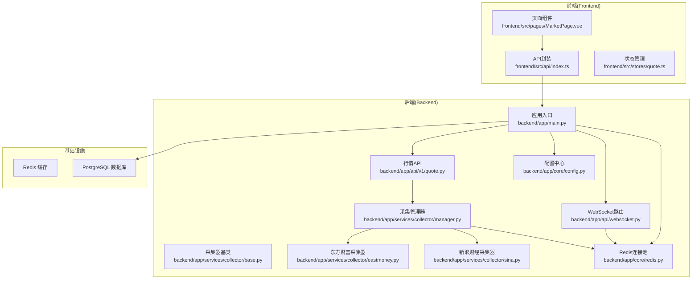
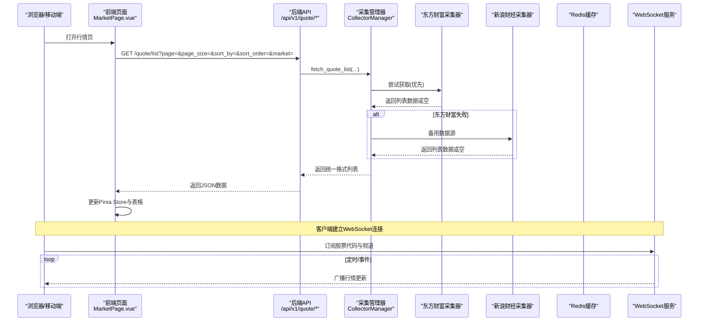
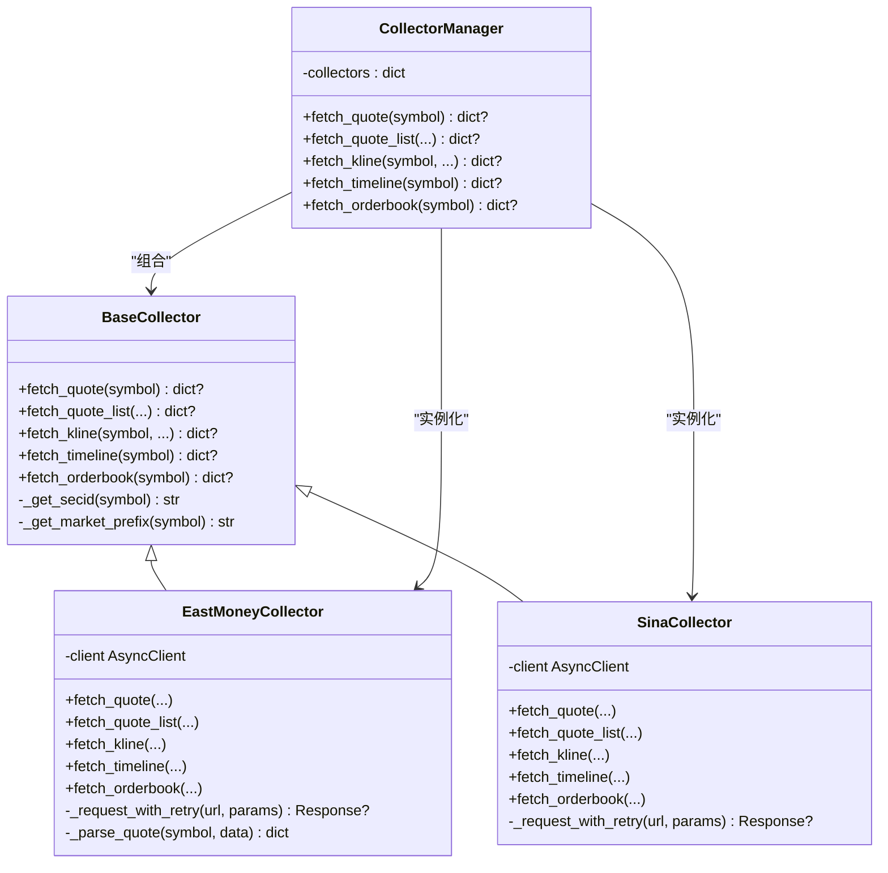
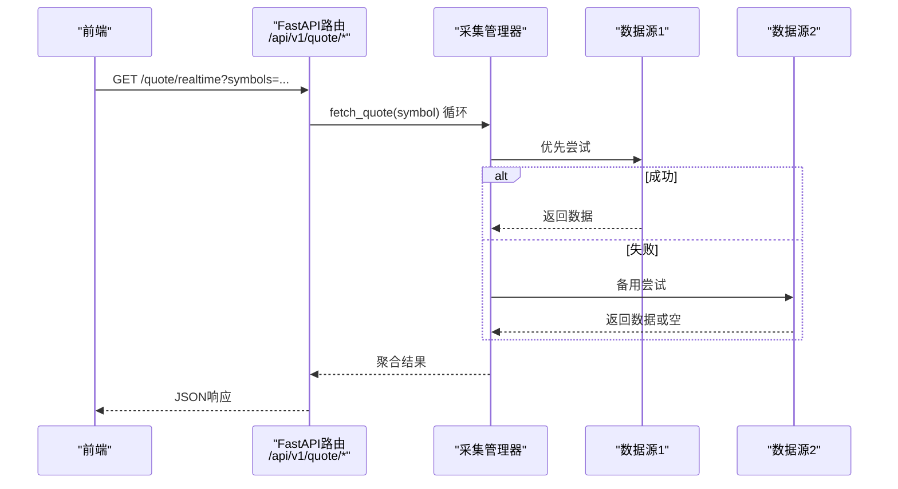
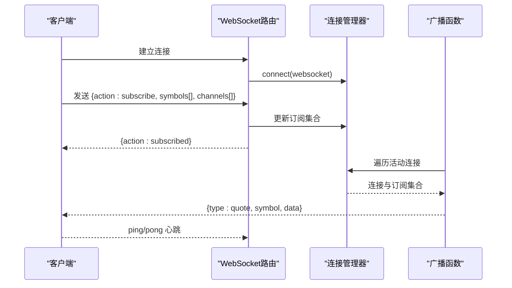
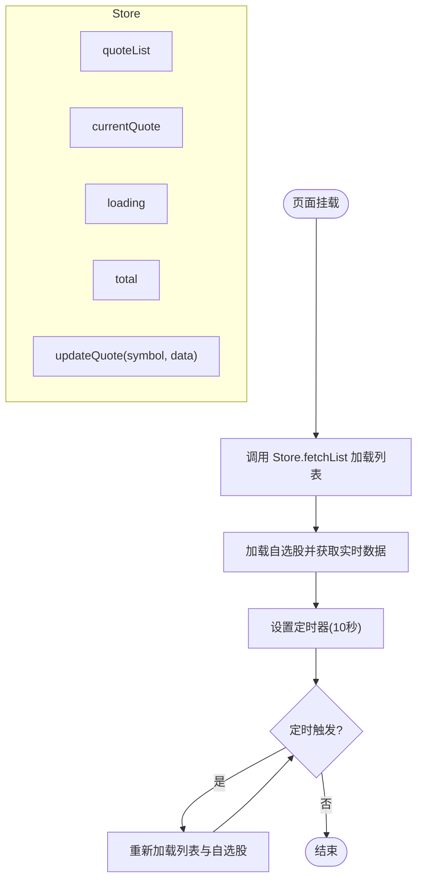
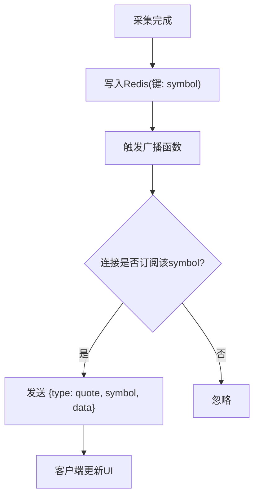
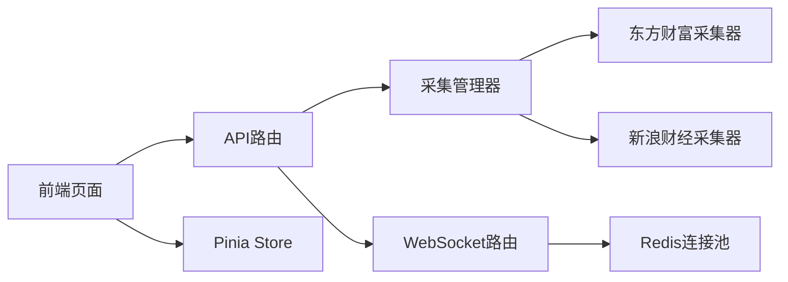

# 组件交互与数据流

<cite>
**本文引用的文件**
- [backend/app/main.py](file://backend/app/main.py)
- [backend/app/api/websocket.py](file://backend/app/api/websocket.py)
- [backend/app/services/collector/base.py](file://backend/app/services/collector/base.py)
- [backend/app/services/collector/eastmoney.py](file://backend/app/services/collector/eastmoney.py)
- [backend/app/services/collector/sina.py](file://backend/app/services/collector/sina.py)
- [backend/app/services/collector/manager.py](file://backend/app/services/collector/manager.py)
- [backend/app/api/v1/quote.py](file://backend/app/api/v1/quote.py)
- [backend/app/core/redis.py](file://backend/app/core/redis.py)
- [backend/app/core/config.py](file://backend/app/core/config.py)
- [frontend/src/api/index.ts](file://frontend/src/api/index.ts)
- [frontend/src/stores/quote.ts](file://frontend/src/stores/quote.ts)
- [frontend/src/pages/MarketPage.vue](file://frontend/src/pages/MarketPage.vue)
- [docker-compose.yml](file://docker-compose.yml)
</cite>

## 目录
1. [引言](#引言)
2. [项目结构](#项目结构)
3. [核心组件](#核心组件)
4. [架构总览](#架构总览)
5. [详细组件分析](#详细组件分析)
6. [依赖分析](#依赖分析)
7. [性能考虑](#性能考虑)
8. [故障排查指南](#故障排查指南)
9. [结论](#结论)
10. [附录](#附录)

## 引言
本文件面向Stock-View项目的组件交互与数据流，系统采用“API层-采集层-缓存层-前端”的分层架构，结合事件驱动与WebSocket实时推送，实现从多数据源采集A股实时行情，经处理后写入Redis缓存，并通过WebSocket向前端推送增量更新。文档重点覆盖：
- 数据采集链路：多数据源采集器与故障转移策略
- 处理与存储：统一数据格式与Redis缓存
- 实时推送：WebSocket订阅与广播机制
- 状态管理：前端Pinia Store与UI联动
- 事件驱动：数据更新事件触发、订阅与分发
- 性能与可靠性：并发控制、一致性保障、错误处理与监控建议

## 项目结构
后端基于FastAPI，前端基于Vue 3 + TypeScript + Pinia，容器化部署通过Docker Compose编排PostgreSQL、Redis与前后端服务。

图表来源
- [backend/app/main.py:1-48](file://backend/app/main.py#L1-L48)
- [backend/app/api/websocket.py:1-79](file://backend/app/api/websocket.py#L1-L79)
- [backend/app/api/v1/quote.py:1-65](file://backend/app/api/v1/quote.py#L1-L65)
- [backend/app/services/collector/manager.py:1-94](file://backend/app/services/collector/manager.py#L1-L94)
- [backend/app/services/collector/base.py:1-45](file://backend/app/services/collector/base.py#L1-L45)
- [backend/app/services/collector/eastmoney.py:1-297](file://backend/app/services/collector/eastmoney.py#L1-L297)
- [backend/app/services/collector/sina.py:1-312](file://backend/app/services/collector/sina.py#L1-L312)
- [backend/app/core/redis.py:1-25](file://backend/app/core/redis.py#L1-L25)
- [backend/app/core/config.py:1-43](file://backend/app/core/config.py#L1-L43)
- [frontend/src/api/index.ts:1-33](file://frontend/src/api/index.ts#L1-L33)
- [frontend/src/stores/quote.ts:1-43](file://frontend/src/stores/quote.ts#L1-L43)
- [frontend/src/pages/MarketPage.vue:1-418](file://frontend/src/pages/MarketPage.vue#L1-L418)
- [docker-compose.yml:1-54](file://docker-compose.yml#L1-L54)

章节来源
- [backend/app/main.py:1-48](file://backend/app/main.py#L1-L48)
- [docker-compose.yml:1-54](file://docker-compose.yml#L1-L54)

## 核心组件
- 应用入口与生命周期
  - FastAPI应用在启动时初始化数据库连接，在关闭时释放Redis连接池，注册各业务路由与WebSocket路由。
- WebSocket实时推送
  - 提供连接管理器与订阅机制，支持客户端订阅/退订，服务端按订阅目标广播行情更新。
- 采集层
  - 抽象采集器定义统一接口；实现两个具体采集器（东方财富、新浪财经），具备重试与解析逻辑；采集管理器负责故障转移与优先级调度。
- API层
  - 提供实时行情、列表、K线、分时、盘口等REST接口，内部委派采集管理器完成数据获取。
- Redis缓存
  - 提供异步Redis连接池与关闭逻辑，用于行情数据的缓存与共享。
- 前端
  - API封装统一访问后端；Pinia Store维护行情列表与当前行情；页面组件定时拉取与渲染数据。

章节来源
- [backend/app/main.py:13-48](file://backend/app/main.py#L13-L48)
- [backend/app/api/websocket.py:12-79](file://backend/app/api/websocket.py#L12-L79)
- [backend/app/services/collector/base.py:5-45](file://backend/app/services/collector/base.py#L5-L45)
- [backend/app/services/collector/manager.py:12-94](file://backend/app/services/collector/manager.py#L12-L94)
- [backend/app/api/v1/quote.py:7-65](file://backend/app/api/v1/quote.py#L7-L65)
- [backend/app/core/redis.py:10-25](file://backend/app/core/redis.py#L10-L25)
- [frontend/src/api/index.ts:8-14](file://frontend/src/api/index.ts#L8-L14)
- [frontend/src/stores/quote.ts:5-43](file://frontend/src/stores/quote.ts#L5-L43)

## 架构总览
系统采用事件驱动与实时推送相结合的架构：
- 数据采集：采集管理器按优先级轮询数据源，解析为统一格式
- 存储与共享：采集结果写入Redis（由采集流程或任务流程负责）
- 推送：WebSocket广播模块根据订阅关系向客户端推送增量更新
- 前端：页面组件定时拉取列表数据，同时通过WebSocket接收实时更新

图表来源
- [backend/app/api/v1/quote.py:19-33](file://backend/app/api/v1/quote.py#L19-L33)
- [backend/app/services/collector/manager.py:35-47](file://backend/app/services/collector/manager.py#L35-L47)
- [backend/app/services/collector/eastmoney.py:87-149](file://backend/app/services/collector/eastmoney.py#L87-L149)
- [backend/app/services/collector/sina.py:109-171](file://backend/app/services/collector/sina.py#L109-L171)
- [frontend/src/pages/MarketPage.vue:188-191](file://frontend/src/pages/MarketPage.vue#L188-L191)

## 详细组件分析

### 数据采集与故障转移
- 抽象基类定义统一接口，确保不同数据源实现一致的返回格式
- 采集器实现：
  - 东方财富采集器：封装HTTP客户端、重试机制、字段映射与解析
  - 新浪财经采集器：兼容JSONP响应、字段映射与解析
- 采集管理器：
  - 维护采集器实例与优先级列表
  - 对单只股票、列表、K线、分时、盘口分别进行故障转移
  - 记录日志并返回首个成功数据源的结果

图表来源
- [backend/app/services/collector/base.py:5-45](file://backend/app/services/collector/base.py#L5-L45)
- [backend/app/services/collector/eastmoney.py:26-297](file://backend/app/services/collector/eastmoney.py#L26-L297)
- [backend/app/services/collector/sina.py:24-312](file://backend/app/services/collector/sina.py#L24-L312)
- [backend/app/services/collector/manager.py:12-94](file://backend/app/services/collector/manager.py#L12-L94)

章节来源
- [backend/app/services/collector/base.py:5-45](file://backend/app/services/collector/base.py#L5-L45)
- [backend/app/services/collector/eastmoney.py:26-297](file://backend/app/services/collector/eastmoney.py#L26-L297)
- [backend/app/services/collector/sina.py:24-312](file://backend/app/services/collector/sina.py#L24-L312)
- [backend/app/services/collector/manager.py:12-94](file://backend/app/services/collector/manager.py#L12-L94)

### API层与服务层调用关系
- API路由集中在v1命名空间，统一前缀为/api/v1
- 实时行情接口按逗号分隔的股票列表逐个查询，聚合返回
- 列表、K线、分时、盘口接口直接委派采集管理器，返回统一结构

图表来源
- [backend/app/api/v1/quote.py:7-16](file://backend/app/api/v1/quote.py#L7-L16)
- [backend/app/services/collector/manager.py:21-33](file://backend/app/services/collector/manager.py#L21-L33)

章节来源
- [backend/app/api/v1/quote.py:7-65](file://backend/app/api/v1/quote.py#L7-L65)
- [backend/app/services/collector/manager.py:21-94](file://backend/app/services/collector/manager.py#L21-L94)

### WebSocket实时推送机制
- 连接管理器维护活动连接与订阅集合，支持订阅/退订/心跳
- 广播函数按订阅目标过滤并发送消息，异常断开自动清理
- 前端页面组件定时拉取列表，同时通过WebSocket接收实时更新

图表来源
- [backend/app/api/websocket.py:39-79](file://backend/app/api/websocket.py#L39-L79)
- [frontend/src/pages/MarketPage.vue:210-221](file://frontend/src/pages/MarketPage.vue#L210-L221)

章节来源
- [backend/app/api/websocket.py:12-79](file://backend/app/api/websocket.py#L12-L79)
- [frontend/src/pages/MarketPage.vue:210-221](file://frontend/src/pages/MarketPage.vue#L210-L221)

### 前端状态管理与数据同步
- API封装统一访问后端，页面组件在挂载时加载列表与自选股实时数据
- Pinia Store维护列表、当前行情、loading与总数，提供更新函数用于合并增量数据
- 页面组件定时器每10秒刷新，保持列表与自选股面板的时效性

图表来源
- [frontend/src/pages/MarketPage.vue:188-221](file://frontend/src/pages/MarketPage.vue#L188-L221)
- [frontend/src/stores/quote.ts:11-42](file://frontend/src/stores/quote.ts#L11-L42)
- [frontend/src/api/index.ts:8-14](file://frontend/src/api/index.ts#L8-L14)

章节来源
- [frontend/src/pages/MarketPage.vue:188-221](file://frontend/src/pages/MarketPage.vue#L188-L221)
- [frontend/src/stores/quote.ts:5-43](file://frontend/src/stores/quote.ts#L5-L43)
- [frontend/src/api/index.ts:8-14](file://frontend/src/api/index.ts#L8-L14)

### 事件驱动与消息分发
- 数据更新事件：采集完成后写入Redis（由采集流程或后台任务负责），WebSocket广播函数遍历订阅并推送
- 订阅机制：客户端通过WebSocket发送订阅指令，服务端记录订阅集合
- 消息分发：广播函数按symbol与channel过滤，仅向匹配的客户端发送

图表来源
- [backend/app/api/websocket.py:67-79](file://backend/app/api/websocket.py#L67-L79)
- [backend/app/core/redis.py:10-18](file://backend/app/core/redis.py#L10-L18)

章节来源
- [backend/app/api/websocket.py:67-79](file://backend/app/api/websocket.py#L67-L79)
- [backend/app/core/redis.py:10-18](file://backend/app/core/redis.py#L10-L18)

## 依赖分析
- 组件耦合
  - API层依赖采集管理器；采集管理器依赖具体采集器实现
  - WebSocket模块依赖Redis连接池与连接管理器
  - 前端依赖API封装与Pinia Store
- 外部依赖
  - Redis用于缓存与广播；PostgreSQL用于持久化（当前未见直接使用示例）
  - Docker Compose编排数据库与缓存服务

图表来源
- [backend/app/api/v1/quote.py:1-65](file://backend/app/api/v1/quote.py#L1-L65)
- [backend/app/services/collector/manager.py:1-94](file://backend/app/services/collector/manager.py#L1-L94)
- [backend/app/api/websocket.py:1-79](file://backend/app/api/websocket.py#L1-L79)
- [backend/app/core/redis.py:1-25](file://backend/app/core/redis.py#L1-L25)
- [frontend/src/pages/MarketPage.vue:1-418](file://frontend/src/pages/MarketPage.vue#L1-L418)
- [frontend/src/stores/quote.ts:1-43](file://frontend/src/stores/quote.ts#L1-L43)

章节来源
- [backend/app/api/v1/quote.py:1-65](file://backend/app/api/v1/quote.py#L1-L65)
- [backend/app/services/collector/manager.py:1-94](file://backend/app/services/collector/manager.py#L1-L94)
- [backend/app/api/websocket.py:1-79](file://backend/app/api/websocket.py#L1-L79)
- [backend/app/core/redis.py:1-25](file://backend/app/core/redis.py#L1-L25)
- [frontend/src/pages/MarketPage.vue:1-418](file://frontend/src/pages/MarketPage.vue#L1-L418)
- [frontend/src/stores/quote.ts:1-43](file://frontend/src/stores/quote.ts#L1-L43)

## 性能考虑
- 并发与限流
  - 采集器使用异步HTTP客户端，限制最大连接数与保活连接数，避免资源耗尽
  - 采集管理器对单只股票与列表采取顺序重试与优先级策略，减少抖动
- 缓存与一致性
  - Redis作为热点数据缓存，建议设置合理TTL与键空间策略，避免内存压力
  - WebSocket广播按订阅过滤，降低无效推送
- 错误处理
  - 采集器对网络异常、协议异常、超时进行重试与告警
  - WebSocket发送异常时主动断开并清理订阅
- 监控与瓶颈
  - 建议埋点：采集成功率、响应时间、Redis命中率、WebSocket连接数与丢包率
  - 瓶颈定位：采集器并发上限、Redis写入延迟、前端渲染卡顿

## 故障排查指南
- WebSocket无法连接
  - 检查后端路由是否正确注册，CORS配置是否允许前端域名
  - 查看连接管理器订阅集合与异常断开日志
- 行情数据为空
  - 确认采集器可用性与网络连通性
  - 检查采集管理器优先级与重试日志
- 前端数据不刷新
  - 检查定时器是否运行，Store更新函数是否调用
  - 确认API返回结构与前端解析逻辑

章节来源
- [backend/app/api/websocket.py:12-79](file://backend/app/api/websocket.py#L12-L79)
- [backend/app/services/collector/manager.py:21-94](file://backend/app/services/collector/manager.py#L21-L94)
- [frontend/src/pages/MarketPage.vue:210-221](file://frontend/src/pages/MarketPage.vue#L210-L221)

## 结论
Stock-View通过清晰的分层设计与事件驱动机制，实现了从多数据源采集、统一处理、缓存共享到实时推送的完整闭环。前端以定时拉取与WebSocket增量更新相结合的方式，兼顾了稳定性与实时性。建议后续完善后台任务驱动的采集与缓存更新、细化监控指标与告警策略，持续优化并发与缓存命中率。

## 附录
- 配置项要点
  - Redis地址、采集间隔、缓存TTL、AI相关参数等
- 部署要点
  - 使用Docker Compose编排数据库、缓存与服务，注意端口映射与健康检查

章节来源
- [backend/app/core/config.py:5-43](file://backend/app/core/config.py#L5-L43)
- [docker-compose.yml:1-54](file://docker-compose.yml#L1-L54)