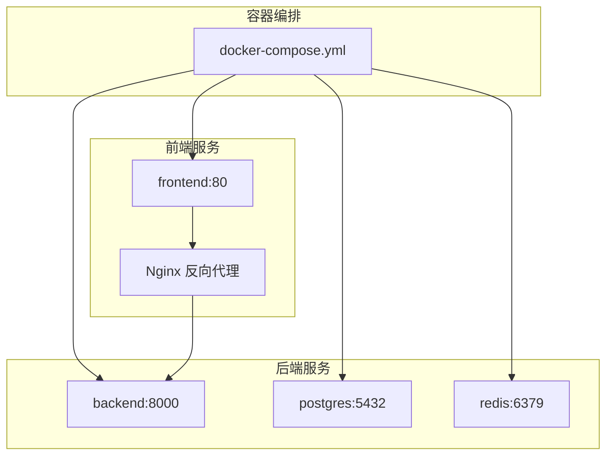
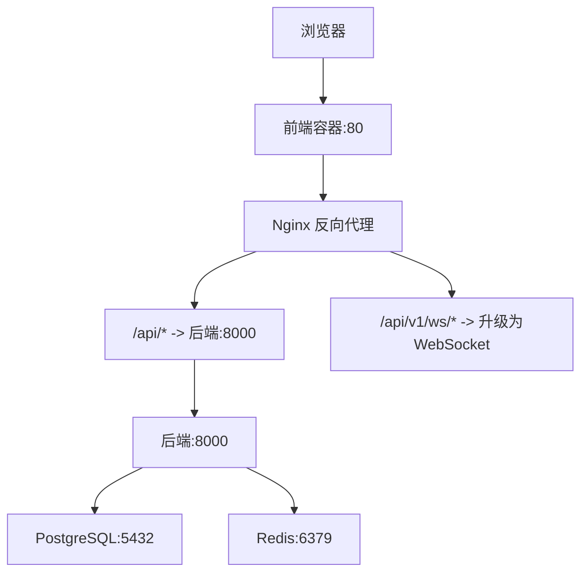
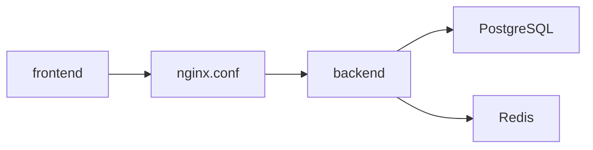

# 部署架构与容器化

<cite>
**本文引用的文件**
- [docker-compose.yml](file://docker-compose.yml)
- [backend/Dockerfile](file://backend/Dockerfile)
- [frontend/Dockerfile](file://frontend/Dockerfile)
- [frontend/nginx.conf](file://frontend/nginx.conf)
- [backend/requirements.txt](file://backend/requirements.txt)
- [backend/app/core/config.py](file://backend/app/core/config.py)
- [backend/app/main.py](file://backend/app/main.py)
- [backend/app/core/database.py](file://backend/app/core/database.py)
- [backend/app/core/redis.py](file://backend/app/core/redis.py)
- [README.md](file://README.md)
- [.env.example](file://Stock-View 软件开发文档/开发文档.md)
</cite>

## 目录
1. [简介](#简介)
2. [项目结构](#项目结构)
3. [核心组件](#核心组件)
4. [架构总览](#架构总览)
5. [详细组件分析](#详细组件分析)
6. [依赖分析](#依赖分析)
7. [性能考虑](#性能考虑)
8. [故障排查指南](#故障排查指南)
9. [结论](#结论)
10. [附录](#附录)

## 简介
本文件面向Stock-View项目的部署架构与容器化实践，系统性阐述基于Docker Compose的服务编排方式，重点覆盖以下方面：
- 容器化部署优势：服务隔离、环境一致性、快速部署、弹性伸缩
- docker-compose.yml配置解析：服务定义、网络、卷、环境变量
- Nginx反向代理：负载均衡、静态资源服务、SSL终止、请求转发
- 数据库与缓存：PostgreSQL与Redis的配置要点（持久化、内存优化、连接池）
- 完整部署流程：从本地开发到生产环境
- 健康检查、日志收集、监控告警最佳实践
- 高可用部署与故障恢复策略

## 项目结构
Stock-View采用前后端分离与数据库/缓存独立容器的架构，通过docker-compose统一编排。核心目录与职责如下：
- backend：Python/FastAPI后端，提供REST API与WebSocket接口
- frontend：Vue 3前端，使用Vite开发，构建产物由Nginx提供静态服务
- docker-compose.yml：统一编排PostgreSQL、Redis、后端、前端服务
- nginx.conf：前端Nginx反向代理配置，实现API转发与静态资源服务

图表来源
- [docker-compose.yml:1-54](file://docker-compose.yml#L1-L54)
- [frontend/nginx.conf:1-30](file://frontend/nginx.conf#L1-L30)

章节来源
- [README.md:92-126](file://README.md#L92-L126)
- [docker-compose.yml:1-54](file://docker-compose.yml#L1-L54)

## 核心组件
- PostgreSQL容器：提供异步SQLAlchemy连接，支持连接池与迁移初始化
- Redis容器：提供异步Redis缓存与Celery队列，配置内存上限与淘汰策略
- 后端容器：基于Uvicorn的FastAPI应用，暴露REST与WebSocket接口
- 前端容器：Nginx提供静态资源服务，并将/api前缀转发至后端

章节来源
- [backend/app/core/database.py:1-25](file://backend/app/core/database.py#L1-L25)
- [backend/app/core/redis.py:1-25](file://backend/app/core/redis.py#L1-L25)
- [backend/app/main.py:1-48](file://backend/app/main.py#L1-L48)
- [frontend/nginx.conf:1-30](file://frontend/nginx.conf#L1-L30)

## 架构总览
下图展示容器间交互与流量走向，包括静态资源访问、API请求转发、WebSocket升级以及数据库/缓存访问。

图表来源
- [frontend/nginx.conf:1-30](file://frontend/nginx.conf#L1-L30)
- [docker-compose.yml:25-50](file://docker-compose.yml#L25-L50)
- [backend/app/main.py:38-48](file://backend/app/main.py#L38-L48)

## 详细组件分析

### docker-compose.yml 配置解析
- 版本与服务
  - 使用Compose版本3.8，定义postgres、redis、backend、frontend四个服务
- PostgreSQL服务
  - 镜像：postgres:15-alpine
  - 环境变量：数据库名、用户名、密码
  - 卷：postgres_data持久化数据目录
  - 端口映射：5432
  - 重启策略：always
- Redis服务
  - 镜像：redis:7-alpine
  - 命令：限制最大内存256MB并设置LRU淘汰策略
  - 卷：redis_data持久化RDB
  - 端口映射：6379
  - 重启策略：always
- 后端服务
  - 构建上下文：./backend/Dockerfile
  - 环境变量：DATABASE_URL、REDIS_URL、AI_ADAPTER、APP_ENV、APP_DEBUG
  - 端口映射：8000
  - 依赖：postgres、redis
  - 重启策略：always
- 前端服务
  - 构建上下文：./frontend/Dockerfile
  - 端口映射：3000:80
  - 依赖：backend
  - 重启策略：always
- 命名卷
  - postgres_data、redis_data用于持久化

章节来源
- [docker-compose.yml:1-54](file://docker-compose.yml#L1-L54)

### Nginx 反向代理配置
- 上游后端
  - upstream指向后端容器地址与端口
- 服务器监听
  - 监听80端口，server_name可按需调整
- 静态资源
  - 根目录指向Nginx默认HTML目录，index为index.html
  - try_files回退到单页应用路由
- API转发
  - /api/前缀代理到上游后端，保留Host与客户端IP头
- WebSocket升级
  - /api/v1/ws/使用HTTP/1.1与Upgrade头进行协议升级，设置长读超时

章节来源
- [frontend/nginx.conf:1-30](file://frontend/nginx.conf#L1-L30)

### 后端容器镜像与运行
- 基础镜像：python:3.11-slim
- 工作目录与依赖安装：更新apt、安装编译工具、pip安装requirements.txt
- 复制应用代码并暴露8000端口
- CMD使用Uvicorn以单工作进程启动FastAPI应用

章节来源
- [backend/Dockerfile:1-12](file://backend/Dockerfile#L1-L12)
- [backend/requirements.txt:1-17](file://backend/requirements.txt#L1-L17)

### 前端容器镜像与Nginx
- 多阶段构建：Node基础镜像构建，Nginx基础镜像运行
- 构建产物：将dist目录复制到Nginx HTML根目录
- Nginx配置：替换默认conf为项目nginx.conf
- 暴露80端口

章节来源
- [frontend/Dockerfile:1-11](file://frontend/Dockerfile#L1-L11)
- [frontend/nginx.conf:1-30](file://frontend/nginx.conf#L1-L30)

### 后端应用配置与连接
- 配置加载
  - 通过pydantic-settings从环境变量读取，支持缓存
  - 默认值覆盖与开发环境变量
- 数据库连接
  - 异步引擎，连接池大小与溢出配置
  - 初始化时创建所有表
- Redis连接
  - 异步Redis连接池，全局复用
  - 应用生命周期结束时关闭连接

章节来源
- [backend/app/core/config.py:1-43](file://backend/app/core/config.py#L1-L43)
- [backend/app/core/database.py:1-25](file://backend/app/core/database.py#L1-L25)
- [backend/app/core/redis.py:1-25](file://backend/app/core/redis.py#L1-L25)
- [backend/app/main.py:1-48](file://backend/app/main.py#L1-L48)

### API健康检查端点
- 提供/api/v1/health健康检查接口，返回状态与版本信息

章节来源
- [backend/app/main.py:46-48](file://backend/app/main.py#L46-L48)

## 依赖分析
- 组件耦合
  - 后端依赖PostgreSQL与Redis；前端依赖后端提供的API
  - 通过compose的depends_on保证启动顺序
- 外部依赖
  - Python依赖集中在requirements.txt
  - Node依赖通过package.json与构建脚本管理

图表来源
- [frontend/nginx.conf:1-30](file://frontend/nginx.conf#L1-L30)
- [docker-compose.yml:25-50](file://docker-compose.yml#L25-L50)

章节来源
- [backend/requirements.txt:1-17](file://backend/requirements.txt#L1-L17)
- [docker-compose.yml:1-54](file://docker-compose.yml#L1-L54)

## 性能考虑
- 数据库连接池
  - 后端使用异步SQLAlchemy，连接池大小与溢出参数可按并发调优
- Redis内存与淘汰策略
  - 通过命令参数限制最大内存并设置LRU淘汰策略，适合缓存场景
- Web服务器并发
  - Uvicorn单进程部署，适合开发与小规模生产；生产建议多进程或多实例配合反向代理
- 静态资源优化
  - Nginx提供静态资源服务，减少后端压力；可结合Gzip/缓存头进一步优化

## 故障排查指南
- 健康检查
  - 访问后端健康端点，确认服务可用
- 日志查看
  - 使用Docker Compose日志命令查看后端容器日志
- 端口冲突
  - 若本地端口被占用，调整映射或释放端口
- 环境变量
  - 确认DATABASE_URL与REDIS_URL指向正确的容器名称与端口
- 数据持久化
  - 如需重置数据，删除命名卷后重建容器

章节来源
- [backend/app/main.py:46-48](file://backend/app/main.py#L46-L48)
- [README.md:146-162](file://README.md#L146-L162)
- [docker-compose.yml:52-54](file://docker-compose.yml#L52-L54)

## 结论
该容器化方案通过Compose实现了前后端与数据库/缓存的一键编排，具备良好的隔离性与一致性。结合Nginx反向代理与健康检查机制，可满足开发与生产的基础需求。针对生产环境，建议引入多实例、负载均衡、持久化卷管理、集中日志与监控告警体系，以提升可用性与可观测性。

## 附录

### 部署流程指南
- 本地开发环境
  - 使用Compose一键启动所有服务
  - 访问前端页面与后端API及文档
- 本地开发模式（可选）
  - 先启动数据库与缓存容器
  - 在后端与前端分别启动开发服务器
- 生产环境建议
  - 使用多实例与反向代理实现负载均衡
  - 配置SSL终止与证书管理
  - 使用独立的持久化卷与备份策略
  - 集成日志聚合与指标监控

章节来源
- [README.md:22-88](file://README.md#L22-L88)
- [docker-compose.yml:1-54](file://docker-compose.yml#L1-L54)

### 环境变量与配置要点
- 关键变量
  - DATABASE_URL：数据库连接串
  - REDIS_URL：Redis连接串
  - AI_ADAPTER：AI适配器选择
  - APP_ENV、APP_DEBUG：运行环境与调试开关
  - PRIMARY_DATA_SOURCE、FALLBACK_DATA_SOURCE：数据源配置
- 示例模板
  - 参考开发文档中的.env.example示例

章节来源
- [backend/app/core/config.py:5-38](file://backend/app/core/config.py#L5-L38)
- [.env.example:2243-2278](file://Stock-View 软件开发文档/开发文档.md#L2243-L2278)