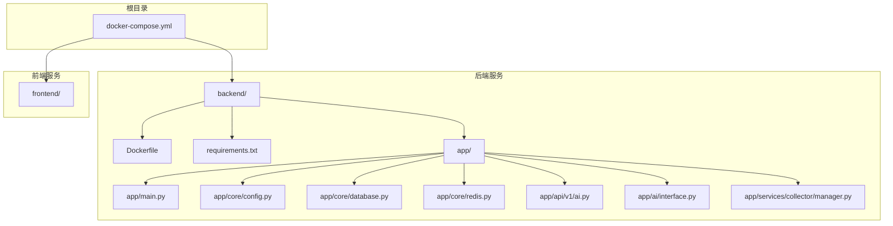
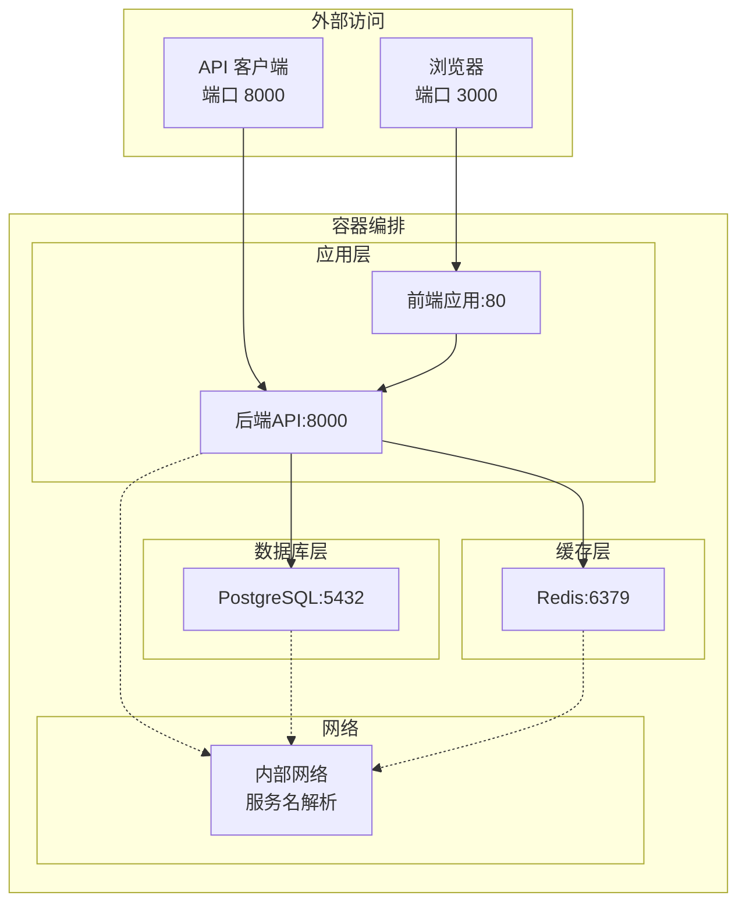
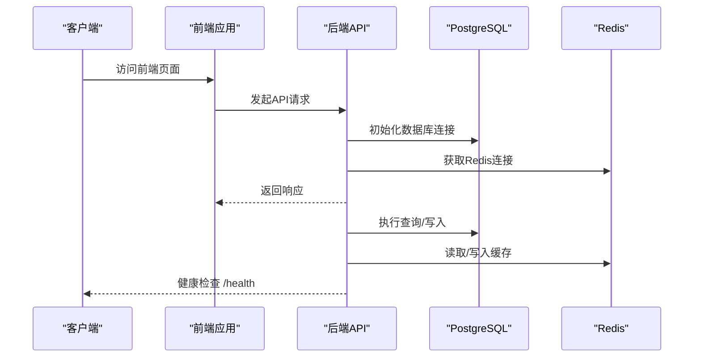
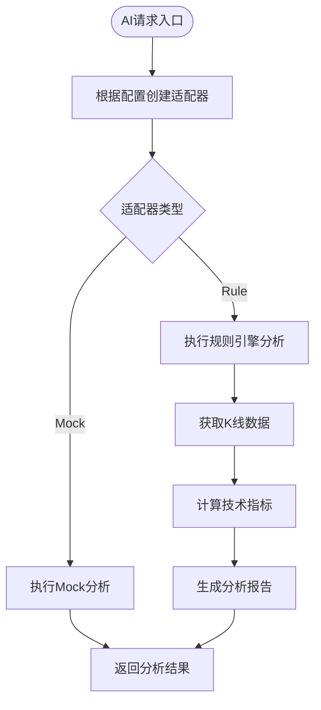
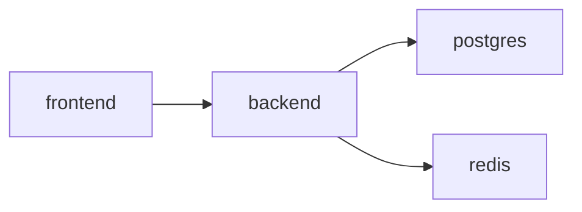

# Docker容器部署

<cite>
**本文引用的文件**
- [docker-compose.yml](file://docker-compose.yml)
- [Dockerfile](file://backend/Dockerfile)
- [requirements.txt](file://backend/requirements.txt)
- [main.py](file://backend/app/main.py)
- [config.py](file://backend/app/core/config.py)
- [database.py](file://backend/app/core/database.py)
- [redis.py](file://backend/app/core/redis.py)
- [ai.py](file://backend/app/api/v1/ai.py)
- [interface.py](file://backend/app/ai/interface.py)
- [manager.py](file://backend/app/services/collector/manager.py)
- [开发文档.md](file://Stock-View 软件开发文档/开发文档.md)
</cite>

## 目录
1. [简介](#简介)
2. [项目结构](#项目结构)
3. [核心组件](#核心组件)
4. [架构总览](#架构总览)
5. [详细组件分析](#详细组件分析)
6. [依赖关系分析](#依赖关系分析)
7. [性能考虑](#性能考虑)
8. [故障排查指南](#故障排查指南)
9. [结论](#结论)
10. [附录](#附录)

## 简介
本指南面向Stock-View项目的Docker容器化部署，提供基于Docker Compose的完整编排方案。内容涵盖PostgreSQL数据库、Redis缓存、后端API服务、前端应用的容器定义与配置；解释服务间依赖关系与启动顺序（depends_on、健康检查、重启策略等）；说明容器网络、端口映射与数据卷挂载；给出构建与启动流程、环境变量传递方式以及日志查看、故障排查与性能监控方法。

## 项目结构
仓库采用前后端分离的模块化组织方式，核心目录与职责如下：
- backend：后端API服务，包含FastAPI应用、数据库与Redis连接、AI适配器、定时任务等
- frontend：前端应用（当前未提供具体Dockerfile，可按多阶段构建或静态资源服务方式扩展）
- 根目录docker-compose.yml：统一编排数据库、缓存、后端、前端服务及持久化卷

图表来源
- [docker-compose.yml](file://docker-compose.yml)
- [Dockerfile](file://backend/Dockerfile)
- [requirements.txt](file://backend/requirements.txt)
- [main.py](file://backend/app/main.py)
- [config.py](file://backend/app/core/config.py)
- [database.py](file://backend/app/core/database.py)
- [redis.py](file://backend/app/core/redis.py)
- [ai.py](file://backend/app/api/v1/ai.py)
- [interface.py](file://backend/app/ai/interface.py)
- [manager.py](file://backend/app/services/collector/manager.py)

章节来源
- [docker-compose.yml](file://docker-compose.yml)
- [Dockerfile](file://backend/Dockerfile)
- [requirements.txt](file://backend/requirements.txt)
- [main.py](file://backend/app/main.py)
- [config.py](file://backend/app/core/config.py)
- [database.py](file://backend/app/core/database.py)
- [redis.py](file://backend/app/core/redis.py)
- [ai.py](file://backend/app/api/v1/ai.py)
- [interface.py](file://backend/app/ai/interface.py)
- [manager.py](file://backend/app/services/collector/manager.py)

## 核心组件
- 数据库服务（PostgreSQL）
  - 镜像：postgres:15-alpine
  - 端口映射：5432:5432
  - 数据卷：postgres_data
  - 环境变量：POSTGRES_DB、POSTGRES_USER、POSTGRES_PASSWORD
  - 重启策略：always
- 缓存服务（Redis）
  - 镜像：redis:7-alpine
  - 端口映射：6379:6379
  - 数据卷：redis_data
  - 命令：限制内存与淘汰策略
  - 重启策略：always
- 后端API服务（FastAPI）
  - 构建上下文：./backend
  - 端口映射：8000:8000
  - 环境变量：DATABASE_URL、REDIS_URL、AI_ADAPTER、APP_ENV、APP_DEBUG
  - 依赖：postgres、redis
  - 重启策略：always
- 前端应用
  - 构建上下文：./frontend
  - 端口映射：3000:80（默认静态站点端口）
  - 依赖：backend
  - 重启策略：always

章节来源
- [docker-compose.yml](file://docker-compose.yml)

## 架构总览
下图展示容器编排的整体架构与服务交互关系：

图表来源
- [docker-compose.yml](file://docker-compose.yml)

## 详细组件分析

### 数据库服务（PostgreSQL）
- 配置要点
  - 使用官方Alpine镜像，体积小、维护成本低
  - 通过环境变量初始化数据库、用户名与密码
  - 将数据目录挂载到宿主机卷，确保数据持久化
  - 暴露5432端口供后端服务连接
- 连接参数
  - 主机名：postgres（容器网络别名）
  - 端口：5432
  - 数据库名：stockview
  - 用户名/密码：stockview/stockview123
- 启动顺序
  - 由后端服务通过depends_on声明依赖，确保数据库先于后端启动
- 重启策略
  - always，保证服务高可用

章节来源
- [docker-compose.yml](file://docker-compose.yml)

### 缓存服务（Redis）
- 配置要点
  - 使用官方Alpine镜像
  - 通过命令限制最大内存与淘汰策略，控制资源占用
  - 数据卷挂载至redis_data，持久化RDB快照
  - 暴露6379端口供后端服务连接
- 连接参数
  - 主机名：redis（容器网络别名）
  - 端口：6379
  - 数据库索引：0（默认）
- 启动顺序
  - 由后端服务通过depends_on声明依赖，确保缓存先于后端启动
- 重启策略
  - always，保证服务高可用

章节来源
- [docker-compose.yml](file://docker-compose.yml)

### 后端API服务（FastAPI）
- 容器定义
  - 基于Python 3.11 Slim镜像，安装构建工具后安装依赖
  - 暴露8000端口，使用Uvicorn运行ASGI应用
  - 通过环境变量传递数据库与缓存连接串、AI适配器类型等配置
- 生命周期与健康检查
  - 应用在启动时初始化数据库并在关闭时释放Redis连接
  - 提供/health端点用于健康检查
- 依赖关系
  - depends_on: postgres, redis
  - 重启策略: always
- 端口映射
  - 8000:8000（容器端口:宿主端口）

图表来源
- [main.py](file://backend/app/main.py)
- [database.py](file://backend/app/core/database.py)
- [redis.py](file://backend/app/core/redis.py)

章节来源
- [Dockerfile](file://backend/Dockerfile)
- [requirements.txt](file://backend/requirements.txt)
- [main.py](file://backend/app/main.py)
- [database.py](file://backend/app/core/database.py)
- [redis.py](file://backend/app/core/redis.py)

### 前端应用
- 容器定义
  - 构建上下文：./frontend
  - 端口映射：3000:80（默认静态站点端口）
  - 依赖：backend（通过反向代理或直接访问）
- 启动顺序
  - 通过depends_on: backend，确保后端可用后再启动前端
- 重启策略
  - always

章节来源
- [docker-compose.yml](file://docker-compose.yml)

### AI适配器与数据采集
- AI适配器
  - 支持mock与规则引擎两种适配器，可通过环境变量AI_ADAPTER切换
  - 提供分析接口与模型信息查询接口
- 数据采集
  - 支持多家数据源（如东方财富、新浪），具备故障转移机制
  - 通过Redis缓存与PostgreSQL存储相结合的方式实现数据流转

图表来源
- [ai.py](file://backend/app/api/v1/ai.py)
- [interface.py](file://backend/app/ai/interface.py)
- [manager.py](file://backend/app/services/collector/manager.py)

章节来源
- [ai.py](file://backend/app/api/v1/ai.py)
- [interface.py](file://backend/app/ai/interface.py)
- [manager.py](file://backend/app/services/collector/manager.py)

## 依赖关系分析
- 服务依赖
  - backend依赖postgres与redis（通过depends_on声明）
  - frontend依赖backend（通过depends_on声明）
- 网络与通信
  - 所有服务位于同一Docker网络，可通过服务名相互访问
  - 数据库与缓存分别暴露端口供外部或内部访问
- 数据持久化
  - postgres_data与redis_data卷确保数据不随容器删除而丢失

图表来源
- [docker-compose.yml](file://docker-compose.yml)

章节来源
- [docker-compose.yml](file://docker-compose.yml)

## 性能考虑
- 数据库连接池
  - 后端使用异步SQLAlchemy连接池，池大小与溢出配置可根据并发需求调整
- 缓存策略
  - Redis设置最大内存与LRU淘汰策略，避免内存无限增长
- Web服务器
  - Uvicorn单进程模式，生产环境建议增加workers或使用反向代理（如Nginx）进行负载分担
- 定时任务
  - 开发文档中提供了Celery相关配置思路，可在生产环境中启用以支持后台任务与定时采集

章节来源
- [database.py](file://backend/app/core/database.py)
- [docker-compose.yml](file://docker-compose.yml)
- [开发文档.md](file://Stock-View 软件开发文档/开发文档.md)

## 故障排查指南
- 健康检查
  - 访问后端/health端点确认服务状态
- 日志查看
  - 使用docker compose logs -f <服务名>查看实时日志
- 连接问题
  - 确认数据库与缓存容器已就绪且端口映射正确
  - 检查后端环境变量中的DATABASE_URL与REDIS_URL是否指向正确的容器名与端口
- 数据库初始化
  - 首次启动后端会自动创建表结构，若异常请检查数据库权限与连接串
- 缓存连接
  - 若Redis连接失败，检查Redis容器状态与内存限制设置

章节来源
- [main.py](file://backend/app/main.py)
- [docker-compose.yml](file://docker-compose.yml)

## 结论
本指南提供了Stock-View项目基于Docker Compose的完整部署方案，覆盖数据库、缓存、后端API与前端应用的容器化配置与编排要点。通过合理的依赖关系、端口映射与数据卷挂载，结合环境变量传递与健康检查，可实现稳定可靠的本地与生产部署。建议在生产环境中进一步完善反向代理、负载均衡与监控告警体系。

## 附录

### 环境变量与配置
- 数据库连接串
  - DATABASE_URL：指向postgres容器
- Redis连接串
  - REDIS_URL：指向redis容器
- AI适配器
  - AI_ADAPTER：mock或rule
- 应用环境
  - APP_ENV：development
  - APP_DEBUG：true

章节来源
- [docker-compose.yml](file://docker-compose.yml)
- [config.py](file://backend/app/core/config.py)

### 启动与验证流程
- 构建与启动
  - docker compose up -d
- 健康检查
  - curl http://localhost:8000/api/v1/health
- 日志查看
  - docker compose logs -f backend
  - docker compose logs -f postgres
  - docker compose logs -f redis
- 停止与清理
  - docker compose down
  - 如需清理数据卷：docker compose down -v

章节来源
- [docker-compose.yml](file://docker-compose.yml)
- [main.py](file://backend/app/main.py)