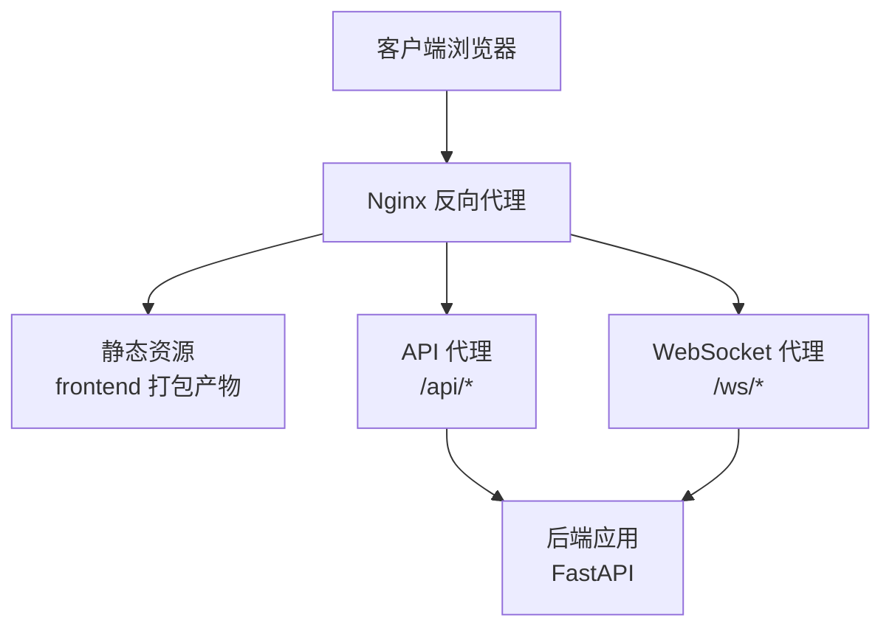
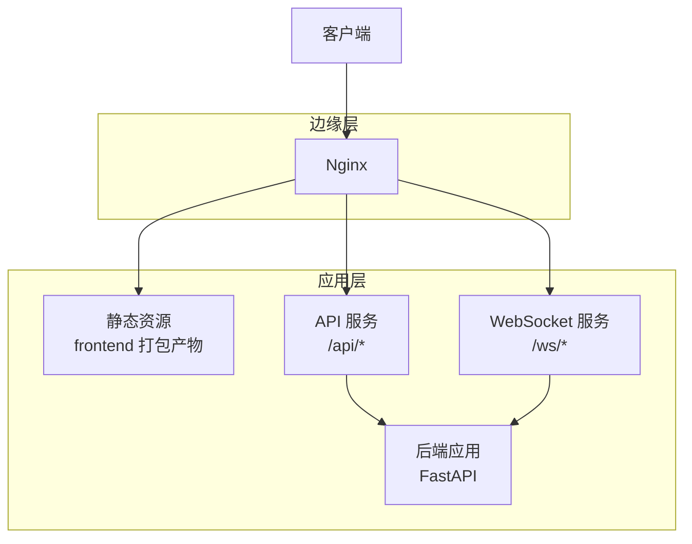
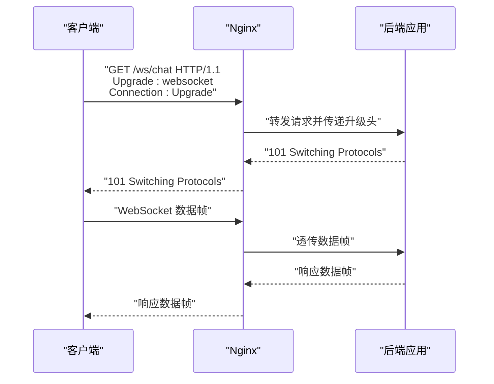
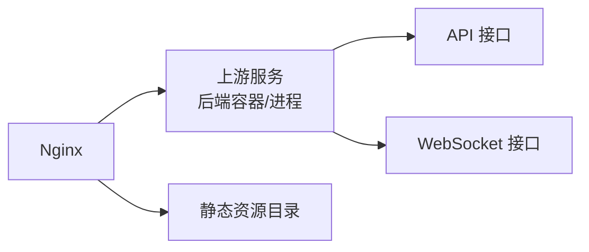

# Nginx反向代理配置

<cite>
**本文档引用的文件**
- [backend/app/main.py](file://backend/app/main.py)
- [backend/app/api/websocket.py](file://backend/app/api/websocket.py)
- [backend/app/core/config.py](file://backend/app/core/config.py)
- [backend/Dockerfile](file://backend/Dockerfile)
- [README.md](file://README.md)
</cite>

## 目录
1. [简介](#简介)
2. [项目结构](#项目结构)
3. [核心组件](#核心组件)
4. [架构总览](#架构总览)
5. [详细组件分析](#详细组件分析)
6. [依赖关系分析](#依赖关系分析)
7. [性能考虑](#性能考虑)
8. [故障排除指南](#故障排除指南)
9. [结论](#结论)
10. [附录](#附录)

## 简介
本指南面向Stock-View项目的Nginx反向代理部署，系统性说明配置文件结构与各指令作用，涵盖上游服务定义、静态资源服务、API代理、WebSocket代理、SSL/TLS安全配置以及缓存策略。文档基于仓库中后端应用的运行方式与接口暴露进行设计，确保与实际代码实现一致。

## 项目结构
Stock-View采用前后端分离架构：前端为静态资源，后端为Python应用（FastAPI），通过Nginx统一对外提供服务。后端容器化部署，监听本地回环地址，由Nginx作为反向代理接收外部请求并转发至后端。

**图表来源**
- [backend/app/main.py](file://backend/app/main.py)
- [backend/app/api/websocket.py](file://backend/app/api/websocket.py)
- [backend/Dockerfile](file://backend/Dockerfile)

**章节来源**
- [backend/app/main.py](file://backend/app/main.py)
- [backend/Dockerfile](file://backend/Dockerfile)

## 核心组件
- 上游服务（upstream）：指向后端容器或进程，支持多实例与健康检查。
- 服务器块（server）：定义监听端口、域名、SSL证书路径等。
- 位置规则（location）：区分静态资源、API、WebSocket等不同路由。
- 缓存策略：静态资源强缓存、API响应缓存控制、浏览器缓存头。
- 安全配置：HTTPS重定向、安全头部、证书安装与轮换。
- WebSocket代理：升级头处理、长连接、心跳检测与超时设置。

**章节来源**
- [backend/app/main.py](file://backend/app/main.py)
- [backend/app/api/websocket.py](file://backend/app/api/websocket.py)
- [backend/app/core/config.py](file://backend/app/core/config.py)

## 架构总览
下图展示Nginx在Stock-View中的典型部署拓扑：客户端请求经Nginx进入，静态资源直接返回，API请求转发到后端，WebSocket请求进行协议升级后透传。

**图表来源**
- [backend/app/main.py](file://backend/app/main.py)
- [backend/app/api/websocket.py](file://backend/app/api/websocket.py)
- [backend/Dockerfile](file://backend/Dockerfile)

## 详细组件分析

### 静态资源服务配置
- 作用：托管前端打包后的静态文件，提供高效访问。
- 关键点：
  - 根目录映射到前端构建输出目录。
  - 启用Gzip/Br压缩以降低带宽。
  - 设置强缓存策略（如一年），结合文件指纹更新版本。
  - 提供404回退至index.html，支持SPA路由。
- 典型指令参考：root、location、gzip、expires、try_files。

**章节来源**
- [README.md](file://README.md)

### API代理配置
- 作用：将/api前缀的请求转发到后端FastAPI服务。
- 关键点：
  - upstream指向后端容器或本地进程。
  - location /api/ 匹配API路径，使用proxy_pass转发。
  - 设置合理的超时（proxy_connect_timeout、proxy_send_timeout、proxy_read_timeout）。
  - 错误处理：proxy_next_upstream、proxy_next_upstream_tries、error_page。
  - 负载均衡：轮询、最少连接、IP哈希等策略（根据需要启用）。
  - 健康检查：可结合Nginx Plus或外部探针实现（开源版建议使用外部工具）。
- 典型指令参考：upstream、proxy_pass、proxy_set_header、proxy_connect_timeout、proxy_next_upstream。

**章节来源**
- [backend/app/main.py](file://backend/app/main.py)
- [backend/Dockerfile](file://backend/Dockerfile)

### WebSocket代理配置
- 作用：将/ws前缀的请求升级为WebSocket协议并保持长连接。
- 关键点：
  - location /ws/ 匹配WebSocket路径。
  - 必须设置升级相关头：Connection、Upgrade。
  - 保持长连接：proxy_set_header Upgrade $http_upgrade; proxy_set_header Connection "upgrade";
  - 超时设置：proxy_read_timeout、proxy_send_timeout需足够长。
  - 心跳检测：可在应用层实现，Nginx侧保持连接活跃。
- 典型指令参考：proxy_set_header、proxy_http_version、proxy_read_timeout。

**图表来源**
- [backend/app/api/websocket.py](file://backend/app/api/websocket.py)

**章节来源**
- [backend/app/api/websocket.py](file://backend/app/api/websocket.py)

### SSL/TLS与安全配置
- 证书安装：将证书与私钥放置于安全目录，权限仅限Nginx用户。
- HTTPS重定向：将HTTP请求301重定向至HTTPS。
- 安全头部：Strict-Transport-Security、X-Frame-Options、X-Content-Type-Options、Referrer-Policy等。
- TLS参数：禁用不安全协议，启用现代加密套件与会话复用。
- OCSP Stapling：提升证书验证性能与隐私。
- 典型指令参考：ssl_certificate、ssl_certificate_key、add_header、hsts、http2。

**章节来源**
- [backend/app/core/config.py](file://backend/app/core/config.py)

### 缓存策略配置
- 静态资源缓存：对CSS/JS/PNG等设置极长有效期，结合文件指纹避免陈旧缓存。
- API响应缓存：谨慎使用，优先采用条件请求（ETag/Last-Modified）。
- 浏览器缓存控制：Cache-Control、Expires、Pragma等头控制。
- CDN集成：通过CNAME接入CDN，Nginx负责回源与缓存标签。
- 典型指令参考：expires、add_header、proxy_cache、proxy_cache_valid。

**章节来源**
- [README.md](file://README.md)

## 依赖关系分析
- Nginx依赖后端容器或进程提供API与WebSocket服务。
- 静态资源依赖前端构建产物目录。
- SSL证书依赖运维管理流程与密钥存储。
- 负载均衡与健康检查依赖上游可用性与探针配置。

**图表来源**
- [backend/Dockerfile](file://backend/Dockerfile)
- [backend/app/main.py](file://backend/app/main.py)
- [backend/app/api/websocket.py](file://backend/app/api/websocket.py)

**章节来源**
- [backend/Dockerfile](file://backend/Dockerfile)
- [backend/app/main.py](file://backend/app/main.py)
- [backend/app/api/websocket.py](file://backend/app/api/websocket.py)

## 性能考虑
- 启用Gzip/Br压缩，减少传输体积。
- 合理设置超时与缓冲区，避免慢启动与内存占用过高。
- 使用静态资源强缓存与CDN加速，降低后端压力。
- 对API接口采用条件缓存与ETag，减少重复传输。
- WebSocket长连接需配合心跳与超时策略，防止资源泄漏。

## 故障排除指南
- 无法访问静态资源：检查root路径与try_files回退逻辑。
- API 502/504：检查upstream可达性、超时设置与后端日志。
- WebSocket 握手失败：确认Upgrade头是否透传、proxy_http_version是否为1.1。
- SSL握手错误：核对证书链完整性、私钥权限与TLS参数兼容性。
- 缓存问题：清理浏览器缓存、检查Cache-Control与ETag设置。

**章节来源**
- [backend/app/main.py](file://backend/app/main.py)
- [backend/app/api/websocket.py](file://backend/app/api/websocket.py)
- [backend/app/core/config.py](file://backend/app/core/config.py)

## 结论
通过合理配置Nginx的upstream、server与location，结合静态资源缓存、API代理与WebSocket升级机制，可为Stock-View提供高性能、安全可靠的边缘服务。配合SSL/TLS与安全头部，可进一步提升用户体验与安全性。

## 附录
- 配置文件命名建议：stockview.conf 或 nginx.conf.d/stockview.conf。
- 日志管理：access_log、error_log 分离，按天切割。
- 监控指标：请求量、响应时间、错误率、上游健康状态。
- 最佳实践：最小权限原则、定期轮换证书、灰度发布与回滚策略。