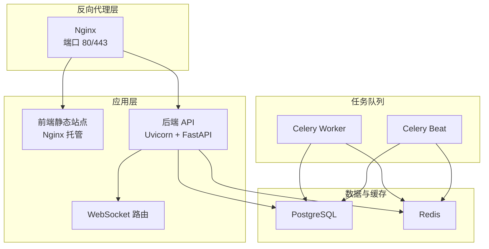
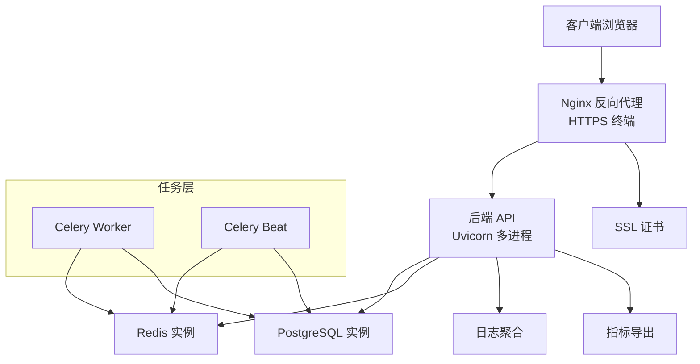
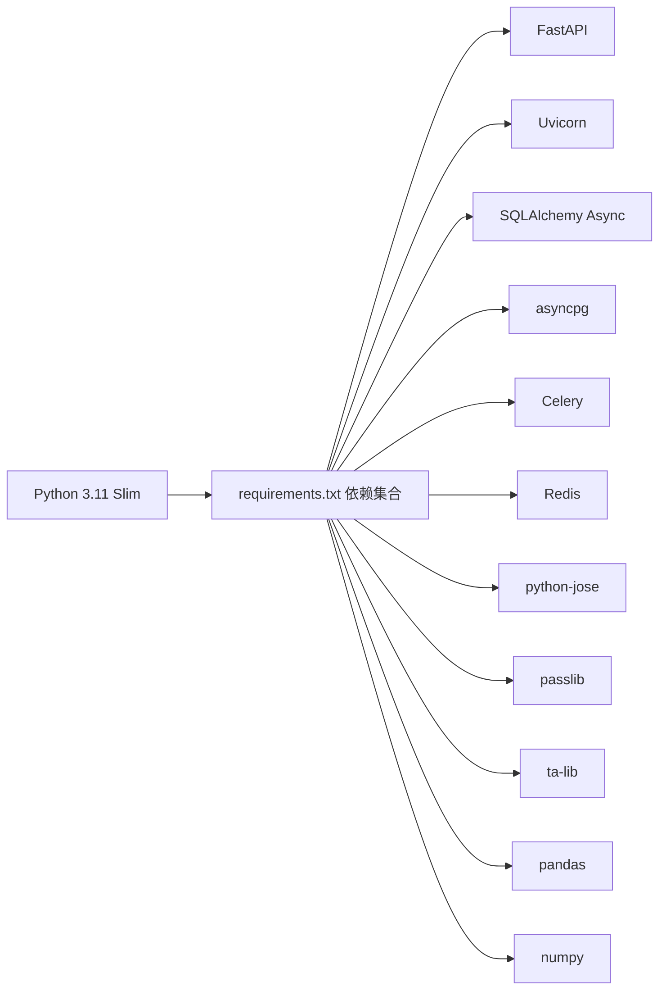

# 生产环境配置

<cite>
**本文引用的文件**
- [backend/app/core/config.py](file://backend/app/core/config.py)
- [backend/app/core/database.py](file://backend/app/core/database.py)
- [backend/app/core/redis.py](file://backend/app/core/redis.py)
- [backend/app/core/security.py](file://backend/app/core/security.py)
- [backend/app/main.py](file://backend/app/main.py)
- [backend/Dockerfile](file://backend/Dockerfile)
- [backend/requirements.txt](file://backend/requirements.txt)
- [docker-compose.yml](file://docker-compose.yml)
- [.env.example](file://.env.example)
- [README.md](file://README.md)
- [开发文档.md](file://Stock-View 软件开发文档/开发文档.md)
</cite>

## 目录
1. [简介](#简介)
2. [项目结构](#项目结构)
3. [核心组件](#核心组件)
4. [架构概览](#架构概览)
5. [详细组件分析](#详细组件分析)
6. [依赖分析](#依赖分析)
7. [性能考虑](#性能考虑)
8. [故障排查指南](#故障排查指南)
9. [结论](#结论)
10. [附录](#附录)

## 简介
本指南面向在生产环境中部署 Stock-View 的工程团队，提供从系统资源、容器编排、网络与安全、性能调优到运维监控与备份的全栈配置说明。内容基于仓库中的配置文件与文档，确保可操作性与一致性。

## 项目结构
后端采用 FastAPI + SQLAlchemy Async + Redis 异步架构；通过 Docker Compose 将 Nginx、PostgreSQL、Redis、后端 API、Celery Worker/Beat 统一编排。前端使用 Nginx 静态托管，反向代理至后端 API。

图表来源
- [docker-compose.yml:1894-1905](file://docker-compose.yml#L1894-L1905)
- [backend/Dockerfile:2028-2029](file://backend/Dockerfile#L2028-L2029)
- [backend/app/main.py:39-43](file://backend/app/main.py#L39-L43)

章节来源
- [开发文档.md:1883-1984](file://Stock-View 软件开发文档/开发文档.md#L1883-L1984)
- [docker-compose.yml:1-54](file://docker-compose.yml#L1-L54)
- [backend/Dockerfile:1-12](file://backend/Dockerfile#L1-L12)

## 核心组件
- 配置管理：基于 Pydantic Settings 的 Settings 类，支持从 .env 文件加载键值对，并提供运行时缓存。
- 数据库：异步 SQLAlchemy 引擎，默认连接池大小与溢出配置已内嵌。
- 缓存：Redis 异步客户端，统一连接池初始化。
- 安全：JWT 加密与解码，密码哈希与校验。
- 应用入口：FastAPI 应用生命周期钩子，注册路由与中间件。

章节来源
- [backend/app/core/config.py:5-43](file://backend/app/core/config.py#L5-L43)
- [backend/app/core/database.py:7-25](file://backend/app/core/database.py#L7-L25)
- [backend/app/core/redis.py:10-25](file://backend/app/core/redis.py#L10-L25)
- [backend/app/core/security.py:18-30](file://backend/app/core/security.py#L18-L30)
- [backend/app/main.py:13-48](file://backend/app/main.py#L13-L48)

## 架构概览
生产环境推荐使用 Nginx 作为反向代理与 SSL 终端，后端以多进程 Uvicorn 运行，数据库与缓存使用独立容器或云服务实例。Celery 任务队列分离部署，分别承担工作与定时任务。

图表来源
- [开发文档.md:1894-1905](file://Stock-View 软件开发文档/开发文档.md#L1894-L1905)
- [backend/Dockerfile:2028-2029](file://backend/Dockerfile#L2028-L2029)
- [backend/app/main.py:22-48](file://backend/app/main.py#L22-L48)

## 详细组件分析

### 配置系统与环境变量
- 配置来源：Settings 类从 .env 文件加载，键名与默认值定义于配置类中。
- 关键变量清单与默认值：
  - 应用与调试：APP_ENV、APP_DEBUG、APP_SECRET_KEY
  - 数据库：DATABASE_URL
  - 缓存：REDIS_URL
  - 数据源：PRIMARY_DATA_SOURCE、FALLBACK_DATA_SOURCE
  - AI 模块：AI_ADAPTER、AI_SERVICE_URL、AI_REQUEST_TIMEOUT、AI_CACHE_ENABLED、AI_CACHE_TTL、AI_RATE_LIMIT
  - Celery：CELERY_BROKER_URL、CELERY_RESULT_BACKEND
  - 行情采集：QUOTE_COLLECT_INTERVAL、QUOTE_CACHE_TTL
  - JWT：JWT_SECRET_KEY、JWT_ALGORITHM、JWT_EXPIRE_MINUTES

最佳实践
- 生产环境必须覆盖默认密钥与连接串，避免硬编码。
- 使用独立的 .env.prod 并通过 CI/CD 注入敏感变量。
- 区分环境变量命名空间，避免与宿主机或容器环境冲突。

章节来源
- [backend/app/core/config.py:8-34](file://backend/app/core/config.py#L8-L34)
- [.env.example:1-33](file://.env.example#L1-L33)
- [README.md:130-142](file://README.md#L130-L142)

### 数据库连接池与性能
- 连接池参数：pool_size=20、max_overflow=10 已在引擎创建处内嵌。
- 建议在生产中根据并发请求数与数据库规格调整，结合连接复用与超时控制。

章节来源
- [backend/app/core/database.py:7-8](file://backend/app/core/database.py#L7-L8)

### 缓存与 Redis 内存策略
- Redis 容器通过 maxmemory 与 LRU 策略限制内存占用，便于在资源受限场景下稳定运行。
- 建议在生产中根据业务缓存规模与淘汰策略进行容量规划。

章节来源
- [docker-compose.yml:18-18](file://docker-compose.yml#L18-L18)
- [backend/app/core/redis.py:13-17](file://backend/app/core/redis.py#L13-L17)

### 应用启动与进程模型
- Dockerfile 中 CMD 使用 uvicorn 并指定 workers=1，生产建议提升为 CPU 核数 × 2 + 1。
- 建议通过环境变量或启动脚本动态注入 workers 数量。

章节来源
- [backend/Dockerfile:2028-2029](file://backend/Dockerfile#L2028-L2029)

### WebSocket 与健康检查
- WebSocket 路由已注册，健康检查接口提供版本信息，便于探活与灰度发布。

章节来源
- [backend/app/main.py:42-48](file://backend/app/main.py#L42-L48)

### JWT 与安全
- JWT 密钥、算法与过期时间在配置中集中管理，生产需更换默认密钥并启用 HTTPS。

章节来源
- [backend/app/core/security.py:18-30](file://backend/app/core/security.py#L18-L30)
- [backend/app/core/config.py:32-34](file://backend/app/core/config.py#L32-L34)

## 依赖分析
- 后端依赖：FastAPI、Uvicorn、SQLAlchemy Async、asyncpg、Celery、Redis、Pydantic Settings、Passlib、TA-Lib、Pandas、NumPy 等。
- 容器镜像：Python 3.11 Slim 基础镜像，安装系统构建工具与 Python 依赖。

图表来源
- [backend/requirements.txt:1-17](file://backend/requirements.txt#L1-L17)

章节来源
- [backend/requirements.txt:1-17](file://backend/requirements.txt#L1-L17)

## 性能考虑
- 数据库连接池
  - 当前 pool_size=20、max_overflow=10，建议按并发峰值与数据库最大连接数上限进行调优。
- Redis 内存限制
  - 建议根据业务缓存命中率与热点数据规模设定 maxmemory 与淘汰策略。
- Web 服务器进程数
  - 建议将 workers 设置为 CPU 核数 × 2 + 1，结合压力测试验证。
- Gunicorn/Uvicorn 参数
  - 可通过环境变量或启动参数传入，避免硬编码在 Dockerfile 中。
- AI 适配器与限流
  - AI_RATE_LIMIT、AI_CACHE_TTL、AI_REQUEST_TIMEOUT 可按外部服务 SLA 调整。
- 行情采集
  - QUOTE_COLLECT_INTERVAL 与 QUOTE_CACHE_TTL 影响实时性与缓存压力，需平衡。

章节来源
- [backend/app/core/database.py:7-8](file://backend/app/core/database.py#L7-L8)
- [docker-compose.yml:18-18](file://docker-compose.yml#L18-L18)
- [backend/Dockerfile:2028-2029](file://backend/Dockerfile#L2028-L2029)
- [backend/app/core/config.py:21-24](file://backend/app/core/config.py#L21-L24)
- [backend/app/core/config.py:29-30](file://backend/app/core/config.py#L29-L30)

## 故障排查指南
- 健康检查
  - 访问 /api/v1/health 获取运行状态与版本信息。
- 日志定位
  - 使用 docker compose logs -f backend 查看后端日志流。
- 数据库连通性
  - 检查 DATABASE_URL 是否指向可用实例，确认网络连通与凭据正确。
- 缓存连通性
  - 检查 REDIS_URL 与 Redis 实例状态，确认 maxmemory 策略未导致频繁淘汰。
- AI 适配器
  - 校验 AI_ADAPTER 与 AI_SERVICE_URL，必要时开启 AI_CACHE_ENABLED 并调整 TTL。
- JWT 问题
  - 更换 JWT_SECRET_KEY 并确保 HTTPS，避免令牌泄露与重放攻击。

章节来源
- [backend/app/main.py:46-48](file://backend/app/main.py#L46-L48)
- [README.md:153-154](file://README.md#L153-L154)
- [backend/app/core/config.py:19-24](file://backend/app/core/config.py#L19-L24)
- [backend/app/core/security.py:18-30](file://backend/app/core/security.py#L18-L30)

## 结论
本指南提供了从配置、网络、安全到性能与运维的生产落地要点。建议在正式上线前完成环境隔离、密钥轮换、压测验证与监控接入，并建立变更与回滚流程。

## 附录

### 环境变量配置清单（生产建议）
- 应用与调试
  - APP_ENV：production
  - APP_DEBUG：false
  - APP_SECRET_KEY：强随机字符串（长度≥32）
- 数据库
  - DATABASE_URL：指向生产数据库实例，包含用户名、密码、主机、端口、数据库名
- 缓存
  - REDIS_URL：指向生产 Redis 实例
- 数据源
  - PRIMARY_DATA_SOURCE：eastmoney 或 sina（按可用性选择）
  - FALLBACK_DATA_SOURCE：备用数据源
- AI 模块
  - AI_ADAPTER：rule 或 mock（生产建议使用真实实现）
  - AI_SERVICE_URL：AI 服务地址
  - AI_REQUEST_TIMEOUT：按外部服务 SLA 调整
  - AI_CACHE_ENABLED：true/false（按业务需求）
  - AI_CACHE_TTL：秒级缓存有效期
  - AI_RATE_LIMIT：每秒请求上限
- Celery
  - CELERY_BROKER_URL：Redis 实例
  - CELERY_RESULT_BACKEND：Redis 实例
- 行情采集
  - QUOTE_COLLECT_INTERVAL：秒级采集间隔
  - QUOTE_CACHE_TTL：秒级缓存有效期
- JWT
  - JWT_SECRET_KEY：强随机字符串（长度≥32）
  - JWT_ALGORITHM：HS256
  - JWT_EXPIRE_MINUTES：分钟级过期时间

章节来源
- [backend/app/core/config.py:8-34](file://backend/app/core/config.py#L8-L34)
- [.env.example:1-33](file://.env.example#L1-L33)

### 部署环境差异策略
- 开发环境
  - APP_ENV=development、APP_DEBUG=true、本地数据库与缓存
- 测试环境
  - APP_ENV=test、APP_DEBUG=false、独立测试数据库与缓存
- 预发布环境
  - APP_ENV=staging、APP_DEBUG=false、与生产相近的资源与配置
- 生产环境
  - APP_ENV=production、APP_DEBUG=false、强密钥、只读审计日志、严格访问控制

章节来源
- [backend/app/core/config.py:8-9](file://backend/app/core/config.py#L8-L9)
- [docker-compose.yml:33-34](file://docker-compose.yml#L33-L34)

### 网络安全配置
- SSL 证书与域名
  - 在 Nginx 中配置 HTTPS 证书路径与域名绑定，启用 TLS 1.2+/1.3
- 反向代理
  - 仅暴露 80/443，后端 API 仅监听 0.0.0.0:8000 并通过 Nginx 转发
- 防火墙
  - 仅开放 80/443 与数据库/缓存端口（最小暴露原则）

章节来源
- [开发文档.md:1894-1905](file://Stock-View 软件开发文档/开发文档.md#L1894-L1905)

### 性能调优参数建议
- 数据库连接池
  - pool_size：建议与并发请求数匹配，max_overflow：建议 10–20
- Redis 内存
  - maxmemory：按业务缓存规模设定，淘汰策略：allkeys-lru
- Web 进程数
  - workers：CPU核数×2+1，结合压力测试验证
- AI 适配器
  - AI_RATE_LIMIT：按外部服务 QPS 上限设置
  - AI_CACHE_TTL：按数据新鲜度需求设置

章节来源
- [backend/app/core/database.py:7-8](file://backend/app/core/database.py#L7-L8)
- [docker-compose.yml:18-18](file://docker-compose.yml#L18-L18)
- [backend/Dockerfile:2028-2029](file://backend/Dockerfile#L2028-L2029)
- [backend/app/core/config.py:21-24](file://backend/app/core/config.py#L21-L24)

### 日志、监控与备份
- 日志
  - 后端输出结构化日志，集中到日志收集系统（如 ELK/Fluentd）
- 监控
  - 指标导出（Prometheus/OpenTelemetry），关注响应时间、错误率、数据库连接池使用率、Redis 命中率
- 备份
  - 数据库定期逻辑备份与增量备份策略，缓存数据不作为持久化依赖

章节来源
- [backend/app/main.py:22-27](file://backend/app/main.py#L22-L27)