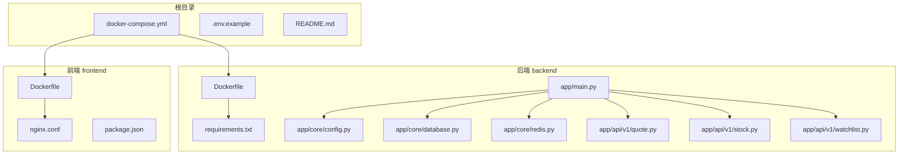
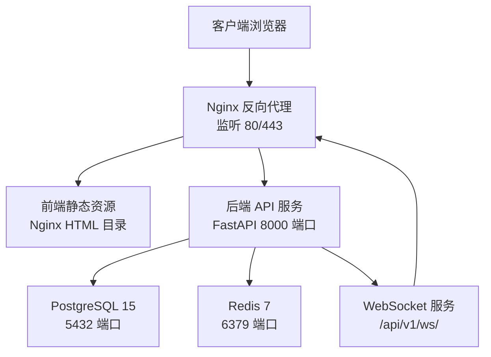
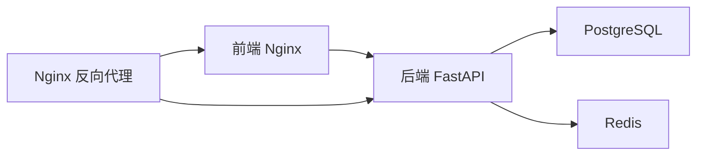

# 部署指南

<cite>
**本文引用的文件**
- [README.md](file://README.md)
- [docker-compose.yml](file://docker-compose.yml)
- [backend/Dockerfile](file://backend/Dockerfile)
- [backend/requirements.txt](file://backend/requirements.txt)
- [backend/app/main.py](file://backend/app/main.py)
- [backend/app/core/config.py](file://backend/app/core/config.py)
- [backend/app/core/database.py](file://backend/app/core/database.py)
- [backend/app/core/redis.py](file://backend/app/core/redis.py)
- [frontend/nginx.conf](file://frontend/nginx.conf)
- [frontend/Dockerfile](file://frontend/Dockerfile)
- [frontend/package.json](file://frontend/package.json)
- [backend/app/api/v1/quote.py](file://backend/app/api/v1/quote.py)
- [backend/app/api/v1/stock.py](file://backend/app/api/v1/stock.py)
- [backend/app/api/v1/watchlist.py](file://backend/app/api/v1/watchlist.py)
</cite>

## 目录
1. [简介](#简介)
2. [项目结构](#项目结构)
3. [核心组件](#核心组件)
4. [架构总览](#架构总览)
5. [详细组件分析](#详细组件分析)
6. [依赖关系分析](#依赖关系分析)
7. [性能考虑](#性能考虑)
8. [故障排查指南](#故障排查指南)
9. [结论](#结论)
10. [附录](#附录)

## 简介
本指南面向生产环境部署 Stock-View 项目，基于 Docker Compose 实现容器化编排，包含后端服务、数据库、缓存、前端静态资源与反向代理。文档覆盖以下关键主题：
- Docker Compose 编排与服务依赖
- 网络与数据卷配置
- 环境变量与配置项说明
- Nginx 反向代理配置（静态资源、API 代理、WebSocket 升级）
- 部署后验证与常见问题排查

## 项目结构
仓库采用多模块组织方式，后端为 Python/FastAPI 应用，前端为 Vue 3 应用，通过 Nginx 提供统一入口与静态资源服务。

图表来源
- [docker-compose.yml:1-54](file://docker-compose.yml#L1-L54)
- [backend/Dockerfile:1-12](file://backend/Dockerfile#L1-L12)
- [backend/requirements.txt:1-17](file://backend/requirements.txt#L1-L17)
- [backend/app/main.py:1-48](file://backend/app/main.py#L1-L48)
- [backend/app/core/config.py:1-43](file://backend/app/core/config.py#L1-L43)
- [backend/app/core/database.py:1-25](file://backend/app/core/database.py#L1-L25)
- [backend/app/core/redis.py:1-25](file://backend/app/core/redis.py#L1-L25)
- [frontend/Dockerfile:1-11](file://frontend/Dockerfile#L1-L11)
- [frontend/nginx.conf:1-30](file://frontend/nginx.conf#L1-L30)
- [frontend/package.json:1-27](file://frontend/package.json#L1-L27)

章节来源
- [README.md:92-126](file://README.md#L92-L126)

## 核心组件
- 后端服务（FastAPI）
  - 通过生命周期钩子初始化数据库与关闭 Redis 连接池
  - 提供 REST API 与 WebSocket 接口
- 数据库（PostgreSQL 15）
  - 使用异步 SQLAlchemy 2.0 连接，池化配置便于高并发
- 缓存（Redis 7）
  - 提供异步 Redis 客户端与连接池管理
- 前端（Vue 3 + Vite + Nginx）
  - 构建产物交由 Nginx 提供静态服务，并代理 API 到后端
- 反向代理（Nginx）
  - 提供静态资源服务、API 代理与 WebSocket 升级

章节来源
- [backend/app/main.py:1-48](file://backend/app/main.py#L1-L48)
- [backend/app/core/database.py:1-25](file://backend/app/core/database.py#L1-L25)
- [backend/app/core/redis.py:1-25](file://backend/app/core/redis.py#L1-L25)
- [frontend/nginx.conf:1-30](file://frontend/nginx.conf#L1-L30)
- [frontend/Dockerfile:1-11](file://frontend/Dockerfile#L1-L11)

## 架构总览
下图展示生产环境典型部署形态：Nginx 作为统一入口，转发静态资源与 API 请求至后端；后端通过异步数据库与 Redis 提供服务；数据库与缓存以独立容器运行。

图表来源
- [frontend/nginx.conf:1-30](file://frontend/nginx.conf#L1-L30)
- [backend/app/main.py:38-43](file://backend/app/main.py#L38-L43)
- [docker-compose.yml:25-50](file://docker-compose.yml#L25-L50)

## 详细组件分析

### Docker Compose 编排与服务依赖
- 服务定义
  - postgres：持久化存储，暴露 5432 端口，使用命名卷保存数据
  - redis：内存缓存，限制最大内存并设置淘汰策略，暴露 6379 端口
  - backend：基于 backend/Dockerfile 构建，注入环境变量，依赖 postgres 与 redis
  - frontend：基于前端 Dockerfile 构建，将构建产物复制到 Nginx，映射 3000:80
- 依赖关系
  - backend 依赖 postgres 与 redis，确保数据库与缓存可用后再启动
  - frontend 依赖 backend，保证 API 可用后再对外提供静态资源
- 数据卷
  - postgres_data、redis_data 用于持久化数据库与缓存数据

章节来源
- [docker-compose.yml:1-54](file://docker-compose.yml#L1-L54)

### 环境变量与配置
- 配置来源
  - 后端通过 pydantic-settings 从 .env 文件加载配置
  - 默认值在配置类中集中定义，便于本地与生产切换
- 关键配置项
  - 数据库连接：DATABASE_URL
  - 缓存连接：REDIS_URL
  - AI 适配器：AI_ADAPTER、AI_SERVICE_URL、AI_REQUEST_TIMEOUT、AI_CACHE_ENABLED、AI_CACHE_TTL、AI_RATE_LIMIT
  - Celery：CELERY_BROKER_URL、CELERY_RESULT_BACKEND
  - 行情采集：QUOTE_COLLECT_INTERVAL、QUOTE_CACHE_TTL
  - JWT：JWT_SECRET_KEY、JWT_ALGORITHM、JWT_EXPIRE_MINUTES
  - 应用环境：APP_ENV、APP_DEBUG
- 环境变量模板
  - .env.example 中列出完整变量清单，建议在生产环境按需覆盖

章节来源
- [backend/app/core/config.py:1-43](file://backend/app/core/config.py#L1-L43)
- [README.md:130-142](file://README.md#L130-L142)

### Nginx 反向代理配置
- 静态资源
  - 直接提供前端构建产物目录，支持单页应用路由回退
- API 代理
  - 将 /api/ 前缀请求转发至后端服务
  - 保留 Host、X-Real-IP、X-Forwarded-For 等头部
- WebSocket 升级
  - 对 /api/v1/ws/ 路径启用升级头与长连接超时
- 上游服务
  - upstream 指向 backend:8000

章节来源
- [frontend/nginx.conf:1-30](file://frontend/nginx.conf#L1-L30)

### 后端服务与 API 路由
- 生命周期
  - 应用启动时初始化数据库表结构，关闭时释放 Redis 连接池
- 路由模块
  - 行情相关：实时、列表、K 线、分时、盘口
  - 股票搜索：基于第三方接口的搜索能力
  - 自选股管理：增删改查与排序
- WebSocket
  - 路由注册于 /api/v1，由 Nginx 单独处理升级

章节来源
- [backend/app/main.py:1-48](file://backend/app/main.py#L1-L48)
- [backend/app/api/v1/quote.py:1-65](file://backend/app/api/v1/quote.py#L1-L65)
- [backend/app/api/v1/stock.py:1-37](file://backend/app/api/v1/stock.py#L1-L37)
- [backend/app/api/v1/watchlist.py:1-77](file://backend/app/api/v1/watchlist.py#L1-L77)

### 前端构建与镜像
- 构建阶段
  - 使用 Node 18 Alpine 安装依赖并执行构建
- 运行阶段
  - 使用 Nginx 1.25 Alpine 提供静态服务
  - 将构建产物复制到 /usr/share/nginx/html
  - 复制 Nginx 配置文件到 /etc/nginx/conf.d/default.conf
- 端口暴露
  - 容器内 80 端口，宿主机映射 3000:80

章节来源
- [frontend/Dockerfile:1-11](file://frontend/Dockerfile#L1-L11)
- [frontend/package.json:1-27](file://frontend/package.json#L1-L27)

## 依赖关系分析
- 组件耦合
  - 后端对数据库与缓存存在直接依赖，通过配置类集中管理
  - 前端通过 Nginx 间接依赖后端 API 与 WebSocket
- 外部依赖
  - PostgreSQL 与 Redis 作为外部服务，通过 Docker 网络互通
- 可能的循环依赖
  - 当前未发现直接循环依赖，但应避免在配置类中引入后端业务模块

图表来源
- [docker-compose.yml:25-50](file://docker-compose.yml#L25-L50)
- [backend/app/core/config.py:12-27](file://backend/app/core/config.py#L12-L27)
- [frontend/nginx.conf:1-30](file://frontend/nginx.conf#L1-L30)

## 性能考虑
- 数据库连接池
  - 异步引擎与会话池配置，建议根据并发与实例规格调优 pool_size 与 overflow
- 缓存策略
  - Redis 最大内存与淘汰策略可按业务峰值调整
- API 限流与缓存
  - AI 适配器支持 TTL 与速率限制，建议结合业务场景优化
- 前端静态资源
  - 合理开启压缩与缓存头，减少带宽占用

章节来源
- [backend/app/core/database.py:7-8](file://backend/app/core/database.py#L7-L8)
- [docker-compose.yml:18-18](file://docker-compose.yml#L18-L18)

## 故障排查指南
- 服务无法启动
  - 检查数据库与缓存是否就绪（depends_on 不等于初始化完成）
  - 查看后端健康检查接口与日志输出
- API 访问异常
  - 确认 Nginx 是否正确代理 /api/ 请求
  - 核对后端路由前缀与 WebSocket 升级路径
- 数据库连接失败
  - 校验 DATABASE_URL 与网络连通性
  - 检查数据库初始化脚本是否成功执行
- 缓存连接失败
  - 校验 REDIS_URL 与网络连通性
  - 观察 Redis 内存与淘汰策略是否导致键被清理
- 前端页面空白
  - 确认 Nginx 静态资源目录映射正确
  - 检查 SPA 回退规则是否生效

章节来源
- [backend/app/main.py:46-48](file://backend/app/main.py#L46-L48)
- [frontend/nginx.conf:9-29](file://frontend/nginx.conf#L9-L29)
- [docker-compose.yml:37-49](file://docker-compose.yml#L37-L49)

## 结论
通过 Docker Compose 将后端、数据库、缓存与前端整合为统一编排单元，配合 Nginx 提供稳定的反向代理与静态资源服务。生产部署建议：
- 明确环境变量与密钥管理，避免硬编码敏感信息
- 配置持久化卷与备份策略
- 监控数据库与缓存资源使用情况
- 在网关层启用 HTTPS 与访问控制

## 附录

### A. 生产环境部署步骤
- 准备工作
  - 安装 Docker 与 Docker Compose
  - 准备域名与 SSL 证书（可选）
- 克隆与构建
  - 克隆仓库并进入根目录
  - 执行构建与启动命令
- 验证服务
  - 访问前端页面与后端 API 文档
  - 调用健康检查接口确认后端状态
- 常用命令
  - 后台启动、停止、查看日志、重启服务

章节来源
- [README.md:24-42](file://README.md#L24-L42)
- [README.md:146-162](file://README.md#L146-L162)

### B. 环境变量配置清单
- 数据库连接：DATABASE_URL
- 缓存连接：REDIS_URL
- AI 适配器：AI_ADAPTER、AI_SERVICE_URL、AI_REQUEST_TIMEOUT、AI_CACHE_ENABLED、AI_CACHE_TTL、AI_RATE_LIMIT
- Celery：CELERY_BROKER_URL、CELERY_RESULT_BACKEND
- 行情采集：QUOTE_COLLECT_INTERVAL、QUOTE_CACHE_TTL
- JWT：JWT_SECRET_KEY、JWT_ALGORITHM、JWT_EXPIRE_MINUTES
- 应用环境：APP_ENV、APP_DEBUG

章节来源
- [backend/app/core/config.py:8-34](file://backend/app/core/config.py#L8-L34)
- [README.md:130-142](file://README.md#L130-L142)

### C. Nginx 反向代理要点
- 静态资源：root 与 try_files 配置
- API 代理：proxy_pass 与头部透传
- WebSocket：升级头与长连接超时

章节来源
- [frontend/nginx.conf:9-29](file://frontend/nginx.conf#L9-L29)