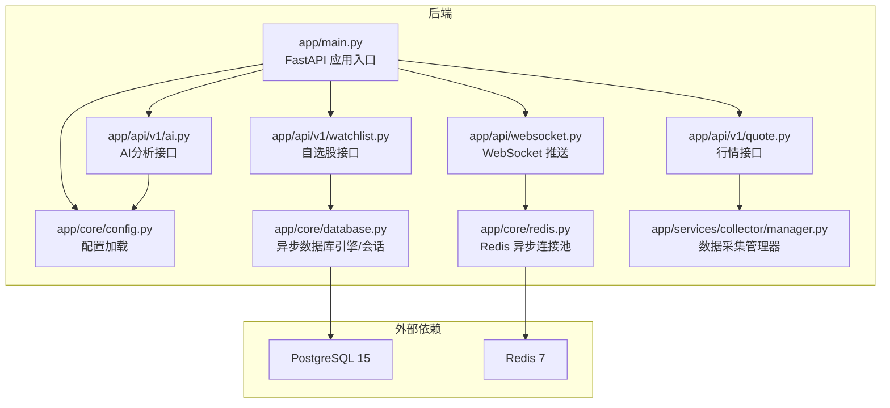
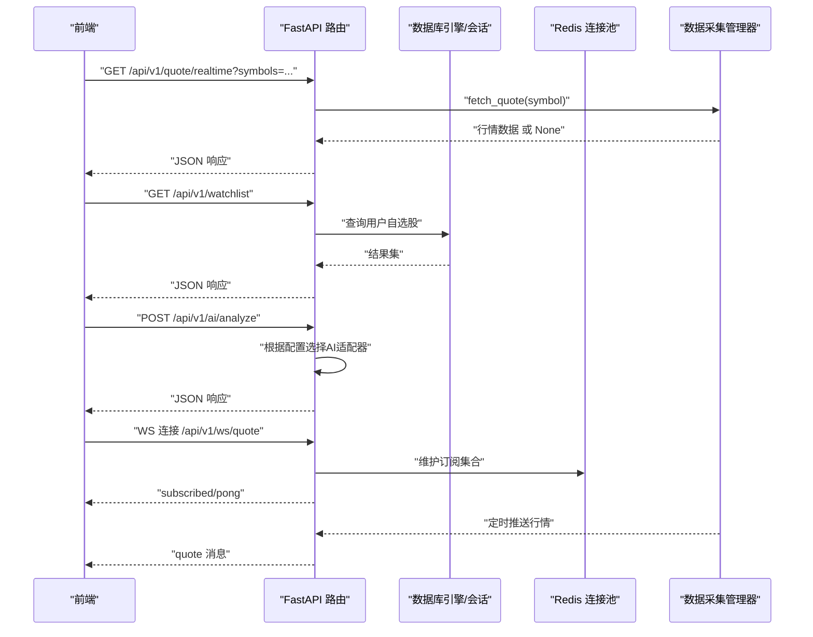
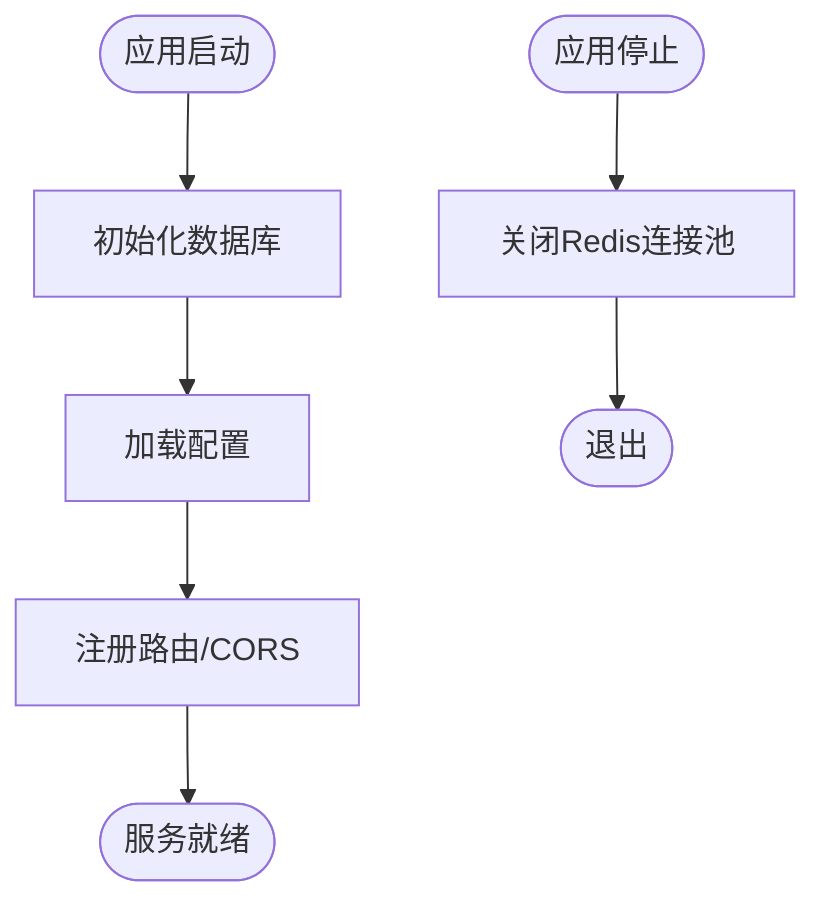
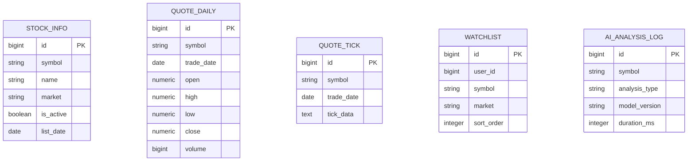
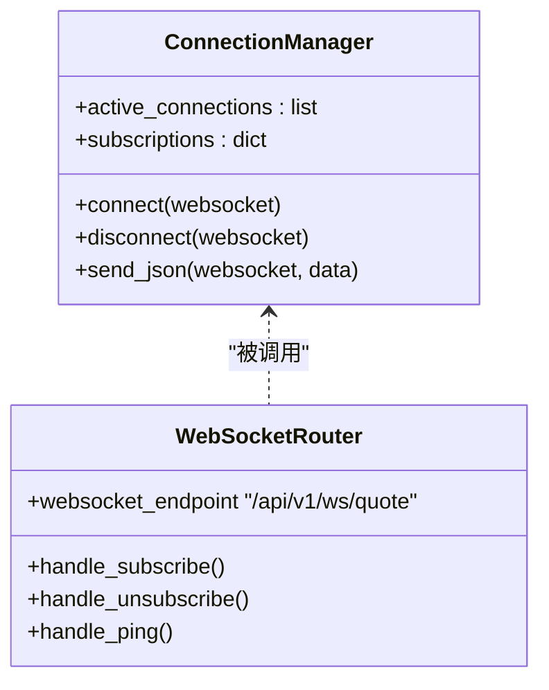
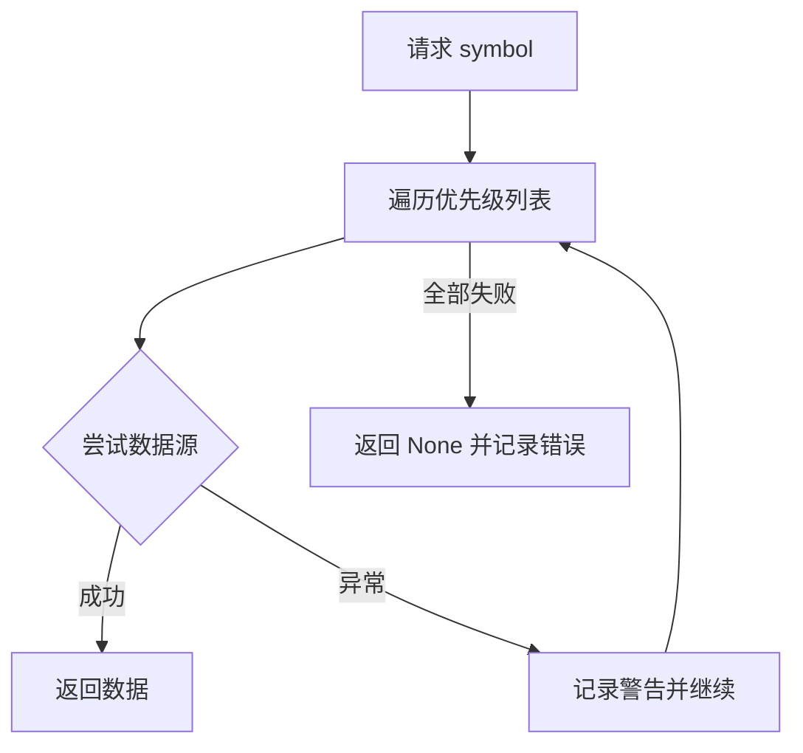
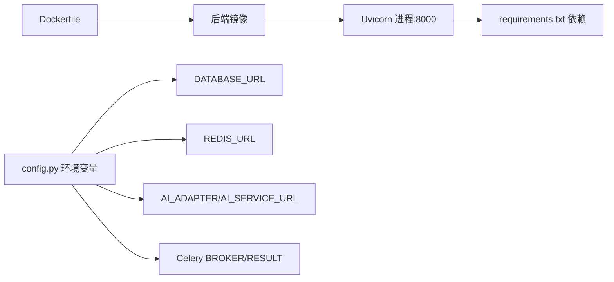

# 部署验证与监控

<cite>
**本文引用的文件**
- [README.md](file://README.md)
- [backend/Dockerfile](file://backend/Dockerfile)
- [backend/requirements.txt](file://backend/requirements.txt)
- [backend/app/main.py](file://backend/app/main.py)
- [backend/app/core/config.py](file://backend/app/core/config.py)
- [backend/app/core/database.py](file://backend/app/core/database.py)
- [backend/app/core/redis.py](file://backend/app/core/redis.py)
- [backend/app/api/v1/quote.py](file://backend/app/api/v1/quote.py)
- [backend/app/api/v1/watchlist.py](file://backend/app/api/v1/watchlist.py)
- [backend/app/api/v1/ai.py](file://backend/app/api/v1/ai.py)
- [backend/app/api/websocket.py](file://backend/app/api/websocket.py)
- [backend/app/services/collector/manager.py](file://backend/app/services/collector/manager.py)
- [backend/app/models/models.py](file://backend/app/models/models.py)
- [backend/app/schemas/schemas.py](file://backend/app/schemas/schemas.py)
</cite>

## 目录
1. [简介](#简介)
2. [项目结构](#项目结构)
3. [核心组件](#核心组件)
4. [架构总览](#架构总览)
5. [详细组件分析](#详细组件分析)
6. [依赖关系分析](#依赖关系分析)
7. [性能监控指标](#性能监控指标)
8. [日志监控配置与查看](#日志监控配置与查看)
9. [部署验证清单](#部署验证清单)
10. [常见问题排查](#常见问题排查)
11. [自动化部署脚本建议](#自动化部署脚本建议)
12. [结论](#结论)

## 简介
本指南面向Stock-View项目部署后的验证与监控，覆盖服务可用性检查、API接口测试、数据库与Redis连通性验证、功能测试清单、日志与性能监控、常见问题排查以及自动化部署脚本建议。内容基于仓库中的后端实现与文档，确保读者能以最小成本完成上线前与上线后的质量保障。

## 项目结构
后端采用FastAPI + SQLAlchemy 2.0(async) + Redis异步客户端，提供REST API与WebSocket实时推送，并通过数据采集器实现多数据源自动故障转移。前端通过Nginx代理访问后端API与静态资源。Dockerfile定义了后端镜像构建与端口暴露，README提供了快速启动与常用命令。

图表来源
- [backend/app/main.py:1-48](file://backend/app/main.py#L1-L48)
- [backend/app/core/config.py:1-43](file://backend/app/core/config.py#L1-L43)
- [backend/app/core/database.py:1-25](file://backend/app/core/database.py#L1-L25)
- [backend/app/core/redis.py:1-25](file://backend/app/core/redis.py#L1-L25)
- [backend/app/api/v1/quote.py:1-65](file://backend/app/api/v1/quote.py#L1-L65)
- [backend/app/api/v1/watchlist.py:1-77](file://backend/app/api/v1/watchlist.py#L1-L77)
- [backend/app/api/v1/ai.py:1-29](file://backend/app/api/v1/ai.py#L1-L29)
- [backend/app/api/websocket.py:1-79](file://backend/app/api/websocket.py#L1-L79)
- [backend/app/services/collector/manager.py:1-80](file://backend/app/services/collector/manager.py#L1-L80)

章节来源
- [README.md:92-126](file://README.md#L92-L126)
- [backend/Dockerfile:1-12](file://backend/Dockerfile#L1-L12)

## 核心组件
- 应用入口与生命周期：在应用启动时初始化数据库，在关闭时释放Redis连接；注册CORS与各模块路由；提供健康检查端点。
- 配置系统：从环境变量读取数据库URL、Redis URL、AI适配器、主备数据源、Celery队列、缓存TTL、JWT参数等。
- 数据库层：使用异步引擎与会话工厂，启动时创建表结构。
- Redis层：提供异步连接池封装，支持全局复用。
- API模块：行情、自选股、AI分析、WebSocket推送。
- 数据采集：多数据源优先级与故障转移策略。

章节来源
- [backend/app/main.py:1-48](file://backend/app/main.py#L1-L48)
- [backend/app/core/config.py:1-43](file://backend/app/core/config.py#L1-L43)
- [backend/app/core/database.py:1-25](file://backend/app/core/database.py#L1-L25)
- [backend/app/core/redis.py:1-25](file://backend/app/core/redis.py#L1-L25)
- [backend/app/api/v1/quote.py:1-65](file://backend/app/api/v1/quote.py#L1-L65)
- [backend/app/api/v1/watchlist.py:1-77](file://backend/app/api/v1/watchlist.py#L1-L77)
- [backend/app/api/v1/ai.py:1-29](file://backend/app/api/v1/ai.py#L1-L29)
- [backend/app/api/websocket.py:1-79](file://backend/app/api/websocket.py#L1-L79)
- [backend/app/services/collector/manager.py:1-80](file://backend/app/services/collector/manager.py#L1-L80)

## 架构总览
下图展示从客户端到后端、数据库与Redis的关键交互路径，以及WebSocket的订阅与广播流程。

图表来源
- [backend/app/api/v1/quote.py:1-65](file://backend/app/api/v1/quote.py#L1-L65)
- [backend/app/api/v1/watchlist.py:1-77](file://backend/app/api/v1/watchlist.py#L1-L77)
- [backend/app/api/v1/ai.py:1-29](file://backend/app/api/v1/ai.py#L1-L29)
- [backend/app/api/websocket.py:1-79](file://backend/app/api/websocket.py#L1-L79)
- [backend/app/services/collector/manager.py:1-80](file://backend/app/services/collector/manager.py#L1-L80)
- [backend/app/core/database.py:1-25](file://backend/app/core/database.py#L1-L25)
- [backend/app/core/redis.py:1-25](file://backend/app/core/redis.py#L1-L25)

## 详细组件分析

### 组件A：健康检查与生命周期
- 启动阶段：初始化数据库（创建表）、加载配置、注册路由、启用CORS。
- 关闭阶段：关闭Redis连接池，避免资源泄漏。
- 健康检查：提供轻量级健康端点用于探活。

图表来源
- [backend/app/main.py:13-27](file://backend/app/main.py#L13-L27)
- [backend/app/core/database.py:23-25](file://backend/app/core/database.py#L23-L25)
- [backend/app/core/redis.py:21-25](file://backend/app/core/redis.py#L21-L25)

章节来源
- [backend/app/main.py:1-48](file://backend/app/main.py#L1-L48)

### 组件B：数据库连接与模型
- 使用异步SQLAlchemy引擎与会话工厂，启动时创建所有表。
- 模型包含股票基础信息、日K、分时、自选股、AI分析日志等。

图表来源
- [backend/app/models/models.py:1-74](file://backend/app/models/models.py#L1-L74)

章节来源
- [backend/app/core/database.py:1-25](file://backend/app/core/database.py#L1-L25)
- [backend/app/models/models.py:1-74](file://backend/app/models/models.py#L1-L74)

### 组件C：Redis连接与WebSocket推送
- Redis连接池按需创建，统一通过异步客户端访问。
- WebSocket管理器维护活跃连接与订阅集合，支持订阅/退订与心跳。

图表来源
- [backend/app/api/websocket.py:12-79](file://backend/app/api/websocket.py#L12-L79)

章节来源
- [backend/app/core/redis.py:1-25](file://backend/app/core/redis.py#L1-L25)
- [backend/app/api/websocket.py:1-79](file://backend/app/api/websocket.py#L1-L79)

### 组件D：数据采集与故障转移
- 管理器按优先级尝试不同数据源，任一成功即返回，否则记录警告并最终返回None。
- 支持实时、列表、K线、分时、盘口等接口的数据采集。

图表来源
- [backend/app/services/collector/manager.py:12-77](file://backend/app/services/collector/manager.py#L12-L77)

章节来源
- [backend/app/services/collector/manager.py:1-80](file://backend/app/services/collector/manager.py#L1-L80)

## 依赖关系分析
- 后端镜像暴露8000端口，容器内运行Uvicorn。
- 依赖包通过requirements.txt声明，包含FastAPI、SQLAlchemy异步、Redis、Celery、HTTPX、Pydantic、TA-Lib、Pandas/Numpy等。
- 配置项决定数据库URL、Redis URL、AI服务地址、Celery队列、缓存TTL、JWT参数等。

图表来源
- [backend/Dockerfile:1-12](file://backend/Dockerfile#L1-L12)
- [backend/requirements.txt:1-17](file://backend/requirements.txt#L1-L17)
- [backend/app/core/config.py:1-43](file://backend/app/core/config.py#L1-L43)

章节来源
- [backend/Dockerfile:1-12](file://backend/Dockerfile#L1-L12)
- [backend/requirements.txt:1-17](file://backend/requirements.txt#L1-L17)
- [backend/app/core/config.py:1-43](file://backend/app/core/config.py#L1-L43)

## 性能监控指标
以下为建议的关键指标，便于在生产环境中持续观测：
- CPU使用率：容器/主机层面统计进程CPU占用。
- 内存占用：RSS与堆外内存，关注GC与长连接导致的内存增长。
- 数据库连接数：并发会话数、空闲连接、等待锁的事务数。
- Redis内存使用：used_memory、keyspace命中率、慢查询日志。
- API响应时间：P50/P95/P99延迟、错误率、吞吐量。
- WebSocket连接数：活跃连接、订阅数量、消息丢弃率。
- 数据采集成功率：各数据源的成功率与耗时分布。

[本节为通用指导，不直接分析具体文件]

## 日志监控配置与查看
- Docker容器日志：使用Compose日志命令查看后端服务输出，结合容器标签过滤。
- 应用日志：后端使用标准logging模块，可通过日志级别与格式控制输出；建议接入集中式日志（如ELK/Fluentd）。
- 数据库日志：PostgreSQL可开启慢查询日志与通用日志，定位慢SQL与锁等待。
- Redis日志：开启慢查询日志与INFO统计，观察内存与过期淘汰情况。
- 建议：将日志输出到stdout/stderr，交由Docker/容器编排系统统一收集。

章节来源
- [README.md:148-162](file://README.md#L148-L162)
- [backend/app/api/websocket.py:1-79](file://backend/app/api/websocket.py#L1-L79)

## 部署验证清单
- 服务可用性检查
  - 访问健康端点：GET /api/v1/health，确认返回状态正常。
  - 访问API文档：GET /docs，确认OpenAPI文档可访问。
  - 访问前端页面：确认静态资源与代理工作正常。
- API接口测试
  - 行情接口：GET /api/v1/quote/realtime、/api/v1/quote/list、/api/v1/quote/kline、/api/v1/quote/timeline、/api/v1/quote/orderbook。
  - 自选股接口：GET /api/v1/watchlist、POST /api/v1/watchlist、DELETE /api/v1/watchlist/{symbol}、PUT /api/v1/watchlist/sort。
  - AI分析接口：POST /api/v1/ai/analyze、GET /api/v1/ai/history、GET /api/v1/ai/model-info。
- 数据库连接验证
  - 在数据库侧确认表存在（stock_info、watchlist、ai_analysis_log等）。
  - 执行简单查询验证连接与权限。
- Redis连接测试
  - 使用Redis客户端连接并执行PING、INFO，确认连通性与基本指标。
- WebSocket推送验证
  - 建立WS连接，发送订阅消息，接收quote类型消息，验证心跳与断线重连。
- 数据采集验证
  - 调用实时/列表接口，确认至少一个数据源返回有效数据；若失败，检查日志与网络连通性。

章节来源
- [backend/app/main.py:46-48](file://backend/app/main.py#L46-L48)
- [backend/app/api/v1/quote.py:1-65](file://backend/app/api/v1/quote.py#L1-L65)
- [backend/app/api/v1/watchlist.py:1-77](file://backend/app/api/v1/watchlist.py#L1-L77)
- [backend/app/api/v1/ai.py:1-29](file://backend/app/api/v1/ai.py#L1-L29)
- [backend/app/api/websocket.py:1-79](file://backend/app/api/websocket.py#L1-L79)
- [backend/app/services/collector/manager.py:1-80](file://backend/app/services/collector/manager.py#L1-L80)

## 常见问题排查
- 容器启动失败
  - 检查Dockerfile构建日志与依赖安装是否成功。
  - 确认端口未被占用，容器映射正确。
- 服务端口冲突
  - 修改映射端口或停止占用进程；确认Compose服务端口配置。
- 数据库连接异常
  - 校验DATABASE_URL格式与可达性；确认PostgreSQL服务运行与认证配置。
  - 检查连接池参数（pool_size/max_overflow）与并发压力。
- Redis连接问题
  - 校验REDIS_URL与网络连通；确认Redis服务运行与密码/DB索引。
  - 观察慢查询与内存峰值，必要时调整配置。
- WebSocket无法推送
  - 检查WS连接建立与订阅消息；确认广播函数被触发且无异常。
- 数据采集失败
  - 查看采集器日志与网络超时；切换主备数据源进行验证。

章节来源
- [backend/Dockerfile:1-12](file://backend/Dockerfile#L1-L12)
- [backend/app/core/config.py:1-43](file://backend/app/core/config.py#L1-L43)
- [backend/app/core/database.py:1-25](file://backend/app/core/database.py#L1-L25)
- [backend/app/core/redis.py:1-25](file://backend/app/core/redis.py#L1-L25)
- [backend/app/api/websocket.py:1-79](file://backend/app/api/websocket.py#L1-L79)
- [backend/app/services/collector/manager.py:1-80](file://backend/app/services/collector/manager.py#L1-L80)

## 自动化部署脚本建议
- 构建与启动
  - 使用Compose构建镜像并后台启动所有服务。
  - 提供一键停止与重启命令，便于回滚与修复。
- 健康检查钩子
  - 在启动后轮询健康端点，直到返回成功再放行流量。
- 配置注入
  - 通过环境变量文件或CI密钥管理注入敏感配置。
- 日志与告警
  - 将容器日志输出到标准流，配合集中式日志与告警规则。
- 回滚策略
  - 保留上一个镜像版本，出现异常时快速回滚。

章节来源
- [README.md:148-162](file://README.md#L148-L162)

## 结论
通过上述验证与监控体系，可以系统性地保证Stock-View在生产环境的稳定性与可观测性。建议在上线前完成端到端的功能验证与性能基线测试，并在上线后持续关注关键指标与日志，结合自动化脚本提升运维效率与故障恢复速度。