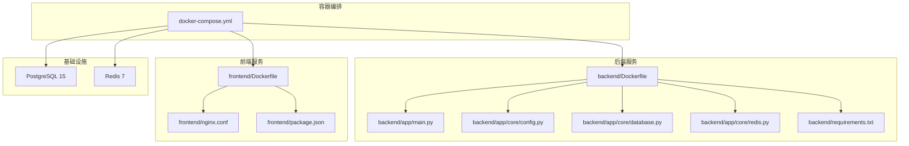
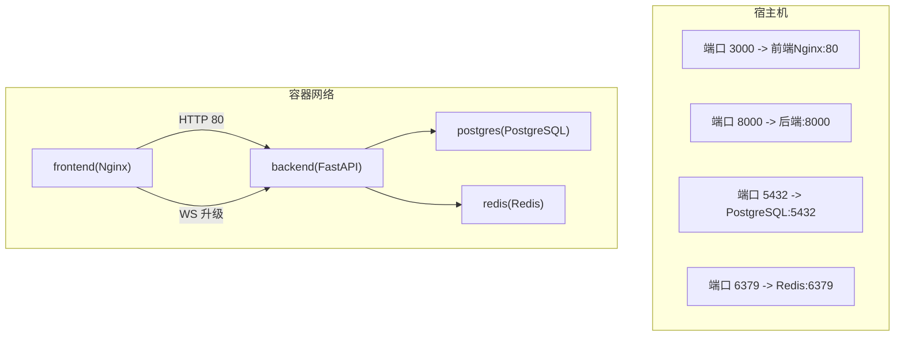
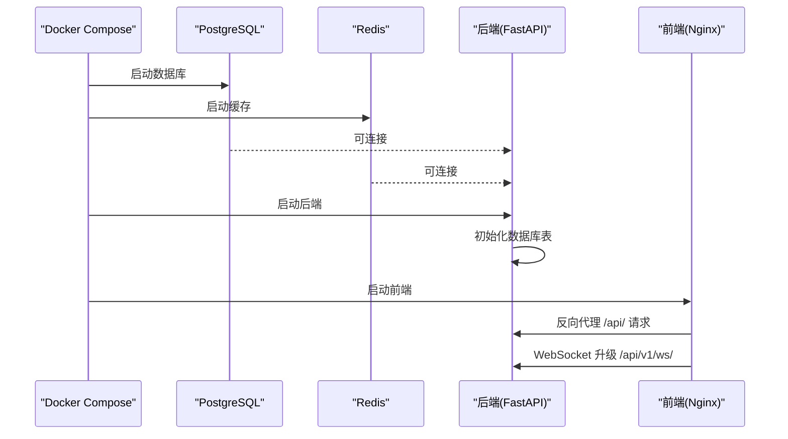
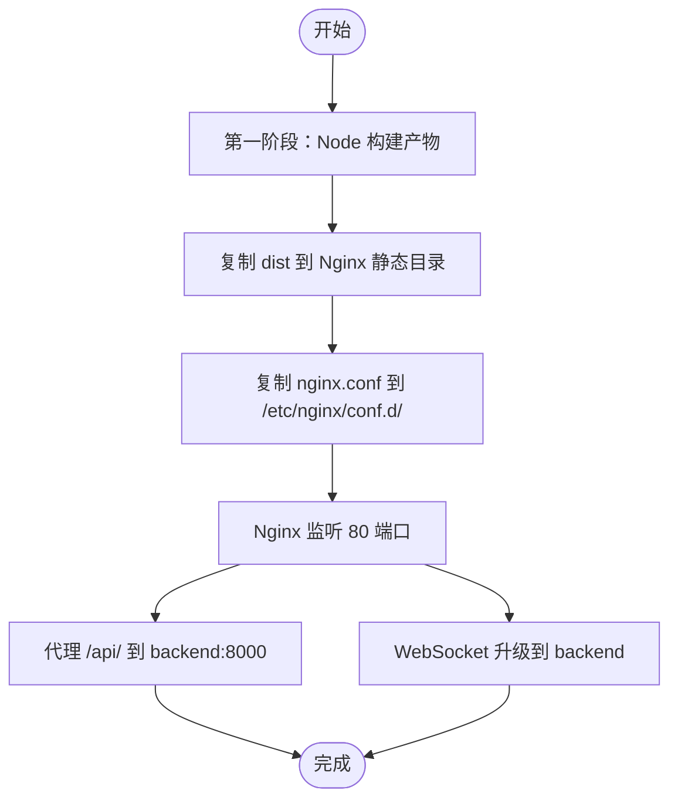
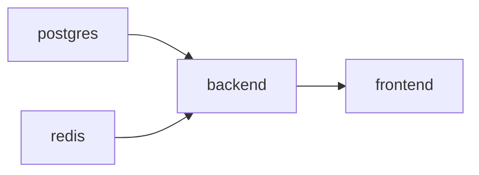

# 容器化部署

<cite>
**本文引用的文件**
- [docker-compose.yml](file://docker-compose.yml)
- [backend/Dockerfile](file://backend/Dockerfile)
- [frontend/Dockerfile](file://frontend/Dockerfile)
- [backend/app/main.py](file://backend/app/main.py)
- [backend/app/core/config.py](file://backend/app/core/config.py)
- [backend/app/core/database.py](file://backend/app/core/database.py)
- [backend/app/core/redis.py](file://backend/app/core/redis.py)
- [backend/requirements.txt](file://backend/requirements.txt)
- [frontend/package.json](file://frontend/package.json)
- [frontend/nginx.conf](file://frontend/nginx.conf)
- [README.md](file://README.md)
</cite>

## 目录
1. [简介](#简介)
2. [项目结构](#项目结构)
3. [核心组件](#核心组件)
4. [架构总览](#架构总览)
5. [详细组件分析](#详细组件分析)
6. [依赖关系分析](#依赖关系分析)
7. [性能考虑](#性能考虑)
8. [故障排查指南](#故障排查指南)
9. [结论](#结论)
10. [附录](#附录)

## 简介
本文件面向DevOps工程师，提供Stock-View项目的容器化部署完整指南。内容涵盖：
- Docker Compose编排配置详解：PostgreSQL数据库、Redis缓存、后端API服务、前端应用的容器定义与依赖关系
- Dockerfile构建流程：Python后端环境配置、Node.js前端构建优化、多阶段构建策略
- 完整部署命令示例、容器启动顺序、依赖关系管理
- 容器网络配置、数据卷挂载、环境变量传递的具体实现
- 面向生产的最佳实践与可执行脚本建议

## 项目结构
仓库采用前后端分离的多模块结构，配合Docker Compose进行统一编排：
- 后端：FastAPI + SQLAlchemy 2.0(async) + PostgreSQL + Redis
- 前端：Vue 3 + Vite + Nginx反向代理
- 编排：docker-compose.yml统一管理四类服务

图表来源
- [docker-compose.yml:1-54](file://docker-compose.yml#L1-L54)
- [backend/Dockerfile:1-12](file://backend/Dockerfile#L1-L12)
- [frontend/Dockerfile:1-11](file://frontend/Dockerfile#L1-L11)
- [backend/app/main.py:1-48](file://backend/app/main.py#L1-L48)
- [backend/app/core/config.py:1-43](file://backend/app/core/config.py#L1-L43)
- [backend/app/core/database.py:1-25](file://backend/app/core/database.py#L1-L25)
- [backend/app/core/redis.py:1-25](file://backend/app/core/redis.py#L1-L25)
- [backend/requirements.txt:1-17](file://backend/requirements.txt#L1-L17)
- [frontend/nginx.conf:1-30](file://frontend/nginx.conf#L1-L30)
- [frontend/package.json:1-27](file://frontend/package.json#L1-L27)

章节来源
- [README.md:1-163](file://README.md#L1-L163)
- [docker-compose.yml:1-54](file://docker-compose.yml#L1-L54)

## 核心组件
- PostgreSQL数据库服务
  - 使用官方alpine镜像，持久化数据卷，暴露5432端口
  - 初始化数据库、用户、密码，便于快速启动
- Redis缓存服务
  - 使用官方alpine镜像，设置内存上限与淘汰策略，持久化数据卷
  - 提供高性能缓存与会话存储能力
- 后端API服务
  - Python 3.11 slim镜像，安装构建工具链，pip离线安装依赖
  - Uvicorn单工作进程启动，监听0.0.0.0:8000
  - 通过环境变量连接数据库与Redis，支持AI适配器与调试开关
- 前端应用服务
  - 多阶段构建：第一阶段使用node:18-alpine安装依赖与打包；第二阶段基于nginx:1.25-alpine提供静态资源
  - Nginx反向代理：静态资源直出，/api前缀转发至后端，WebSocket升级路径特殊处理

章节来源
- [docker-compose.yml:3-50](file://docker-compose.yml#L3-L50)
- [backend/Dockerfile:1-12](file://backend/Dockerfile#L1-L12)
- [frontend/Dockerfile:1-11](file://frontend/Dockerfile#L1-L11)
- [frontend/nginx.conf:1-30](file://frontend/nginx.conf#L1-L30)

## 架构总览
下图展示容器间的网络拓扑、端口映射与服务依赖关系。

图表来源
- [docker-compose.yml:12-23](file://docker-compose.yml#L12-L23)
- [frontend/nginx.conf:15-29](file://frontend/nginx.conf#L15-L29)
- [backend/app/main.py:39-43](file://backend/app/main.py#L39-L43)

## 详细组件分析

### PostgreSQL数据库服务
- 镜像与版本：postgres:15-alpine
- 环境变量：数据库名、用户名、密码
- 数据卷：postgres_data，确保数据持久化
- 端口映射：5432
- 重启策略：always
- 启动顺序：优先于后端服务，后端通过depends_on等待其可用

章节来源
- [docker-compose.yml:4-14](file://docker-compose.yml#L4-L14)

### Redis缓存服务
- 镜像与版本：redis:7-alpine
- 内存限制：最大256MB，LRU淘汰策略
- 数据卷：redis_data
- 端口映射：6379
- 重启策略：always
- 启动顺序：与PostgreSQL并行，后端通过depends_on等待

章节来源
- [docker-compose.yml:16-23](file://docker-compose.yml#L16-L23)

### 后端API服务（FastAPI）
- 镜像构建：基于python:3.11-slim，安装build-essential，pip离线安装requirements.txt
- 工作目录：/app
- 端口暴露：8000
- 启动命令：uvicorn监听0.0.0.0:8000，单工作进程
- 环境变量：
  - DATABASE_URL：指向postgres容器
  - REDIS_URL：指向redis容器
  - AI_ADAPTER：mock
  - APP_ENV：development
  - APP_DEBUG：true
- 依赖关系：depends_on postgres与redis
- 生命周期：应用启动时初始化数据库表，关闭时释放Redis连接

图表来源
- [docker-compose.yml:25-50](file://docker-compose.yml#L25-L50)
- [backend/app/main.py:13-27](file://backend/app/main.py#L13-L27)
- [backend/app/core/database.py:23-25](file://backend/app/core/database.py#L23-L25)
- [frontend/nginx.conf:15-29](file://frontend/nginx.conf#L15-L29)

章节来源
- [docker-compose.yml:25-40](file://docker-compose.yml#L25-L40)
- [backend/Dockerfile:1-12](file://backend/Dockerfile#L1-L12)
- [backend/app/main.py:1-48](file://backend/app/main.py#L1-L48)
- [backend/app/core/config.py:1-43](file://backend/app/core/config.py#L1-L43)
- [backend/app/core/database.py:1-25](file://backend/app/core/database.py#L1-L25)
- [backend/app/core/redis.py:1-25](file://backend/app/core/redis.py#L1-L25)

### 前端应用服务（Nginx）
- 多阶段构建：
  - 第一阶段：node:18-alpine，安装依赖并执行构建
  - 第二阶段：nginx:1.25-alpine，复制dist与nginx.conf
- 端口映射：3000:80
- Nginx配置要点：
  - 静态资源：root + try_files回退到index.html
  - API代理：/api/转发至backend:8000
  - WebSocket：/api/v1/ws/升级为HTTP/1.1并设置Connection: upgrade
- 依赖关系：depends_on backend

图表来源
- [frontend/Dockerfile:1-11](file://frontend/Dockerfile#L1-L11)
- [frontend/nginx.conf:1-30](file://frontend/nginx.conf#L1-L30)

章节来源
- [docker-compose.yml:42-50](file://docker-compose.yml#L42-L50)
- [frontend/Dockerfile:1-11](file://frontend/Dockerfile#L1-L11)
- [frontend/nginx.conf:1-30](file://frontend/nginx.conf#L1-L30)
- [frontend/package.json:1-27](file://frontend/package.json#L1-L27)

### 环境变量与配置
- 后端配置加载：通过pydantic-settings从.env文件读取，支持缓存与类型校验
- 默认值覆盖：compose中通过environment覆盖默认连接串
- 关键变量：
  - DATABASE_URL：连接postgres容器
  - REDIS_URL：连接redis容器
  - AI_ADAPTER：mock
  - APP_ENV：development
  - APP_DEBUG：true
  - PRIMARY_DATA_SOURCE/FALLBACK_DATA_SOURCE：数据源选择

章节来源
- [backend/app/core/config.py:1-43](file://backend/app/core/config.py#L1-L43)
- [docker-compose.yml:29-35](file://docker-compose.yml#L29-L35)
- [README.md:130-142](file://README.md#L130-L142)

## 依赖关系分析
- 容器间依赖
  - backend依赖postgres与redis（depends_on）
  - frontend依赖backend（depends_on）
- 端口与网络
  - 前端Nginx对外暴露3000:80
  - 后端Uvicorn对外暴露8000:8000
  - 数据库与缓存分别暴露5432与6379
- 数据持久化
  - postgres_data与redis_data命名卷，避免数据丢失
- 启动顺序
  - Compose按定义顺序启动，但depends_on仅保证容器启动顺序，不保证服务就绪。生产建议在后端增加健康检查与重试逻辑。

图表来源
- [docker-compose.yml:37-49](file://docker-compose.yml#L37-L49)

章节来源
- [docker-compose.yml:1-54](file://docker-compose.yml#L1-L54)

## 性能考虑
- 后端并发与资源
  - 当前使用单工作进程，适合开发与小规模测试。生产建议根据CPU核数调整workers数量，并启用Gunicorn替代Uvicorn以获得更好的稳定性
- 数据库连接池
  - SQLAlchemy异步引擎默认池大小与溢出参数合理，可根据并发请求调优
- 缓存策略
  - Redis内存限制256MB，适合中小规模数据缓存。生产需结合业务量评估容量与淘汰策略
- 前端构建优化
  - 多阶段构建减少最终镜像体积；生产建议开启压缩与缓存头配置
- 网络与代理
  - Nginx作为反向代理，建议开启gzip压缩与静态资源缓存头，提升首屏性能

## 故障排查指南
- 健康检查
  - 后端提供健康接口，可通过curl或浏览器访问后端健康端点验证服务状态
- 日志查看
  - 使用docker compose logs -f backend查看后端日志流
  - 使用docker compose logs -f frontend查看前端Nginx错误日志
- 端口冲突
  - 若宿主机端口被占用，修改docker-compose.yml中的端口映射
- 数据卷问题
  - 如需清理数据库/缓存数据，删除对应命名卷并重建服务
- 环境变量
  - 确保DATABASE_URL与REDIS_URL指向正确的容器名称与端口，避免localhost导致容器内解析失败

章节来源
- [backend/app/main.py:46-48](file://backend/app/main.py#L46-L48)
- [README.md:146-162](file://README.md#L146-L162)

## 结论
本容器化方案通过Docker Compose实现了PostgreSQL、Redis、后端API与前端应用的一键编排，具备清晰的依赖关系与合理的数据持久化策略。建议在生产环境中进一步完善：
- 后端使用Gunicorn + 多worker模式
- 增加后端健康检查与优雅停机
- 前端启用gzip与缓存头
- 数据库与Redis增加备份与监控

## 附录

### 部署命令与最佳实践
- 一键启动（推荐）
  - docker compose up --build
- 后台启动
  - docker compose up -d
- 停止与清理
  - docker compose down
- 查看日志
  - docker compose logs -f backend
  - docker compose logs -f frontend
- 重启服务
  - docker compose restart backend
  - docker compose restart frontend

章节来源
- [README.md:146-162](file://README.md#L146-L162)

### 环境变量清单
- DATABASE_URL：PostgreSQL连接串，默认指向postgres容器
- REDIS_URL：Redis连接串，默认指向redis容器
- AI_ADAPTER：AI适配器（mock/rule），默认mock
- APP_ENV：运行环境，默认development
- APP_DEBUG：调试模式，默认true
- PRIMARY_DATA_SOURCE：主数据源，默认eastmoney
- FALLBACK_DATA_SOURCE：备用数据源，默认sina

章节来源
- [backend/app/core/config.py:12-27](file://backend/app/core/config.py#L12-L27)
- [docker-compose.yml:29-35](file://docker-compose.yml#L29-L35)
- [README.md:130-142](file://README.md#L130-L142)