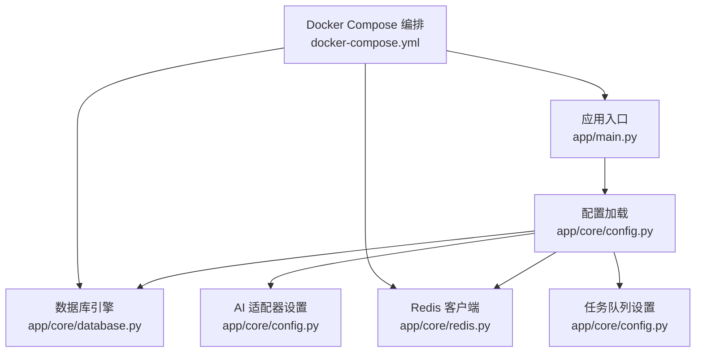
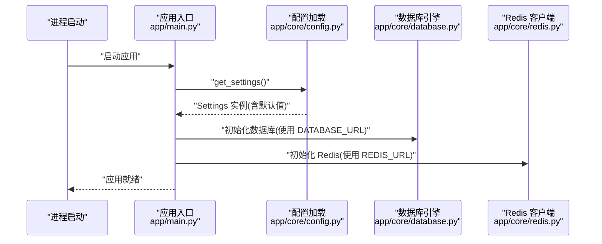
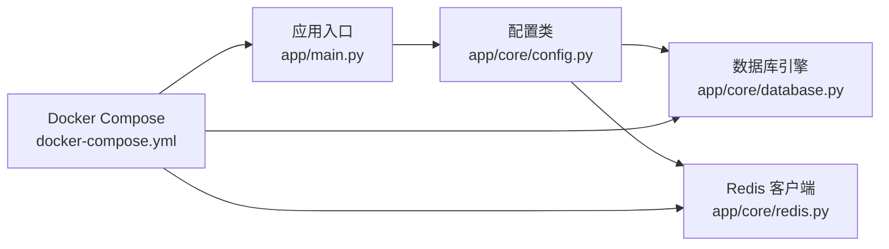

# 环境配置

<cite>
**本文引用的文件**
- [backend/app/core/config.py](file://backend/app/core/config.py)
- [backend/app/main.py](file://backend/app/main.py)
- [backend/app/core/database.py](file://backend/app/core/database.py)
- [backend/app/core/redis.py](file://backend/app/core/redis.py)
- [Stock-View 软件开发文档/开发文档.md](file://Stock-View 软件开发文档/开发文档.md)
- [docker-compose.yml](file://docker-compose.yml)
</cite>

## 目录
1. [简介](#简介)
2. [项目结构](#项目结构)
3. [核心组件](#核心组件)
4. [架构总览](#架构总览)
5. [详细组件分析](#详细组件分析)
6. [依赖分析](#依赖分析)
7. [性能考虑](#性能考虑)
8. [故障排查指南](#故障排查指南)
9. [结论](#结论)
10. [附录](#附录)

## 简介
本文件为 Stock-View 的环境配置管理文档，聚焦后端应用的配置模型、默认值、运行时加载方式以及在开发与生产环境中的差异要点。内容覆盖数据库连接、Redis 缓存、AI 适配器、任务队列、JWT、采集与缓存策略等关键配置项，并提供安全与运维最佳实践、配置验证与优先级规则、以及面向系统管理员的故障排查方法。

## 项目结构
后端通过统一的配置类集中管理所有运行时参数，应用启动时加载环境变量并注入到数据库引擎、Redis 连接、AI 适配器、任务队列等模块中。Docker Compose 提供了生产级编排示例，展示了服务间依赖与环境变量传递方式。

**图表来源**
- [backend/app/main.py:10](file://backend/app/main.py#L10)
- [backend/app/core/config.py:5-43](file://backend/app/core/config.py#L5-L43)
- [backend/app/core/database.py:7](file://backend/app/core/database.py#L7)
- [backend/app/core/redis.py:10-18](file://backend/app/core/redis.py#L10-L18)
- [docker-compose.yml](file://docker-compose.yml)

**章节来源**
- [backend/app/main.py:10-48](file://backend/app/main.py#L10-L48)
- [backend/app/core/config.py:5-43](file://backend/app/core/config.py#L5-L43)
- [backend/app/core/database.py:1-25](file://backend/app/core/database.py#L1-L25)
- [backend/app/core/redis.py:1-25](file://backend/app/core/redis.py#L1-L25)
- [Stock-View 软件开发文档/开发文档.md:1883-2325](file://Stock-View 软件开发文档/开发文档.md#L1883-L2325)

## 核心组件
- 配置模型：基于 pydantic-settings 的 Settings 类，定义了全部运行时配置项及其默认值；通过装饰器实现单例缓存。
- 应用入口：FastAPI 应用在启动时调用配置加载函数，确保全局一致的配置实例。
- 数据库引擎：根据 DATABASE_URL 初始化异步引擎，并依据调试开关启用 SQL 输出。
- Redis 客户端：解析 REDIS_URL 并复用连接池，提供全局访问与优雅关闭。
- AI 与任务队列：AI 适配器、超时、缓存、限流、Celery Broker/Backend 等均来自配置。

**章节来源**
- [backend/app/core/config.py:5-43](file://backend/app/core/config.py#L5-L43)
- [backend/app/main.py:10-48](file://backend/app/main.py#L10-L48)
- [backend/app/core/database.py:7](file://backend/app/core/database.py#L7)
- [backend/app/core/redis.py:10-18](file://backend/app/core/redis.py#L10-L18)

## 架构总览
下图展示配置在系统中的加载与使用路径，以及开发与生产环境的关键差异点。

**图表来源**
- [backend/app/main.py:10-48](file://backend/app/main.py#L10-L48)
- [backend/app/core/config.py:41-43](file://backend/app/core/config.py#L41-L43)
- [backend/app/core/database.py:7](file://backend/app/core/database.py#L7)
- [backend/app/core/redis.py:10-18](file://backend/app/core/redis.py#L10-L18)

## 详细组件分析

### 配置模型与默认值
- 环境与调试
  - APP_ENV：应用环境，默认 development
  - APP_DEBUG：调试模式，默认 True
- 安全与认证
  - APP_SECRET_KEY：应用密钥，默认 dev-secret-key
  - JWT_SECRET_KEY、JWT_ALGORITHM、JWT_EXPIRE_MINUTES：JWT 相关配置
- 数据库
  - DATABASE_URL：PostgreSQL 异步驱动连接串，默认本地开发地址
- 缓存与中间件
  - REDIS_URL：Redis 连接串，默认本地开发地址
- 数据源与采集
  - PRIMARY_DATA_SOURCE、FALLBACK_DATA_SOURCE：主备数据源名称
  - QUOTE_COLLECT_INTERVAL、QUOTE_CACHE_TTL：行情采集与缓存 TTL
- AI 适配器
  - AI_ADAPTER：AI 适配器名称，默认 mock
  - AI_SERVICE_URL：AI 服务地址，默认本地端口
  - AI_REQUEST_TIMEOUT：请求超时秒数，默认 30
  - AI_CACHE_ENABLED、AI_CACHE_TTL：缓存开关与 TTL
  - AI_RATE_LIMIT：速率限制（具体语义由上层逻辑定义）
- 任务队列
  - CELERY_BROKER_URL、CELERY_RESULT_BACKEND：Celery 消息与结果存储
- 配置加载
  - env_file=".env"、env_file_encoding="utf-8"：指定 .env 文件与编码

上述字段均在配置类中声明并提供默认值，未显式设置时将采用默认值。

**章节来源**
- [backend/app/core/config.py:8-34](file://backend/app/core/config.py#L8-L34)
- [backend/app/core/config.py:36-38](file://backend/app/core/config.py#L36-L38)

### 数据库引擎初始化
- 使用 DATABASE_URL 创建异步引擎
- echo 参数由 APP_DEBUG 决定是否输出 SQL
- 连接池大小与溢出由代码内常量设定

**章节来源**
- [backend/app/core/database.py:7](file://backend/app/core/database.py#L7)

### Redis 客户端初始化
- 使用 REDIS_URL 创建异步客户端
- 全局连接池复用，提供关闭钩子以优雅释放

**章节来源**
- [backend/app/core/redis.py:10-18](file://backend/app/core/redis.py#L10-L18)

### 应用启动与生命周期
- 应用启动时初始化数据库
- 应用关闭时关闭 Redis 连接

**章节来源**
- [backend/app/main.py:13-20](file://backend/app/main.py#L13-L20)

### 开发 vs 生产环境差异
- 环境标识：APP_ENV 默认 development，生产应设为 production
- 调试模式：APP_DEBUG 默认 True，生产建议 False 以避免 SQL 泄露与性能损耗
- 日志级别：可通过 APP_ENV 控制（如 production 使用 info 或更高），当前代码未显式读取该变量，建议在日志配置处按环境切换
- 缓存策略：生产可开启更严格的缓存 TTL 与限流，结合 AI_CACHE_ENABLED/AI_CACHE_TTL/AI_RATE_LIMIT 调整
- 外部服务：生产环境使用容器网络域名（如 postgres、redis）而非 localhost

以上差异在 Docker Compose 示例中有体现，服务间通过环境变量传递数据库与 Redis 地址。

**章节来源**
- [Stock-View 软件开发文档/开发文档.md:1883-2325](file://Stock-View 软件开发文档/开发文档.md#L1883-L2325)

### 配置验证机制、默认值与优先级
- 验证机制：基于 pydantic-settings 的类型校验与默认值填充
- 加载顺序（从低到高，后者覆盖前者）：
  1) 配置类中的默认值
  2) .env 文件（env_file 指定）
  3) 进程环境变量（如 Docker Compose 的 environment 字段）
- 注意：当前代码未显式处理 .env.example 文件，建议在 CI/CD 中将 .env.example 作为模板并在部署前生成 .env

**章节来源**
- [backend/app/core/config.py:36-38](file://backend/app/core/config.py#L36-L38)
- [Stock-View 软件开发文档/开发文档.md:1883-2325](file://Stock-View 软件开发文档/开发文档.md#L1883-L2325)

### 安全管理最佳实践
- 敏感信息保护
  - 不将 .env/.env.example 提交至版本库；使用 .gitignore 已包含 .env
  - 在生产环境使用密钥管理服务或容器编排的机密管理功能
- 环境隔离
  - 开发、测试、生产分别维护独立的 .env 文件与 Docker Compose 环境块
- 配置热更新
  - 当前实现为启动时一次性加载；若需热更新，可在上层增加监听与重新加载逻辑（例如监听 .env 变化后重建配置实例）

**章节来源**
- [backend/app/core/config.py:36-38](file://backend/app/core/config.py#L36-L38)
- [Stock-View 软件开发文档/开发文档.md:1883-2325](file://Stock-View 软件开发文档/开发文档.md#L1883-L2325)

## 依赖分析
- 配置对数据库与 Redis 的依赖是直接且强耦合的：数据库引擎与 Redis 客户端均直接使用配置项
- 应用入口对配置的依赖体现在启动与关闭生命周期中
- Docker Compose 对配置的依赖体现在服务间通过环境变量传递 DATABASE_URL 与 REDIS_URL

**图表来源**
- [backend/app/core/config.py:5-43](file://backend/app/core/config.py#L5-L43)
- [backend/app/core/database.py:7](file://backend/app/core/database.py#L7)
- [backend/app/core/redis.py:10-18](file://backend/app/core/redis.py#L10-L18)
- [backend/app/main.py:10-48](file://backend/app/main.py#L10-L48)
- [docker-compose.yml](file://docker-compose.yml)

**章节来源**
- [backend/app/core/config.py:5-43](file://backend/app/core/config.py#L5-L43)
- [backend/app/core/database.py:7](file://backend/app/core/database.py#L7)
- [backend/app/core/redis.py:10-18](file://backend/app/core/redis.py#L10-L18)
- [backend/app/main.py:10-48](file://backend/app/main.py#L10-L48)
- [docker-compose.yml](file://docker-compose.yml)

## 性能考虑
- 调试模式：APP_DEBUG=True 会开启 SQL 回显，影响性能与日志体积，生产建议关闭
- 连接池：数据库连接池参数在代码中固定，如需调整请在相应模块修改
- 缓存与限流：AI 侧缓存与限流参数直接影响外部服务压力与响应时间，建议结合业务峰值进行压测与调优
- 采集频率：QUOTE_COLLECT_INTERVAL 与 QUOTE_CACHE_TTL 影响数据新鲜度与后端压力，需平衡用户体验与资源消耗

[本节为通用指导，无需列出章节来源]

## 故障排查指南
- 数据库无法连接
  - 检查 DATABASE_URL 是否正确（主机名、端口、数据库名、凭据）
  - 确认容器网络连通性（生产使用服务名而非 localhost）
  - 查看启动日志中是否有 SQLAlchemy 报错
- Redis 连接异常
  - 检查 REDIS_URL 与目标实例状态
  - 确认网络策略与防火墙放行
- AI 服务不可达
  - 检查 AI_SERVICE_URL 与端口
  - 调整 AI_REQUEST_TIMEOUT 与 AI_RATE_LIMIT
- 配置未生效
  - 确认 .env 文件存在且编码为 UTF-8
  - 确认进程实际加载的环境变量（可通过打印配置实例验证）
  - 在 Docker 环境中确认 docker-compose.yml 的 environment 字段已正确传入

**章节来源**
- [backend/app/core/database.py:7](file://backend/app/core/database.py#L7)
- [backend/app/core/redis.py:10-18](file://backend/app/core/redis.py#L10-L18)
- [backend/app/core/config.py:19-27](file://backend/app/core/config.py#L19-L27)
- [Stock-View 软件开发文档/开发文档.md:1883-2325](file://Stock-View 软件开发文档/开发文档.md#L1883-L2325)

## 结论
本配置体系以集中式 Settings 类为核心，结合 .env 与进程环境变量实现灵活的运行时配置。通过明确的默认值、严格的类型校验与清晰的加载顺序，既满足开发便捷性，又为生产环境提供了可操作的优化空间。建议在生产中严格区分环境、最小暴露敏感信息、并结合缓存与限流策略提升整体稳定性与性能。

[本节为总结性内容，无需列出章节来源]

## 附录
- 配置项速查表
  - 环境与调试：APP_ENV、APP_DEBUG、APP_SECRET_KEY
  - 数据库：DATABASE_URL
  - 缓存：REDIS_URL
  - 数据源：PRIMARY_DATA_SOURCE、FALLBACK_DATA_SOURCE
  - 行情采集：QUOTE_COLLECT_INTERVAL、QUOTE_CACHE_TTL
  - AI 适配器：AI_ADAPTER、AI_SERVICE_URL、AI_REQUEST_TIMEOUT、AI_CACHE_ENABLED、AI_CACHE_TTL、AI_RATE_LIMIT
  - 任务队列：CELERY_BROKER_URL、CELERY_RESULT_BACKEND
  - JWT：JWT_SECRET_KEY、JWT_ALGORITHM、JWT_EXPIRE_MINUTES
- 开发与生产建议
  - 将 .env 与 .env.example 分离管理，生产使用机密管理替代明文文件
  - 生产关闭 APP_DEBUG，合理设置日志级别
  - 使用容器网络域名与独立网络隔离不同环境

[本节为参考性内容，无需列出章节来源]