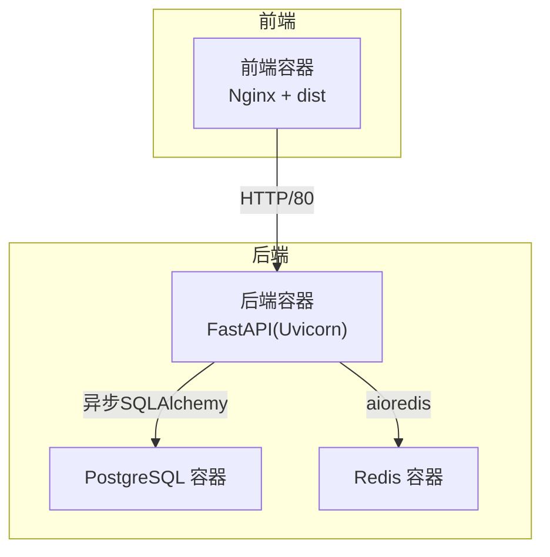
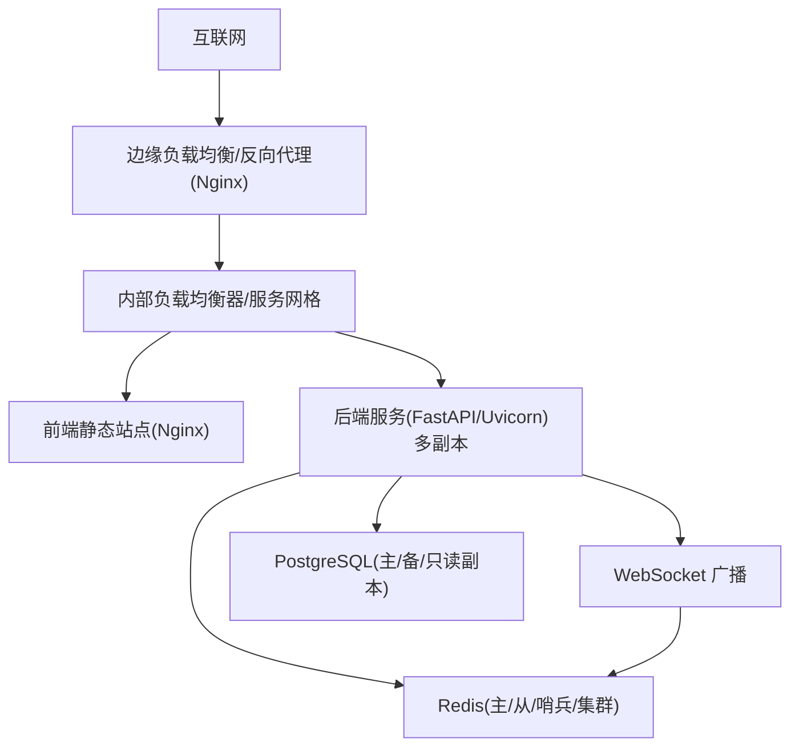
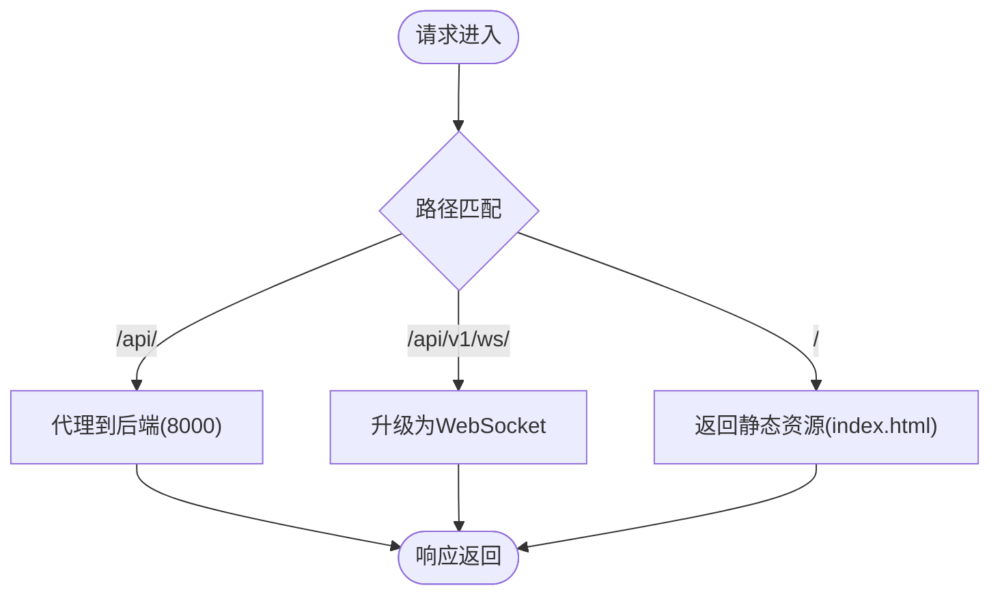
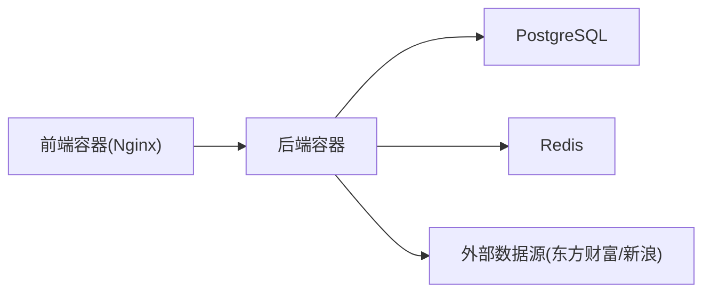

# 生产部署

<cite>
**本文引用的文件**
- [docker-compose.yml](file://docker-compose.yml)
- [backend/Dockerfile](file://backend/Dockerfile)
- [frontend/Dockerfile](file://frontend/Dockerfile)
- [frontend/nginx.conf](file://frontend/nginx.conf)
- [backend/app/main.py](file://backend/app/main.py)
- [backend/app/core/config.py](file://backend/app/core/config.py)
- [backend/app/core/database.py](file://backend/app/core/database.py)
- [backend/app/core/redis.py](file://backend/app/core/redis.py)
- [backend/app/api/v1/quote.py](file://backend/app/api/v1/quote.py)
- [backend/app/api/v1/stock.py](file://backend/app/api/v1/stock.py)
- [backend/app/api/v1/watchlist.py](file://backend/app/api/v1/watchlist.py)
- [backend/app/api/websocket.py](file://backend/app/api/websocket.py)
- [backend/app/services/collector/manager.py](file://backend/app/services/collector/manager.py)
- [backend/app/core/security.py](file://backend/app/core/security.py)
- [backend/requirements.txt](file://backend/requirements.txt)
- [frontend/package.json](file://frontend/package.json)
- [README.md](file://README.md)
</cite>

## 目录
1. [简介](#简介)
2. [项目结构](#项目结构)
3. [核心组件](#核心组件)
4. [架构总览](#架构总览)
5. [详细组件分析](#详细组件分析)
6. [依赖关系分析](#依赖关系分析)
7. [性能考虑](#性能考虑)
8. [故障排查指南](#故障排查指南)
9. [结论](#结论)
10. [附录](#附录)

## 简介
本文件面向企业级运维团队，提供 Stock-View 在生产环境的完整部署与运维指南。内容涵盖部署架构、Nginx 反向代理与静态资源优化、SSL 证书管理、负载均衡与高可用策略、安全加固、备份与灾难恢复、版本回滚、性能调优以及合规建议。所有建议均基于仓库现有实现与配置进行提炼与扩展。

## 项目结构
- 后端采用 FastAPI + 异步 SQLAlchemy，容器内通过 Uvicorn 运行，暴露 8000 端口。
- 前端使用 Vite 构建，Nginx 提供静态资源与反向代理，映射至 80 端口。
- 数据层使用 PostgreSQL 与 Redis，分别通过独立容器提供服务。
- docker-compose 将各组件编排为统一的服务网格。

图表来源
- [docker-compose.yml:1-54](file://docker-compose.yml#L1-L54)
- [frontend/Dockerfile:1-11](file://frontend/Dockerfile#L1-L11)
- [backend/Dockerfile:1-12](file://backend/Dockerfile#L1-L12)

章节来源
- [README.md:92-126](file://README.md#L92-L126)
- [docker-compose.yml:1-54](file://docker-compose.yml#L1-L54)

## 核心组件
- 应用入口与生命周期：后端通过 lifespan 初始化数据库并在关闭时释放 Redis 连接池。
- 配置体系：通过 pydantic-settings 从环境变量加载，支持开发/生产切换。
- 数据库与缓存：异步 SQLAlchemy 连接池与 aioredis 连接池，具备连接复用与超时控制。
- API 路由：行情、股票、自选股、AI 与 WebSocket 实时推送。
- 数据采集：多数据源优先级与故障转移，保障可用性。
- 安全：密码哈希、JWT 加解密、CORS 策略。

章节来源
- [backend/app/main.py:1-48](file://backend/app/main.py#L1-L48)
- [backend/app/core/config.py:1-43](file://backend/app/core/config.py#L1-L43)
- [backend/app/core/database.py:1-25](file://backend/app/core/database.py#L1-L25)
- [backend/app/core/redis.py:1-25](file://backend/app/core/redis.py#L1-L25)
- [backend/app/api/v1/quote.py:1-65](file://backend/app/api/v1/quote.py#L1-L65)
- [backend/app/api/v1/stock.py:1-37](file://backend/app/api/v1/stock.py#L1-L37)
- [backend/app/api/v1/watchlist.py:1-77](file://backend/app/api/v1/watchlist.py#L1-L77)
- [backend/app/api/websocket.py:1-79](file://backend/app/api/websocket.py#L1-L79)
- [backend/app/services/collector/manager.py:1-94](file://backend/app/services/collector/manager.py#L1-L94)
- [backend/app/core/security.py:1-30](file://backend/app/core/security.py#L1-L30)

## 架构总览
生产部署建议采用“边缘-Nginx 反代 + 多实例后端 + 数据库/缓存”的三层架构。Nginx 负责静态资源、反向代理与健康检查；后端以多副本运行并通过服务发现或外部负载均衡器对外提供 API 与 WebSocket；数据库与缓存作为有状态服务，配合持久化卷与备份策略。

图表来源
- [frontend/nginx.conf:1-30](file://frontend/nginx.conf#L1-L30)
- [backend/app/api/websocket.py:1-79](file://backend/app/api/websocket.py#L1-L79)
- [backend/app/core/database.py:1-25](file://backend/app/core/database.py#L1-L25)
- [backend/app/core/redis.py:1-25](file://backend/app/core/redis.py#L1-L25)

## 详细组件分析

### Nginx 反向代理与静态资源优化
- 反向代理：将 /api/ 路径转发至后端服务，/api/v1/ws/ 路径升级为 WebSocket。
- 静态资源：前端构建产物直接由 Nginx 提供，启用 Gzip/HTTP/2/缓存头可提升性能。
- 日志与限流：建议开启访问/错误日志，结合 IP 限流与请求大小限制，降低 DDoS 风险。
- 健康检查：后端提供 /api/v1/health 接口，Nginx upstream 健康检查可基于此。

图表来源
- [frontend/nginx.conf:1-30](file://frontend/nginx.conf#L1-L30)

章节来源
- [frontend/nginx.conf:1-30](file://frontend/nginx.conf#L1-L30)
- [backend/app/main.py:46-48](file://backend/app/main.py#L46-L48)

### SSL/TLS 证书管理
- 使用 Let’s Encrypt 或商业证书颁发机构签发证书，结合自动续期工具（如 certbot/cert-manager）。
- Nginx 配置 HTTPS 监听，启用 TLS1.3、禁用弱套件，强制 HSTS。
- 将证书与私钥放置于受控目录，仅授予 Nginx 读权限，定期轮换密钥。

章节来源
- [frontend/nginx.conf:5-30](file://frontend/nginx.conf#L5-L30)

### 负载均衡与高可用
- 多实例后端：后端容器以多副本运行，结合 Nginx upstream 或云负载均衡器实现健康检查与故障切换。
- 服务发现：在容器编排平台中使用服务名解析；或在 Kubernetes 中使用 Headless Service + Pod 模板。
- 无状态设计：后端不存储会话，Redis 用于会话与缓存，确保任意副本可处理请求。
- 健康检查：使用 /api/v1/health，Nginx/负载均衡器配置探针，异常节点摘除。

章节来源
- [docker-compose.yml:25-50](file://docker-compose.yml#L25-L50)
- [backend/app/main.py:46-48](file://backend/app/main.py#L46-L48)

### 安全加固
- 防火墙：仅开放 80/443/22 端口，内网访问数据库与缓存端口。
- 访问控制：Nginx 层限流与 WAF；后端 CORS 仅允许授权域名；JWT 令牌过期与刷新策略。
- 数据加密：数据库连接使用 SSL；传输层强制 TLS；敏感配置通过环境变量注入。
- 最小权限：容器以非 root 用户运行；挂载卷最小化；镜像扫描与漏洞修复。

章节来源
- [backend/app/core/config.py:32-34](file://backend/app/core/config.py#L32-L34)
- [backend/app/core/security.py:1-30](file://backend/app/core/security.py#L1-L30)
- [backend/app/main.py:29-36](file://backend/app/main.py#L29-L36)

### 备份与灾难恢复
- 数据库备份：定时逻辑备份（pg_dump）与增量备份策略，异地存储，周期性恢复演练。
- 缓存备份：导出 Redis RDB/AOF，或使用主从复制实现快速切换。
- 配置与镜像：版本化管理 .env 与 docker-compose.yml，镜像打标签并推送到私有仓库。
- 灾难恢复：定义 RTO/RPO 指标，准备多活或多区部署方案，定期演练。

章节来源
- [docker-compose.yml:10-23](file://docker-compose.yml#L10-L23)
- [backend/app/core/database.py:1-25](file://backend/app/core/database.py#L1-L25)
- [backend/app/core/redis.py:1-25](file://backend/app/core/redis.py#L1-L25)

### 版本回滚机制
- 容器编排：固定镜像标签，变更前先拉取新镜像并预热，失败则回滚至上一个稳定标签。
- 前端：构建产物带版本号/哈希，CDN 缓存可按版本清理。
- 后端：灰度发布 1~2 个副本，观察指标与日志后再扩大流量。
- 回滚步骤：停止新版本服务，恢复旧版本镜像标签，重启服务并验证健康检查。

章节来源
- [frontend/Dockerfile:1-11](file://frontend/Dockerfile#L1-L11)
- [backend/Dockerfile:1-12](file://backend/Dockerfile#L1-L12)

### 性能调优
- 数据库优化：连接池参数（pool_size/max_overflow）、慢查询日志、索引与分区策略；必要时引入只读副本。
- 缓存策略：热点数据预热、TTL 合理设置、Redis 内存淘汰策略；WebSocket 广播使用订阅模型减少广播风暴。
- CDN 与静态资源：启用压缩与缓存头，静态资源走 CDN；前端构建产物指纹化。
- 后端并发：根据 CPU/IO 调整 workers/thread 数量；监控 P95/P99 延迟与错误率。

章节来源
- [backend/app/core/database.py:7-8](file://backend/app/core/database.py#L7-L8)
- [backend/app/api/websocket.py:67-79](file://backend/app/api/websocket.py#L67-L79)
- [frontend/nginx.conf:9-13](file://frontend/nginx.conf#L9-L13)

## 依赖关系分析

图表来源
- [docker-compose.yml:4-50](file://docker-compose.yml#L4-L50)
- [backend/app/services/collector/manager.py:12-19](file://backend/app/services/collector/manager.py#L12-L19)

章节来源
- [docker-compose.yml:1-54](file://docker-compose.yml#L1-L54)
- [backend/app/services/collector/manager.py:1-94](file://backend/app/services/collector/manager.py#L1-L94)

## 性能考虑
- 数据库连接池：根据并发与延迟目标调整 pool_size 与超时，避免连接泄漏。
- 缓存命中：对高频查询结果进行缓存，合理设置 TTL；对 WebSocket 订阅进行去重。
- 网络与协议：启用 HTTP/2/QUIC、TLS 会话复用；静态资源 CDN 加速。
- 监控与告警：Prometheus/Grafana 收集 QPS、P95、错误率、连接数、缓存命中率。

章节来源
- [backend/app/core/database.py:7-8](file://backend/app/core/database.py#L7-L8)
- [backend/app/core/redis.py:10-18](file://backend/app/core/redis.py#L10-L18)
- [backend/app/api/websocket.py:67-79](file://backend/app/api/websocket.py#L67-L79)

## 故障排查指南
- 健康检查：访问 /api/v1/health，确认后端存活。
- 日志定位：查看 Nginx 访问/错误日志与后端 Uvicorn 日志，结合业务错误码定位问题。
- 数据源故障：CollectorManager 会自动故障转移，若仍失败，检查外部数据源可用性与网络连通。
- 缓存异常：检查 Redis 连接、内存与淘汰策略；必要时清空异常键空间。
- WebSocket 不可用：确认 Nginx 升级头配置与超时设置，检查订阅管理器连接状态。

章节来源
- [backend/app/main.py:46-48](file://backend/app/main.py#L46-L48)
- [backend/app/api/websocket.py:39-65](file://backend/app/api/websocket.py#L39-L65)
- [backend/app/services/collector/manager.py:21-33](file://backend/app/services/collector/manager.py#L21-L33)

## 结论
本指南基于现有代码与配置，为企业级生产部署提供了从架构到运维的系统性建议。建议在上线前完成安全基线检查、压测与演练，并建立完善的监控与告警体系，确保系统在高并发与复杂环境下稳定运行。

## 附录

### 环境变量与配置要点
- 数据库与缓存连接串需指向生产地址与端口。
- 生产环境关闭调试模式，设置强密钥与 JWT 参数。
- 外部 AI 服务地址与超时、缓存 TTL、速率限制按生产需求调整。

章节来源
- [backend/app/core/config.py:8-34](file://backend/app/core/config.py#L8-L34)
- [backend/app/core/database.py:7-8](file://backend/app/core/database.py#L7-L8)
- [backend/app/core/redis.py:10-18](file://backend/app/core/redis.py#L10-L18)

### 依赖与技术栈
- 后端：FastAPI、Uvicorn、SQLAlchemy 2.0(async)、Redis、Celery、HTTPX。
- 前端：Vue 3 + TypeScript + Vite + ECharts + Element Plus。
- 部署：Docker + docker-compose/Nginx。

章节来源
- [backend/requirements.txt:1-17](file://backend/requirements.txt#L1-L17)
- [frontend/package.json:11-26](file://frontend/package.json#L11-L26)
- [README.md:11-18](file://README.md#L11-L18)