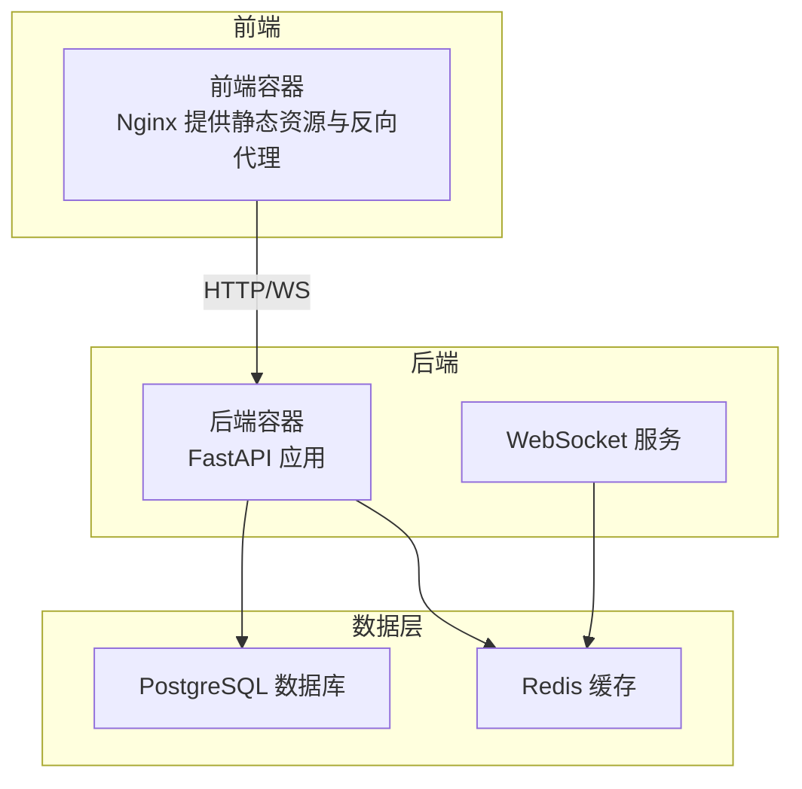
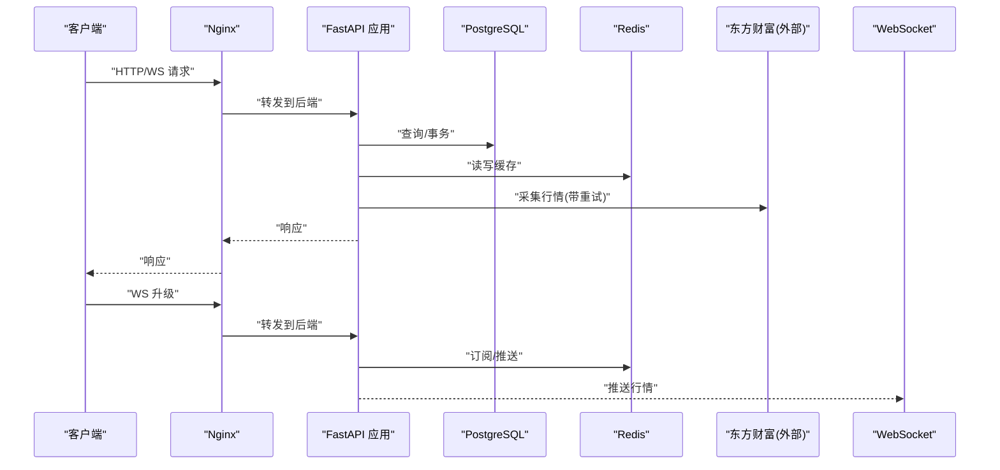
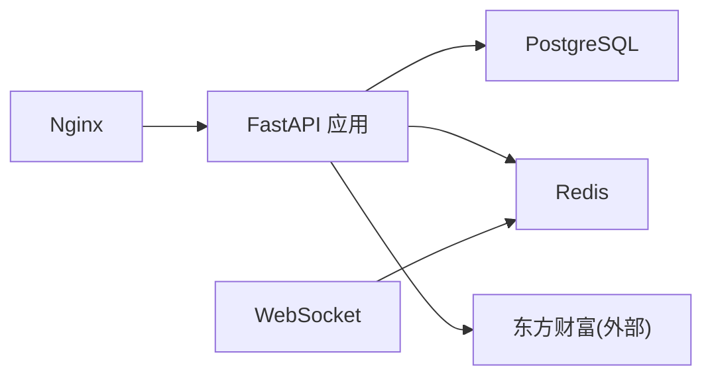

# 监控日志

<cite>
**本文引用的文件**
- [docker-compose.yml](file://docker-compose.yml)
- [backend/Dockerfile](file://backend/Dockerfile)
- [frontend/Dockerfile](file://frontend/Dockerfile)
- [backend/app/main.py](file://backend/app/main.py)
- [backend/app/core/config.py](file://backend/app/core/config.py)
- [backend/app/core/database.py](file://backend/app/core/database.py)
- [backend/app/core/redis.py](file://backend/app/core/redis.py)
- [backend/app/api/websocket.py](file://backend/app/api/websocket.py)
- [backend/app/services/collector/manager.py](file://backend/app/services/collector/manager.py)
- [backend/app/services/collector/eastmoney.py](file://backend/app/services/collector/eastmoney.py)
- [backend/app/ai/interface.py](file://backend/app/ai/interface.py)
- [frontend/nginx.conf](file://frontend/nginx.conf)
- [README.md](file://README.md)
</cite>

## 目录
1. [简介](#简介)
2. [项目结构](#项目结构)
3. [核心组件](#核心组件)
4. [架构总览](#架构总览)
5. [详细组件分析](#详细组件分析)
6. [依赖分析](#依赖分析)
7. [性能考虑](#性能考虑)
8. [故障排查指南](#故障排查指南)
9. [结论](#结论)
10. [附录](#附录)

## 简介
本文件面向运维工程师，围绕 Stock-View 的监控与日志管理提供系统化指导，覆盖容器健康检查、服务可用性监控、性能指标采集、日志聚合与轮转、关键指标定义、告警规则、异常检测与性能瓶颈定位，并给出日志分析工具与监控仪表板建议及故障诊断流程。

## 项目结构
Stock-View 采用前后端分离的容器化部署：后端基于 Python/FastAPI，前端基于 Vue/Vite，通过 Nginx 作为反向代理与静态资源服务；数据库与缓存分别使用 PostgreSQL 与 Redis。Compose 文件定义了服务间的依赖与端口映射，便于统一编排与健康检查。

图表来源
- [docker-compose.yml:1-54](file://docker-compose.yml#L1-L54)
- [frontend/nginx.conf:1-30](file://frontend/nginx.conf#L1-L30)
- [backend/app/api/websocket.py:1-45](file://backend/app/api/websocket.py#L1-L45)

章节来源
- [docker-compose.yml:1-54](file://docker-compose.yml#L1-L54)
- [frontend/nginx.conf:1-30](file://frontend/nginx.conf#L1-L30)

## 核心组件
- 容器编排与依赖
  - 使用 Compose 统一编排后端、前端、数据库与缓存服务，定义端口映射与重启策略，便于健康检查与日志聚合。
- 后端服务
  - FastAPI 应用提供健康检查端点、路由注册与生命周期管理；WebSocket 路由用于行情推送。
- 数据与缓存
  - 异步 SQLAlchemy 连接池配置；Redis 连接池初始化与关闭；Collector 管理器实现多数据源自动故障转移。
- 前端与网关
  - Nginx 作为静态资源与 API/WS 代理，支持长连接与反向代理头部透传。

章节来源
- [backend/app/main.py:1-48](file://backend/app/main.py#L1-L48)
- [backend/app/core/database.py:1-25](file://backend/app/core/database.py#L1-L25)
- [backend/app/core/redis.py:1-25](file://backend/app/core/redis.py#L1-L25)
- [backend/app/api/websocket.py:1-45](file://backend/app/api/websocket.py#L1-L45)
- [backend/app/services/collector/manager.py:1-94](file://backend/app/services/collector/manager.py#L1-L94)
- [frontend/nginx.conf:1-30](file://frontend/nginx.conf#L1-L30)

## 架构总览
下图展示了容器化部署下的服务交互与监控关注点：健康检查端点、数据库连接池、Redis 连接池、WebSocket 连接管理、外部数据源采集与重试、Nginx 代理链路。

图表来源
- [frontend/nginx.conf:15-29](file://frontend/nginx.conf#L15-L29)
- [backend/app/main.py:38-43](file://backend/app/main.py#L38-L43)
- [backend/app/core/database.py:7-8](file://backend/app/core/database.py#L7-L8)
- [backend/app/core/redis.py:10-18](file://backend/app/core/redis.py#L10-L18)
- [backend/app/services/collector/eastmoney.py:41-67](file://backend/app/services/collector/eastmoney.py#L41-L67)
- [backend/app/api/websocket.py:39-45](file://backend/app/api/websocket.py#L39-L45)

## 详细组件分析

### 健康检查与可用性监控
- 健康端点
  - 后端提供健康检查端点，返回服务状态与版本信息，适合容器健康探针使用。
- 探针配置建议
  - HTTP GET /api/v1/health，成功返回 200；设置初始延迟、超时、重试间隔与成功率阈值，结合重启策略实现自愈。
- 服务依赖
  - 后端依赖数据库与缓存；Compose 中定义了服务间依赖与端口暴露，便于统一健康检查。

章节来源
- [backend/app/main.py:46-48](file://backend/app/main.py#L46-L48)
- [docker-compose.yml:25-40](file://docker-compose.yml#L25-L40)

### 日志聚合与轮转
- Docker 日志驱动
  - 使用默认 json-file 驱动输出容器标准输出/错误流；建议在生产环境启用日志驱动参数以控制日志大小与数量。
- 日志轮转策略
  - 在宿主机侧使用 systemd/journald 或 logrotate 控制容器日志文件轮转，限制单文件大小与保留份数。
- 日志格式标准化
  - 统一 JSON 字段：时间戳、服务名、级别、模块、消息、请求上下文等；在后端引入结构化日志记录，便于检索与分析。
- 前端与网关
  - Nginx 访问/错误日志可按天轮转，结合日志格式字段统一化，便于关联分析。

章节来源
- [backend/Dockerfile:1-12](file://backend/Dockerfile#L1-L12)
- [frontend/Dockerfile:1-11](file://frontend/Dockerfile#L1-L11)
- [frontend/nginx.conf:1-30](file://frontend/nginx.conf#L1-L30)

### 性能指标采集
- API 层
  - 收集请求耗时、请求量、错误码分布、并发连接数；可通过中间件或装饰器埋点。
- 数据库层
  - 连接池利用率、等待时间、慢查询计数、事务提交/回滚次数；监控连接池上限与溢出。
- 缓存层
  - 命中率、过期/淘汰计数、内存使用、命令耗时；结合 Redis INFO 输出。
- 外部采集
  - 数据源请求耗时、成功率、重试次数、解析失败率；用于评估上游稳定性。
- WebSocket
  - 活跃连接数、消息吞吐、订阅主题数、连接断开原因统计。

章节来源
- [backend/app/core/database.py:7-8](file://backend/app/core/database.py#L7-L8)
- [backend/app/core/redis.py:10-18](file://backend/app/core/redis.py#L10-L18)
- [backend/app/services/collector/eastmoney.py:41-67](file://backend/app/services/collector/eastmoney.py#L41-L67)
- [backend/app/api/websocket.py:12-36](file://backend/app/api/websocket.py#L12-L36)

### 关键监控指标定义
- API 响应时间
  - P50/P90/P95 响应时间，错误率，每分钟请求数。
- 数据库连接数
  - 活跃连接数、空闲连接数、等待队列长度、连接池耗尽次数。
- Redis 命中率
  - keyspace hits/misses 比值，内存使用，slowlog 长指令。
- 内存使用情况
  - 容器 RSS/峰值、GC 指标（如适用）、堆外内存（网络栈/连接池）。
- 外部数据源
  - 成功率、平均耗时、重试次数、解析失败率、上游限流触发次数。

章节来源
- [backend/app/core/database.py:7-8](file://backend/app/core/database.py#L7-L8)
- [backend/app/core/redis.py:10-18](file://backend/app/core/redis.py#L10-L18)
- [backend/app/services/collector/manager.py:21-47](file://backend/app/services/collector/manager.py#L21-L47)
- [backend/app/services/collector/eastmoney.py:41-67](file://backend/app/services/collector/eastmoney.py#L41-L67)

### 告警规则与异常检测
- 告警规则示例
  - API 响应时间 P95 超过阈值持续 N 分钟；错误率超过阈值；数据库连接池耗尽次数增长；Redis 命中率下降；WS 连接断开率上升。
- 异常检测
  - 基于滑动窗口的异常检测（Z-score/阈值），识别流量突增、响应时间异常、外部数据源失败率异常。
- 自愈与降级
  - 自动重启、熔断外部依赖、降级到缓存/本地规则、限流与排队。

章节来源
- [backend/app/services/collector/manager.py:21-47](file://backend/app/services/collector/manager.py#L21-L47)
- [backend/app/services/collector/eastmoney.py:41-67](file://backend/app/services/collector/eastmoney.py#L41-L67)

### 性能瓶颈识别方法
- 端到端链路
  - 通过分布式追踪（如 OpenTelemetry）串联 Nginx → FastAPI → Redis/DB → 外部数据源，定位耗时环节。
- 数据库与缓存
  - 慢查询日志、连接池等待时间、Redis slowlog、KEYSPACE 命令分析。
- WebSocket
  - 连接数与消息速率、订阅主题数、广播延迟、断线重连频率。

章节来源
- [frontend/nginx.conf:15-29](file://frontend/nginx.conf#L15-L29)
- [backend/app/api/websocket.py:12-36](file://backend/app/api/websocket.py#L12-L36)
- [backend/app/core/database.py:7-8](file://backend/app/core/database.py#L7-L8)
- [backend/app/core/redis.py:10-18](file://backend/app/core/redis.py#L10-L18)

### 日志分析工具与仪表板
- 日志分析
  - 使用 ELK/EFK 或 Loki + Promtail + Grafana 进行日志采集、索引与可视化；对结构化日志进行字段提取与聚合。
- 仪表板
  - API 指标面板（QPS、P95、错误率）、数据库面板（连接数、慢查询、等待）、缓存面板（命中率、内存）、外部数据源面板（成功率、耗时）。
- 告警集成
  - 将告警规则与 Prometheus Alertmanager 或平台内置告警联动，实现自动通知与处置。

章节来源
- [frontend/nginx.conf:1-30](file://frontend/nginx.conf#L1-L30)

### 故障诊断流程
- 快速定位
  - 通过健康检查端点确认服务存活；查看容器日志与 Nginx 访问/错误日志；检查数据库与 Redis 连接状态。
- 深入分析
  - 结合外部数据源重试日志与解析失败日志，判断上游问题；分析数据库慢查询与连接池状态；评估 Redis 命中率与内存压力。
- 处置与验证
  - 实施降级/熔断、扩容连接池、优化查询、清理热点键；验证修复后指标恢复情况。

章节来源
- [backend/app/main.py:46-48](file://backend/app/main.py#L46-L48)
- [backend/app/services/collector/eastmoney.py:41-67](file://backend/app/services/collector/eastmoney.py#L41-L67)
- [frontend/nginx.conf:15-29](file://frontend/nginx.conf#L15-L29)

## 依赖分析
- 组件耦合
  - 后端对数据库与缓存存在直接依赖；WebSocket 依赖 Redis；外部数据采集依赖 HTTP 客户端与重试逻辑。
- 外部依赖
  - 东方财富数据源的可用性直接影响行情服务；需通过重试与故障转移提升鲁棒性。
- 依赖可视化

图表来源
- [backend/app/core/database.py:7-8](file://backend/app/core/database.py#L7-L8)
- [backend/app/core/redis.py:10-18](file://backend/app/core/redis.py#L10-L18)
- [backend/app/services/collector/eastmoney.py:26-39](file://backend/app/services/collector/eastmoney.py#L26-L39)
- [backend/app/api/websocket.py:5-6](file://backend/app/api/websocket.py#L5-L6)
- [frontend/nginx.conf:1-30](file://frontend/nginx.conf#L1-L30)

## 性能考虑
- 连接池与并发
  - 数据库连接池大小与溢出配置需结合业务峰值 QPS 与查询复杂度；Redis 连接池与网络超时需平衡吞吐与延迟。
- 外部请求优化
  - 合理设置超时与重试间隔，避免雪崩效应；对上游限流与错误进行隔离与降级。
- 缓存策略
  - 合理设置 TTL 与淘汰策略，避免热点键导致缓存穿透；监控缓存命中率与内存使用。
- WebSocket 扩展
  - 评估订阅主题数与广播频率，必要时拆分频道或引入消息队列。

章节来源
- [backend/app/core/database.py:7-8](file://backend/app/core/database.py#L7-L8)
- [backend/app/core/redis.py:10-18](file://backend/app/core/redis.py#L10-L18)
- [backend/app/services/collector/eastmoney.py:33-39](file://backend/app/services/collector/eastmoney.py#L33-L39)
- [backend/app/api/websocket.py:12-36](file://backend/app/api/websocket.py#L12-L36)

## 故障排查指南
- 健康检查失败
  - 检查后端健康端点是否可达；确认数据库与 Redis 服务状态；查看容器日志中的启动异常。
- API 响应异常
  - 分析 Nginx 访问日志与后端错误日志；定位慢查询与缓存未命中；检查外部数据源重试与解析失败。
- 数据库问题
  - 观察连接池耗尽与慢查询；检查事务锁等待与表膨胀；评估索引与查询计划。
- 缓存问题
  - 监控命中率骤降与内存压力；检查过期键与热键分布；评估淘汰策略。
- WebSocket 断线
  - 统计断线原因与重连频率；检查 Redis 订阅与推送链路；评估客户端网络质量。

章节来源
- [backend/app/main.py:46-48](file://backend/app/main.py#L46-L48)
- [frontend/nginx.conf:15-29](file://frontend/nginx.conf#L15-L29)
- [backend/app/core/database.py:15-20](file://backend/app/core/database.py#L15-L20)
- [backend/app/core/redis.py:21-25](file://backend/app/core/redis.py#L21-L25)
- [backend/app/api/websocket.py:19-33](file://backend/app/api/websocket.py#L19-L33)
- [backend/app/services/collector/manager.py:28-32](file://backend/app/services/collector/manager.py#L28-L32)

## 结论
通过健康检查端点、结构化日志与连接池/缓存指标监控，结合外部数据源的重试与故障转移策略，可显著提升 Stock-View 的可用性与可观测性。建议在生产环境完善日志轮转与聚合、建立关键指标仪表板与告警规则，并制定标准化的故障诊断流程，以保障系统稳定运行。

## 附录
- 常用命令参考
  - 查看后端日志、重启后端服务、后台启动与停止等常用命令见项目说明。

章节来源
- [README.md:146-162](file://README.md#L146-L162)