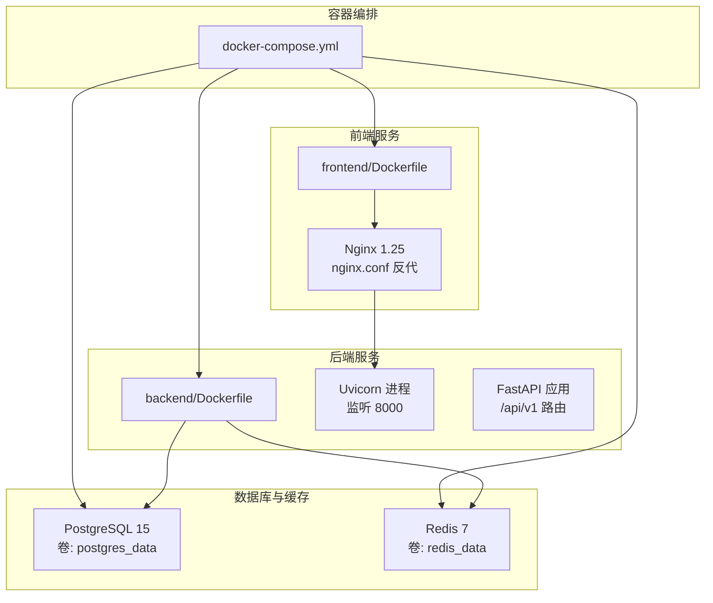
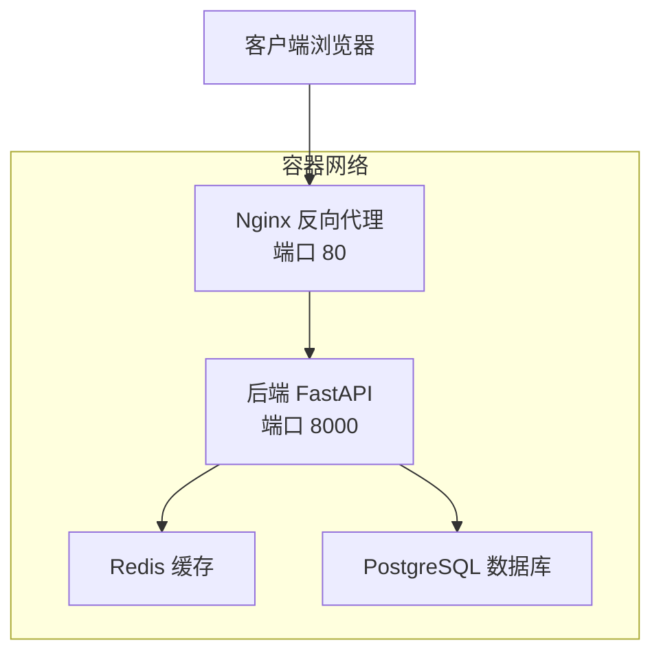
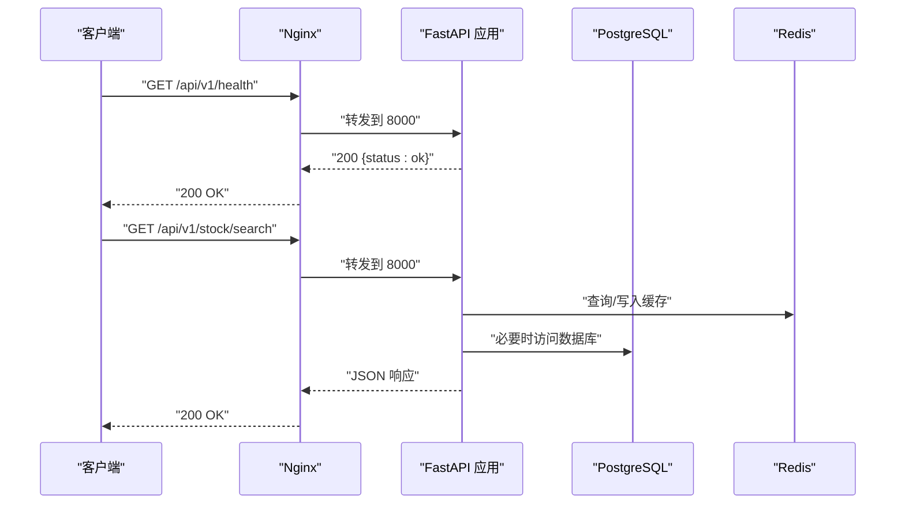
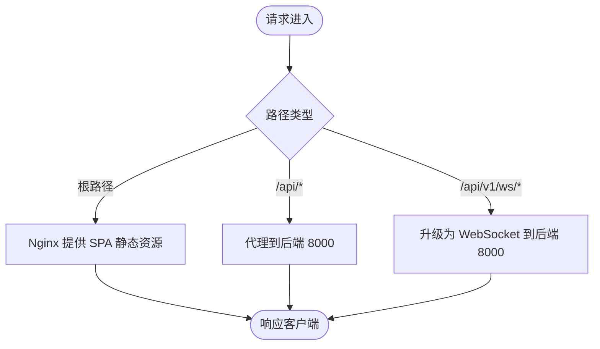
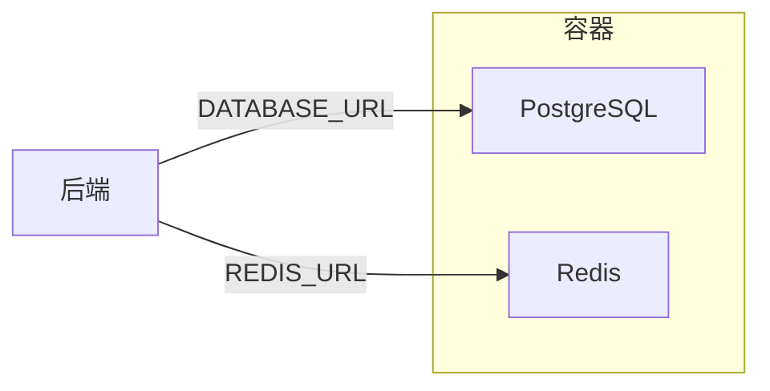
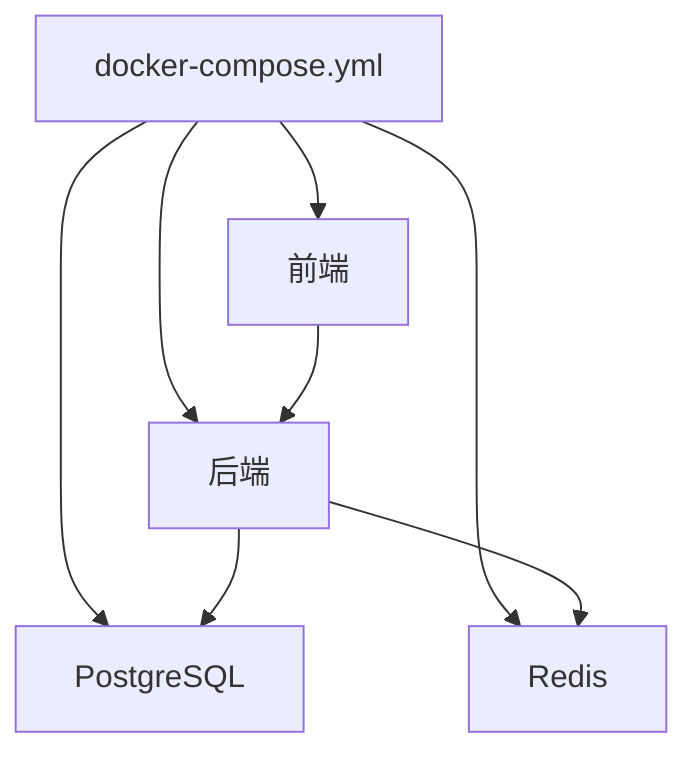

# 部署运维

<cite>
**本文引用的文件**
- [docker-compose.yml](file://docker-compose.yml)
- [backend/Dockerfile](file://backend/Dockerfile)
- [frontend/Dockerfile](file://frontend/Dockerfile)
- [frontend/nginx.conf](file://frontend/nginx.conf)
- [backend/requirements.txt](file://backend/requirements.txt)
- [backend/app/main.py](file://backend/app/main.py)
- [backend/app/core/config.py](file://backend/app/core/config.py)
- [backend/app/core/database.py](file://backend/app/core/database.py)
- [backend/app/core/redis.py](file://backend/app/core/redis.py)
- [backend/app/api/v1/stock.py](file://backend/app/api/v1/stock.py)
- [backend/app/services/collector/manager.py](file://backend/app/services/collector/manager.py)
- [README.md](file://README.md)
</cite>

## 目录
1. [简介](#简介)
2. [项目结构](#项目结构)
3. [核心组件](#核心组件)
4. [架构总览](#架构总览)
5. [详细组件分析](#详细组件分析)
6. [依赖分析](#依赖分析)
7. [性能考虑](#性能考虑)
8. [故障排除指南](#故障排除指南)
9. [结论](#结论)
10. [附录](#附录)

## 简介
本运维文档面向DevOps工程师与系统管理员，围绕Stock-View项目的容器化部署与生产运维展开，覆盖Docker镜像构建、docker-compose编排、Nginx反向代理、环境变量与配置、服务发现与负载均衡、监控与日志、备份恢复、安全加固、版本升级、故障排除、性能调优与容量规划等主题。文档以仓库现有文件为依据，确保可执行性与可追溯性。

## 项目结构
- 后端采用Python 3.11 + FastAPI + SQLAlchemy 2.0(async)，通过Uvicorn提供异步HTTP服务，并使用Redis与PostgreSQL作为缓存与持久化存储。
- 前端基于Vue 3 + Vite构建，使用Nginx作为静态资源服务器与反向代理，统一暴露80端口。
- 使用Docker Compose进行多服务编排，包含PostgreSQL、Redis、后端、前端四类服务；卷用于持久化数据库与Redis数据。

图表来源
- [docker-compose.yml:1-54](file://docker-compose.yml#L1-L54)
- [backend/Dockerfile:1-12](file://backend/Dockerfile#L1-L12)
- [frontend/Dockerfile:1-11](file://frontend/Dockerfile#L1-L11)
- [frontend/nginx.conf:1-30](file://frontend/nginx.conf#L1-L30)

章节来源
- [README.md:1-163](file://README.md#L1-L163)
- [docker-compose.yml:1-54](file://docker-compose.yml#L1-L54)

## 核心组件
- 后端镜像与进程
  - 基于Python 3.11-slim，安装构建工具，复制依赖与源码，暴露8000端口，使用Uvicorn以单工作进程启动。
  - 通过环境变量注入数据库与Redis连接串、AI适配器、运行环境与调试开关等。
- 前端镜像与Nginx
  - 多阶段构建：Node 18 Alpine构建产物，Nginx 1.25 Alpine运行时，拷贝构建产物与Nginx配置，暴露80端口。
  - Nginx配置对静态资源与API路径进行反向代理，WebSocket路径通过升级头透传。
- 数据库与缓存
  - PostgreSQL 15-alpine，挂载卷持久化；Redis 7-alpine，设置内存上限与LRU淘汰策略。
- 编排与依赖
  - docker-compose定义服务间依赖与端口映射，后端依赖数据库与缓存，前端依赖后端。

章节来源
- [backend/Dockerfile:1-12](file://backend/Dockerfile#L1-L12)
- [frontend/Dockerfile:1-11](file://frontend/Dockerfile#L1-L11)
- [frontend/nginx.conf:1-30](file://frontend/nginx.conf#L1-L30)
- [docker-compose.yml:1-54](file://docker-compose.yml#L1-L54)

## 架构总览
下图展示生产环境典型拓扑：Nginx作为反向代理与静态资源服务，后端提供REST与WebSocket接口，数据库与缓存分别承载结构化数据与热点缓存。

图表来源
- [frontend/nginx.conf:1-30](file://frontend/nginx.conf#L1-L30)
- [backend/app/main.py:1-48](file://backend/app/main.py#L1-L48)
- [docker-compose.yml:1-54](file://docker-compose.yml#L1-L54)

## 详细组件分析

### 后端服务（FastAPI + Uvicorn）
- 进程与端口
  - 使用Uvicorn以单工作进程启动，监听0.0.0.0:8000，便于容器内通信与外部映射。
- 生命周期与健康检查
  - 应用注册生命周期钩子，在启动时初始化数据库，在关闭时释放Redis连接池。
  - 提供健康检查端点，返回状态与版本信息。
- 路由与模块
  - 注册行情、股票、自选、AI与WebSocket路由，统一前缀/api/v1。
- 数据与缓存
  - 使用SQLAlchemy 2.0异步引擎连接PostgreSQL，连接池参数可按生产环境调整。
  - 使用Redis异步客户端，解析URL并复用连接池。
- 配置与环境变量
  - 通过Pydantic Settings从.env加载配置，支持运行环境、调试、数据库、Redis、AI、JWT、数据采集等参数。

图表来源
- [backend/app/main.py:1-48](file://backend/app/main.py#L1-L48)
- [backend/app/core/database.py:1-25](file://backend/app/core/database.py#L1-L25)
- [backend/app/core/redis.py:1-25](file://backend/app/core/redis.py#L1-L25)
- [frontend/nginx.conf:1-30](file://frontend/nginx.conf#L1-L30)

章节来源
- [backend/app/main.py:1-48](file://backend/app/main.py#L1-L48)
- [backend/app/core/config.py:1-43](file://backend/app/core/config.py#L1-L43)
- [backend/app/core/database.py:1-25](file://backend/app/core/database.py#L1-L25)
- [backend/app/core/redis.py:1-25](file://backend/app/core/redis.py#L1-L25)

### 前端服务（Nginx + 静态资源）
- 构建与运行
  - 多阶段构建：Node阶段安装依赖并打包，Nginx阶段拷贝产物与配置，暴露80端口。
- 反向代理与静态资源
  - 对根路径提供SPA回退与静态文件服务；对/api/前缀代理至后端；对/api/v1/ws/启用WebSocket升级。
- 端口映射
  - docker-compose将容器80端口映射到宿主机3000端口，便于本地访问。

图表来源
- [frontend/nginx.conf:1-30](file://frontend/nginx.conf#L1-L30)
- [frontend/Dockerfile:1-11](file://frontend/Dockerfile#L1-L11)

章节来源
- [frontend/Dockerfile:1-11](file://frontend/Dockerfile#L1-L11)
- [frontend/nginx.conf:1-30](file://frontend/nginx.conf#L1-L30)

### 数据库与缓存（PostgreSQL + Redis）
- PostgreSQL
  - 使用15-alpine镜像，挂载卷postgres_data，暴露5432端口，初始凭据在compose中定义。
  - 连接串通过环境变量注入后端，支持异步驱动。
- Redis
  - 使用7-alpine镜像，设置内存上限与LRU策略，挂载卷redis_data，暴露6379端口。
  - 连接串通过环境变量注入后端，用于缓存与Celery队列。

图表来源
- [docker-compose.yml:1-54](file://docker-compose.yml#L1-L54)
- [backend/app/core/config.py:1-43](file://backend/app/core/config.py#L1-L43)

章节来源
- [docker-compose.yml:1-54](file://docker-compose.yml#L1-L54)
- [backend/app/core/config.py:1-43](file://backend/app/core/config.py#L1-L43)

### 部署与编排（Docker Compose）
- 服务定义
  - postgres、redis、backend、frontend四类服务，均设置restart策略为always，保证异常退出后自动恢复。
  - 后端依赖数据库与缓存，前端依赖后端。
- 环境变量
  - 后端通过环境变量注入数据库与Redis连接串、AI适配器、运行环境与调试开关等。
  - 建议在生产环境中替换默认密码与敏感配置。
- 端口映射
  - 前端映射宿主3000:80，后端映射宿主8000:8000，数据库5432:5432，缓存6379:6379。

章节来源
- [docker-compose.yml:1-54](file://docker-compose.yml#L1-L54)

## 依赖分析
- 组件耦合
  - 后端对数据库与缓存存在直接依赖，且通过配置模块集中管理连接串。
  - 前端通过Nginx反向代理与后端解耦，便于独立扩展。
- 外部依赖
  - 后端依赖PostgreSQL与Redis；部分路由调用外部数据源（如东方财富），具备故障转移逻辑。
- 依赖链
  - docker-compose定义服务启动顺序与依赖；后端在启动时初始化数据库并在关闭时清理资源。

图表来源
- [docker-compose.yml:1-54](file://docker-compose.yml#L1-L54)

章节来源
- [backend/app/core/database.py:1-25](file://backend/app/core/database.py#L1-L25)
- [backend/app/core/redis.py:1-25](file://backend/app/core/redis.py#L1-L25)
- [backend/app/services/collector/manager.py:1-94](file://backend/app/services/collector/manager.py#L1-L94)

## 性能考虑
- 连接池与并发
  - 后端数据库连接池参数可在生产环境根据CPU与I/O能力调优；当前示例使用固定池大小与溢出配置。
- 缓存策略
  - Redis用于热点数据缓存，建议结合业务热点与内存上限评估TTL与淘汰策略。
- Web服务器
  - Nginx作为静态资源与反向代理，建议开启gzip压缩与合理的超时配置。
- WebSocket
  - Nginx对WebSocket升级头透传，建议结合实际并发与超时需求调整proxy_read_timeout。
- 工作进程
  - 当前后端以单工作进程运行，生产环境可按CPU核数与负载评估是否增加工作进程数量。

章节来源
- [backend/app/core/database.py:1-25](file://backend/app/core/database.py#L1-L25)
- [frontend/nginx.conf:1-30](file://frontend/nginx.conf#L1-L30)
- [backend/Dockerfile:1-12](file://backend/Dockerfile#L1-L12)

## 故障排除指南
- 健康检查
  - 访问后端健康端点验证服务可用性。
- 日志定位
  - 使用docker compose日志命令查看后端服务日志，定位异常堆栈与错误上下文。
- 端口冲突
  - 若宿主机端口被占用，修改docker-compose中的端口映射或释放冲突端口。
- 数据库连接
  - 检查DATABASE_URL格式与可达性；确认数据库已初始化并允许容器网络访问。
- 缓存连接
  - 检查REDIS_URL与Redis实例状态；确认容器网络连通。
- 前端无法访问
  - 确认Nginx配置正确、后端已就绪、WebSocket路径升级头透传正常。
- 外部数据源
  - 若行情数据为空，检查外部接口可用性与故障转移逻辑是否生效。

章节来源
- [backend/app/main.py:46-48](file://backend/app/main.py#L46-L48)
- [README.md:146-162](file://README.md#L146-L162)
- [backend/app/services/collector/manager.py:1-94](file://backend/app/services/collector/manager.py#L1-L94)

## 结论
本文基于仓库现有文件，给出了Stock-View的容器化部署与运维实践建议。通过docker-compose实现服务编排，Nginx提供反向代理与静态资源服务，后端以FastAPI+Uvicorn提供API与WebSocket能力，并通过Redis与PostgreSQL支撑数据与缓存。建议在生产环境中强化安全、监控与备份策略，并结合业务负载持续优化性能与容量规划。

## 附录

### A. 环境变量与配置清单
- 数据库连接串
  - 作用：后端连接PostgreSQL
  - 示例：来自compose中的环境变量
- Redis连接串
  - 作用：后端连接Redis
  - 示例：来自compose中的环境变量
- AI适配器
  - 作用：选择AI分析适配器
  - 示例：mock/rule
- 运行环境与调试
  - 作用：控制日志级别与行为
  - 示例：development/production，true/false
- 数据源与缓存
  - 作用：主备数据源与缓存策略
  - 示例：eastmoney/sina，TTL与限流

章节来源
- [docker-compose.yml:25-40](file://docker-compose.yml#L25-L40)
- [backend/app/core/config.py:1-43](file://backend/app/core/config.py#L1-L43)

### B. 监控与日志最佳实践
- 健康检查
  - 使用后端健康端点定期探测服务状态。
- 容器日志
  - 使用docker compose日志命令收集后端与数据库日志，结合时间戳与错误堆栈定位问题。
- 性能指标
  - 建议在Nginx层统计请求量与响应时间；在后端层统计数据库慢查询与Redis命中率。
- 错误日志收集
  - 将容器标准输出重定向至集中式日志系统，保留关键字段（时间、服务名、路径、状态码、耗时）。

章节来源
- [backend/app/main.py:46-48](file://backend/app/main.py#L46-L48)
- [README.md:146-162](file://README.md#L146-L162)

### C. 备份与恢复策略
- 数据库备份
  - 使用PostgreSQL的逻辑备份工具定期导出数据，归档至对象存储或本地备份介质。
- 缓存数据
  - Redis快照持久化（RDB/AOF）策略需结合数据重要性与恢复时间目标设定。
- 恢复流程
  - 优先恢复数据库，再恢复缓存，最后重启后端服务并验证健康检查。

章节来源
- [docker-compose.yml:10-11](file://docker-compose.yml#L10-L11)
- [backend/app/core/database.py:1-25](file://backend/app/core/database.py#L1-L25)

### D. 安全加固措施
- 网络隔离
  - 将数据库与缓存限制在内部网络，避免直接对外暴露端口。
- 凭据管理
  - 替换默认密码与密钥，使用环境变量或密钥管理服务注入敏感信息。
- CORS与认证
  - 在生产中收紧CORS白名单，补充JWT认证与权限控制。
- 反向代理安全
  - 在Nginx层启用HTTPS终止、请求大小限制与速率限制。

章节来源
- [frontend/nginx.conf:1-30](file://frontend/nginx.conf#L1-L30)
- [backend/app/main.py:29-36](file://backend/app/main.py#L29-L36)
- [backend/app/core/config.py:32-34](file://backend/app/core/config.py#L32-L34)

### E. 版本升级流程
- 后端升级
  - 更新依赖清单，重新构建镜像，滚动更新或蓝绿发布，验证健康检查与核心接口。
- 前端升级
  - 重新构建静态资源，替换Nginx镜像，确保代理配置不变。
- 数据库迁移
  - 在维护窗口执行迁移脚本，备份后再升级，验证数据一致性。
- 回滚策略
  - 保存上一版本镜像标签，出现异常时快速回滚。

章节来源
- [backend/requirements.txt:1-17](file://backend/requirements.txt#L1-L17)
- [frontend/Dockerfile:1-11](file://frontend/Dockerfile#L1-L11)
- [docker-compose.yml:25-50](file://docker-compose.yml#L25-L50)

### F. 容量规划指导
- CPU与内存
  - 根据并发请求数与WebSocket连接数估算后端工作进程数与JVM/解释器内存。
- 存储
  - 数据库与Redis卷容量需满足峰值数据与历史数据留存需求。
- 网络
  - 外部数据源调用需考虑带宽与超时设置，避免成为瓶颈。

章节来源
- [backend/app/core/database.py:7-8](file://backend/app/core/database.py#L7-L8)
- [backend/app/services/collector/manager.py:1-94](file://backend/app/services/collector/manager.py#L1-L94)
- [docker-compose.yml:16-23](file://docker-compose.yml#L16-L23)