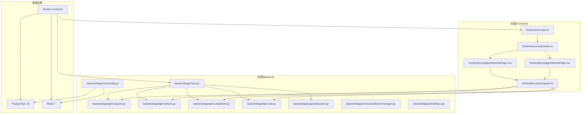
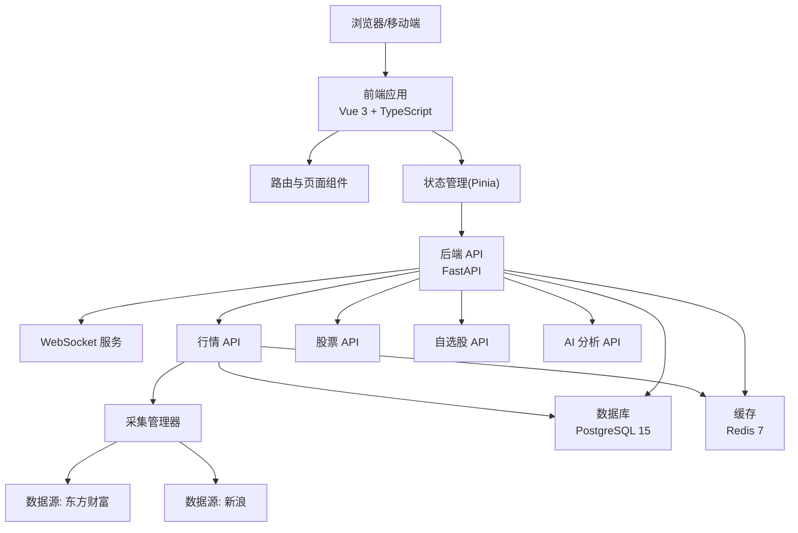
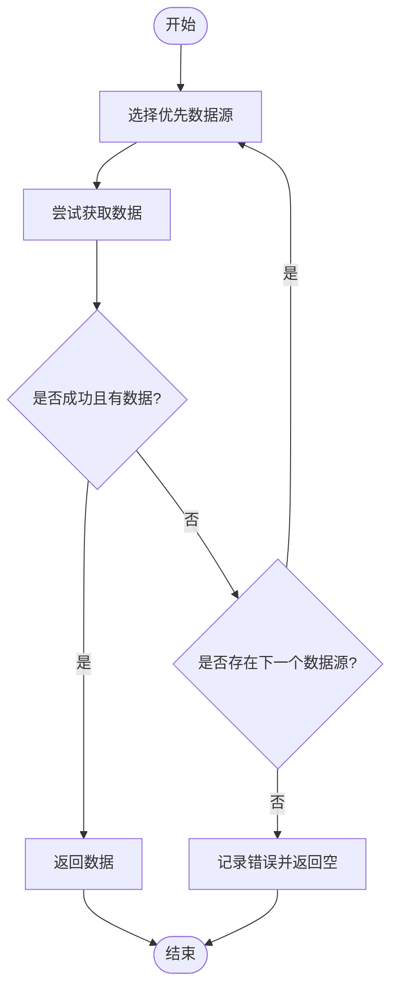
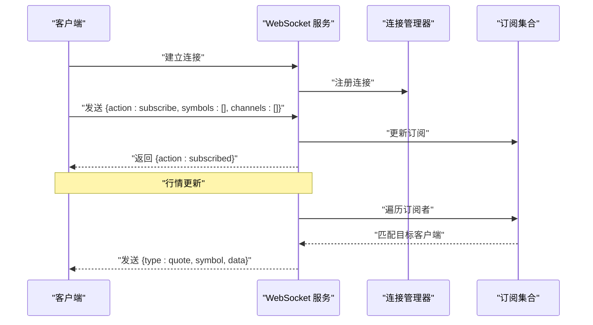
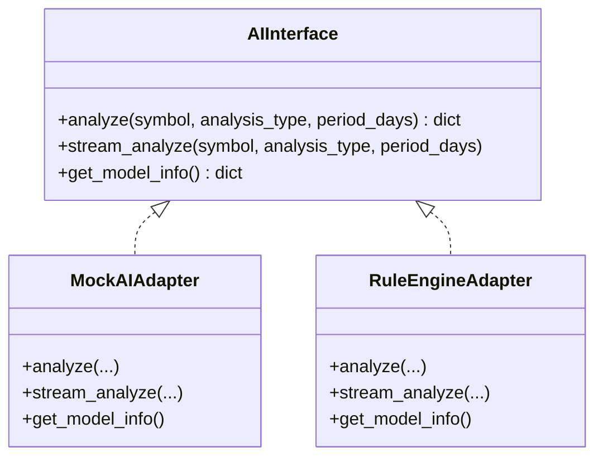
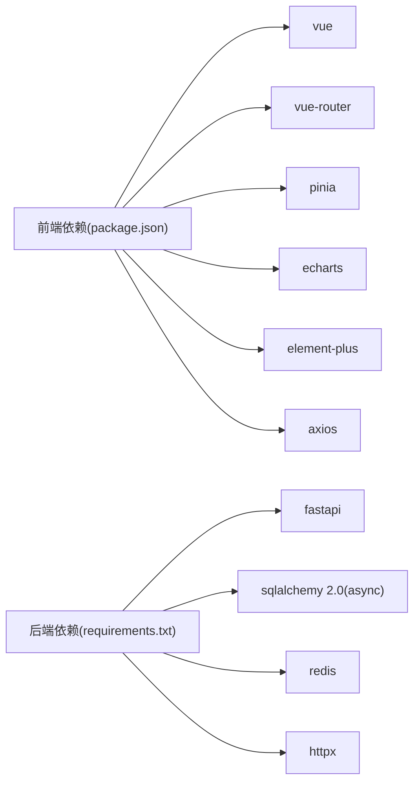

# 项目概述

<cite>
**本文引用的文件**
- [README.md](file://README.md)
- [docker-compose.yml](file://docker-compose.yml)
- [backend/app/main.py](file://backend/app/main.py)
- [backend/app/core/config.py](file://backend/app/core/config.py)
- [backend/app/api/v1/quote.py](file://backend/app/api/v1/quote.py)
- [backend/app/api/v1/stock.py](file://backend/app/api/v1/stock.py)
- [backend/app/api/v1/watchlist.py](file://backend/app/api/v1/watchlist.py)
- [backend/app/api/v1/ai.py](file://backend/app/api/v1/ai.py)
- [backend/app/api/websocket.py](file://backend/app/api/websocket.py)
- [backend/app/services/collector/manager.py](file://backend/app/services/collector/manager.py)
- [backend/app/ai/interface.py](file://backend/app/ai/interface.py)
- [frontend/src/main.ts](file://frontend/src/main.ts)
- [frontend/package.json](file://frontend/package.json)
- [frontend/src/router/index.ts](file://frontend/src/router/index.ts)
- [frontend/src/pages/MarketPage.vue](file://frontend/src/pages/MarketPage.vue)
- [frontend/src/pages/WatchlistPage.vue](file://frontend/src/pages/WatchlistPage.vue)
- [frontend/src/stores/quote.ts](file://frontend/src/stores/quote.ts)
</cite>

## 目录
1. [引言](#引言)
2. [项目结构](#项目结构)
3. [核心组件](#核心组件)
4. [架构总览](#架构总览)
5. [详细组件分析](#详细组件分析)
6. [依赖关系分析](#依赖关系分析)
7. [性能考虑](#性能考虑)
8. [故障排查指南](#故障排查指南)
9. [结论](#结论)
10. [附录](#附录)

## 引言
Stock-View 是一个参考主流股票软件（如东方财富、同花顺）核心能力而构建的 A 股实时行情查看与 AI 分析平台。项目聚焦三大核心能力：
- 实时 A 股行情：支持沪深 A 股实时报价、K 线、分时、盘口等多维数据
- AI 智能分析：预留插件化 AI 分析架构，可快速接入外部分析服务
- 自选股管理：提供自选股列表维护、排序与实时追踪

项目采用现代化技术栈与工程化实践，通过 Docker Compose 实现一键部署，并提供前后端分离的开发体验。对于初学者，项目提供了清晰的页面导航与数据展示；对于有经验的开发者，项目在数据采集、实时推送、AI 插件化等方面提供了可扩展的架构与实现细节。

## 项目结构
项目采用前后端分离的目录组织方式，后端以 FastAPI 为核心，前端以 Vue 3 + TypeScript 为基础，数据库与缓存分别采用 PostgreSQL 与 Redis，容器化编排通过 Docker Compose 实现。

图表来源
- [backend/app/main.py:1-48](file://backend/app/main.py#L1-L48)
- [backend/app/core/config.py:1-43](file://backend/app/core/config.py#L1-L43)
- [backend/app/api/v1/quote.py:1-65](file://backend/app/api/v1/quote.py#L1-L65)
- [backend/app/api/v1/stock.py:1-37](file://backend/app/api/v1/stock.py#L1-L37)
- [backend/app/api/v1/watchlist.py:1-77](file://backend/app/api/v1/watchlist.py#L1-L77)
- [backend/app/api/v1/ai.py:1-29](file://backend/app/api/v1/ai.py#L1-L29)
- [backend/app/api/websocket.py:1-79](file://backend/app/api/websocket.py#L1-L79)
- [backend/app/services/collector/manager.py:1-94](file://backend/app/services/collector/manager.py#L1-L94)
- [backend/app/ai/interface.py:1-196](file://backend/app/ai/interface.py#L1-L196)
- [frontend/src/main.ts:1-12](file://frontend/src/main.ts#L1-L12)
- [frontend/src/router/index.ts:1-14](file://frontend/src/router/index.ts#L1-L14)
- [frontend/src/pages/MarketPage.vue:1-182](file://frontend/src/pages/MarketPage.vue#L1-L182)
- [frontend/src/pages/WatchlistPage.vue:1-79](file://frontend/src/pages/WatchlistPage.vue#L1-L79)
- [frontend/src/stores/quote.ts:1-43](file://frontend/src/stores/quote.ts#L1-L43)
- [docker-compose.yml:1-54](file://docker-compose.yml#L1-L54)

章节来源
- [README.md:92-126](file://README.md#L92-L126)
- [docker-compose.yml:1-54](file://docker-compose.yml#L1-L54)

## 核心组件
- 后端入口与路由
  - FastAPI 应用在生命周期内完成数据库初始化与 Redis 清理，注册行情、股票、自选股、AI 与 WebSocket 路由，提供健康检查端点。
- 配置中心
  - 通过环境变量集中管理数据库连接、缓存地址、AI 适配器、数据源优先级、定时任务队列等参数。
- 数据采集与故障转移
  - 提供统一的数据采集管理器，内置多家数据源（如东方财富、新浪），按优先级自动故障转移，保障数据可用性。
- 实时行情 API
  - 支持批量实时行情、行情列表、K 线、分时、盘口等接口，统一返回结构便于前端消费。
- 股票搜索
  - 基于第三方搜索接口实现 A 股股票代码与名称的快速检索。
- 自选股管理
  - 提供自选股增删改查与排序能力，结合数据库持久化与前端状态管理。
- WebSocket 实时推送
  - 提供订阅/退订机制，按股票与频道维度向客户端推送行情更新。
- AI 分析插件
  - 抽象出 AI 接口，内置 Mock 与规则引擎两种适配器，支持流式分析进度与结果返回。
- 前端应用
  - 使用 Vue 3 + TypeScript + Pinia + Element Plus + ECharts 构建，包含行情列表、自选股、搜索与详情页，路由驱动页面切换。

章节来源
- [backend/app/main.py:1-48](file://backend/app/main.py#L1-L48)
- [backend/app/core/config.py:1-43](file://backend/app/core/config.py#L1-L43)
- [backend/app/services/collector/manager.py:1-94](file://backend/app/services/collector/manager.py#L1-L94)
- [backend/app/api/v1/quote.py:1-65](file://backend/app/api/v1/quote.py#L1-L65)
- [backend/app/api/v1/stock.py:1-37](file://backend/app/api/v1/stock.py#L1-L37)
- [backend/app/api/v1/watchlist.py:1-77](file://backend/app/api/v1/watchlist.py#L1-L77)
- [backend/app/api/websocket.py:1-79](file://backend/app/api/websocket.py#L1-L79)
- [backend/app/ai/interface.py:1-196](file://backend/app/ai/interface.py#L1-L196)
- [frontend/src/main.ts:1-12](file://frontend/src/main.ts#L1-L12)
- [frontend/src/router/index.ts:1-14](file://frontend/src/router/index.ts#L1-L14)
- [frontend/src/pages/MarketPage.vue:1-182](file://frontend/src/pages/MarketPage.vue#L1-L182)
- [frontend/src/pages/WatchlistPage.vue:1-79](file://frontend/src/pages/WatchlistPage.vue#L1-L79)
- [frontend/src/stores/quote.ts:1-43](file://frontend/src/stores/quote.ts#L1-L43)

## 架构总览
下图展示了从浏览器到后端 API、数据采集与缓存的整体交互路径，以及容器化部署的服务关系。

图表来源
- [backend/app/main.py:1-48](file://backend/app/main.py#L1-L48)
- [backend/app/api/v1/quote.py:1-65](file://backend/app/api/v1/quote.py#L1-L65)
- [backend/app/api/v1/stock.py:1-37](file://backend/app/api/v1/stock.py#L1-L37)
- [backend/app/api/v1/watchlist.py:1-77](file://backend/app/api/v1/watchlist.py#L1-L77)
- [backend/app/api/v1/ai.py:1-29](file://backend/app/api/v1/ai.py#L1-L29)
- [backend/app/api/websocket.py:1-79](file://backend/app/api/websocket.py#L1-L79)
- [backend/app/services/collector/manager.py:1-94](file://backend/app/services/collector/manager.py#L1-L94)
- [backend/app/core/config.py:1-43](file://backend/app/core/config.py#L1-L43)
- [docker-compose.yml:1-54](file://docker-compose.yml#L1-L54)

## 详细组件分析

### 后端入口与生命周期
- 应用在启动阶段初始化数据库连接，在关闭阶段释放 Redis 连接，确保资源正确回收。
- 统一注册各模块路由，提供健康检查端点，便于容器编排与运维监控。

章节来源
- [backend/app/main.py:1-48](file://backend/app/main.py#L1-L48)

### 配置中心与环境变量
- 集中管理数据库、缓存、AI 适配器、数据源、定时任务队列、JWT 等关键参数，支持开发与生产环境差异化配置。

章节来源
- [backend/app/core/config.py:1-43](file://backend/app/core/config.py#L1-L43)
- [README.md:130-142](file://README.md#L130-L142)

### 数据采集与故障转移
- 采集管理器按优先级依次尝试多个数据源，若某数据源返回空或异常则自动切换至下一个，提升数据可用性与稳定性。
- 支持实时行情、行情列表、K 线、分时、盘口等多类数据的采集与回退策略。

图表来源
- [backend/app/services/collector/manager.py:1-94](file://backend/app/services/collector/manager.py#L1-L94)

章节来源
- [backend/app/services/collector/manager.py:1-94](file://backend/app/services/collector/manager.py#L1-L94)

### 实时行情 API
- 实时行情：支持批量股票代码查询，限制最多 50 只，统一返回结构便于前端渲染。
- 行情列表：支持按市场、排序字段与方向、分页参数查询，返回总条数与数据项。
- K 线/分时/盘口：按周期、复权类型、数量等参数查询，异常时返回明确错误码。

章节来源
- [backend/app/api/v1/quote.py:1-65](file://backend/app/api/v1/quote.py#L1-L65)

### 股票搜索 API
- 基于第三方搜索接口，支持根据关键词返回 A 股股票代码、名称、市场等信息，限制返回数量。

章节来源
- [backend/app/api/v1/stock.py:1-37](file://backend/app/api/v1/stock.py#L1-L37)

### 自选股管理 API
- 列表：按用户维度返回自选股，按排序字段有序展示。
- 添加：去重判断并自动分配排序序号。
- 删除：按用户与股票代码删除。
- 排序：批量更新排序顺序。

章节来源
- [backend/app/api/v1/watchlist.py:1-77](file://backend/app/api/v1/watchlist.py#L1-L77)

### WebSocket 实时推送
- 连接管理：维护活动连接与订阅集合，支持订阅/退订与心跳 ping/pong。
- 广播：按股票与频道维度向客户端推送行情更新，异常断开自动清理。

图表来源
- [backend/app/api/websocket.py:1-79](file://backend/app/api/websocket.py#L1-L79)

章节来源
- [backend/app/api/websocket.py:1-79](file://backend/app/api/websocket.py#L1-L79)

### AI 分析插件
- 抽象接口：定义统一的分析与流式分析方法，以及模型信息查询。
- Mock 适配器：返回随机但结构化的分析结果，便于前端联调与演示。
- 规则引擎适配器：基于简单技术指标规则进行趋势与置信度评估，支持流式进度返回。

图表来源
- [backend/app/ai/interface.py:1-196](file://backend/app/ai/interface.py#L1-L196)

章节来源
- [backend/app/ai/interface.py:1-196](file://backend/app/ai/interface.py#L1-L196)
- [backend/app/api/v1/ai.py:1-29](file://backend/app/api/v1/ai.py#L1-L29)

### 前端应用与页面
- 应用入口：创建 Vue 实例，挂载路由、状态管理与 UI 组件库。
- 路由：首页重定向至行情页，支持行情、详情、自选股、搜索页面。
- 市场页：顶部标签切换、搜索框、自选股侧栏、行情表格与分页，定时刷新。
- 自选股页：展示自选股列表，支持点击跳转详情与移除操作。
- 状态管理：封装行情列表、当前行情、加载状态与实时数据更新逻辑。

章节来源
- [frontend/src/main.ts:1-12](file://frontend/src/main.ts#L1-L12)
- [frontend/src/router/index.ts:1-14](file://frontend/src/router/index.ts#L1-L14)
- [frontend/src/pages/MarketPage.vue:1-182](file://frontend/src/pages/MarketPage.vue#L1-L182)
- [frontend/src/pages/WatchlistPage.vue:1-79](file://frontend/src/pages/WatchlistPage.vue#L1-L79)
- [frontend/src/stores/quote.ts:1-43](file://frontend/src/stores/quote.ts#L1-L43)

## 依赖关系分析
- 技术栈概览
  - 前端：Vue 3 + TypeScript + Pinia + ECharts + Element Plus + Axios
  - 后端：Python 3.11 + FastAPI + SQLAlchemy 2.0(async) + Redis
  - 数据库：PostgreSQL 15 + Redis 7
  - 部署：Docker Compose + Nginx
- 组件耦合
  - 前端通过 API 客户端与后端交互，状态管理与页面组件解耦。
  - 后端 API 与数据采集层解耦，采集管理器统一调度多个数据源。
  - WebSocket 与 API 解耦，独立负责实时推送。

图表来源
- [frontend/package.json:1-27](file://frontend/package.json#L1-L27)
- [README.md:11-18](file://README.md#L11-L18)

章节来源
- [frontend/package.json:1-27](file://frontend/package.json#L1-L27)
- [README.md:11-18](file://README.md#L11-L18)

## 性能考虑
- 数据采集与缓存
  - 通过 Redis 缓存热点数据，降低对上游数据源的压力；合理设置 TTL 与容量上限。
- 实时推送
  - WebSocket 订阅按股票与频道过滤，避免广播风暴；异常断连及时清理。
- 前端渲染
  - 行情列表分页加载与定时刷新策略平衡实时性与性能；大列表使用虚拟滚动优化渲染。
- API 设计
  - 批量查询限制单次数量，避免一次性拉取过多数据；错误码与降级策略保证用户体验。

## 故障排查指南
- 后端服务不可用
  - 检查健康检查端点与容器日志，确认数据库与缓存连接字符串正确。
- 数据为空或异常
  - 查看采集管理器日志，确认数据源优先级与故障转移是否生效；核对股票代码格式与市场标识。
- WebSocket 断连
  - 检查订阅集合与连接管理器状态，确认 ping/pong 心跳正常；排查网络与防火墙。
- 前端无法加载数据
  - 确认代理配置与后端端口映射；检查状态管理中的加载状态与错误处理。

章节来源
- [backend/app/main.py:46-48](file://backend/app/main.py#L46-L48)
- [backend/app/api/websocket.py:1-79](file://backend/app/api/websocket.py#L1-L79)
- [backend/app/services/collector/manager.py:1-94](file://backend/app/services/collector/manager.py#L1-L94)
- [README.md:146-162](file://README.md#L146-L162)

## 结论
Stock-View 在参考主流股票软件核心功能的基础上，构建了现代化、可扩展的 A 股行情与 AI 分析平台。通过前后端分离、容器化部署与插件化架构，项目既满足初学者的易用性需求，也为进阶开发者提供了清晰的扩展路径。建议在生产环境中进一步完善监控告警、限流熔断与数据一致性保障，并持续演进 AI 分析能力与数据源覆盖范围。

## 附录
- 快速启动与常用命令
  - Docker Compose 一键启动与日志查看
  - 前端开发与构建命令
  - 后端开发与热更新命令
- 环境变量说明
  - 数据库、缓存、AI 适配器、数据源、定时任务队列等关键参数

章节来源
- [README.md:22-90](file://README.md#L22-L90)
- [README.md:130-162](file://README.md#L130-L162)
- [docker-compose.yml:1-54](file://docker-compose.yml#L1-L54)