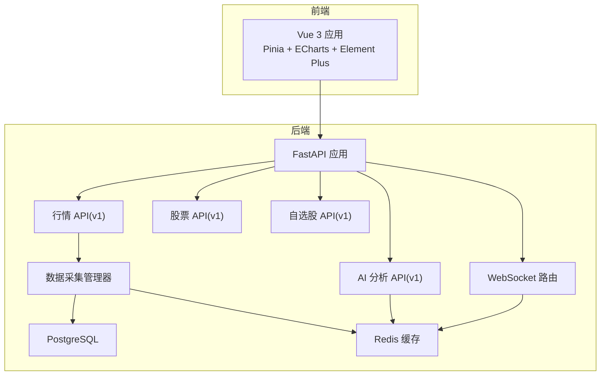
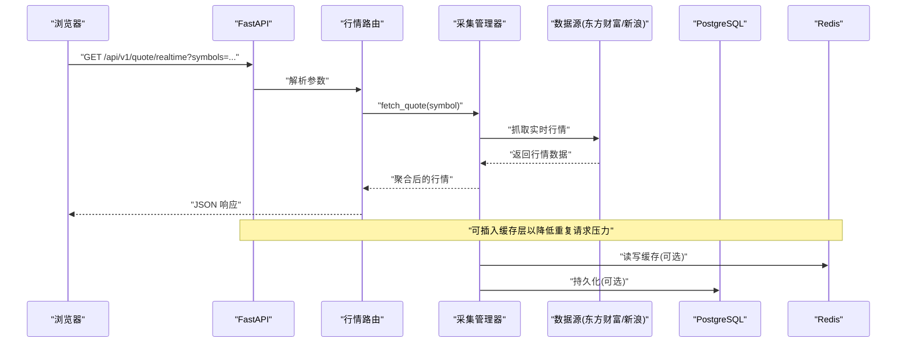
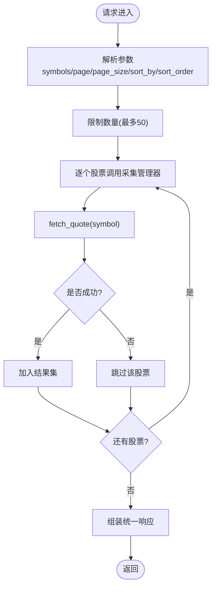
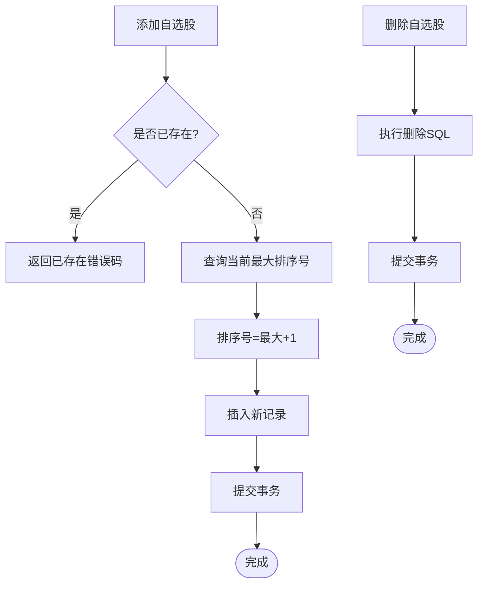
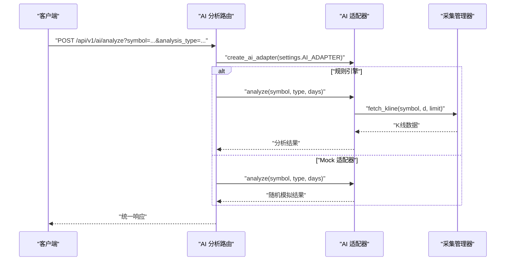
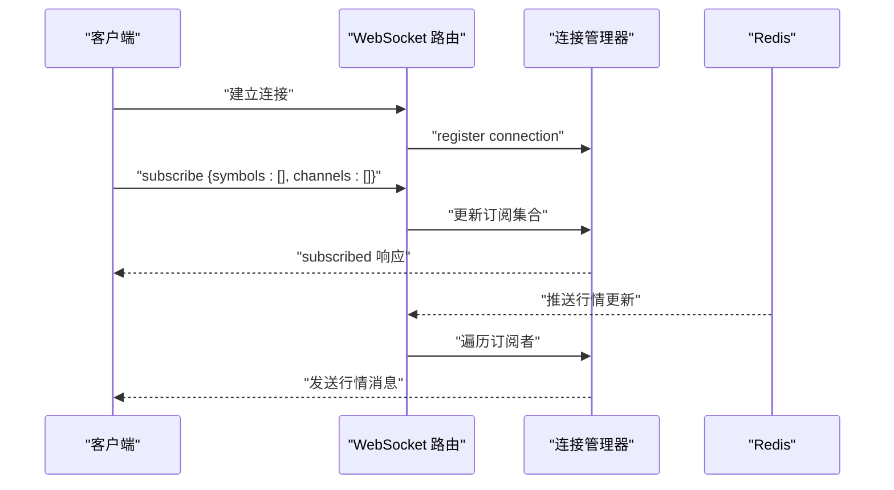
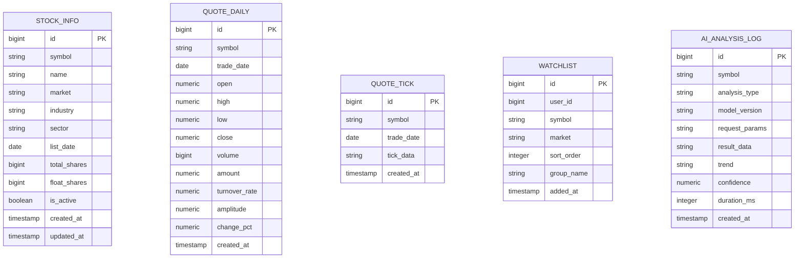
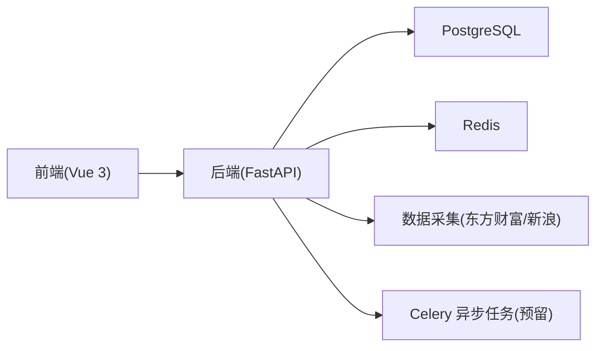

# 项目概述

<cite>
**本文引用的文件**
- [README.md](file://README.md)
- [backend/app/main.py](file://backend/app/main.py)
- [backend/app/core/config.py](file://backend/app/core/config.py)
- [backend/requirements.txt](file://backend/requirements.txt)
- [backend/app/api/v1/quote.py](file://backend/app/api/v1/quote.py)
- [backend/app/api/v1/ai.py](file://backend/app/api/v1/ai.py)
- [backend/app/api/v1/watchlist.py](file://backend/app/api/v1/watchlist.py)
- [backend/app/models/models.py](file://backend/app/models/models.py)
- [backend/app/services/collector/manager.py](file://backend/app/services/collector/manager.py)
- [backend/app/ai/interface.py](file://backend/app/ai/interface.py)
- [backend/app/api/websocket.py](file://backend/app/api/websocket.py)
- [backend/app/schemas/schemas.py](file://backend/app/schemas/schemas.py)
- [backend/app/core/database.py](file://backend/app/core/database.py)
- [backend/app/core/redis.py](file://backend/app/core/redis.py)
</cite>

## 目录
1. [引言](#引言)
2. [项目结构](#项目结构)
3. [核心组件](#核心组件)
4. [架构总览](#架构总览)
5. [详细组件分析](#详细组件分析)
6. [依赖关系分析](#依赖关系分析)
7. [性能考虑](#性能考虑)
8. [故障排查指南](#故障排查指南)
9. [结论](#结论)
10. [附录](#附录)

## 引言
Stock-View 是一个面向 A 股市场的实时行情查看与 AI 分析平台，参考东方财富、同花顺等主流股票软件的核心功能设计，提供实时行情、K 线/分时图、盘口数据、AI 分析以及自选股管理等能力。项目采用现代化技术栈组合，强调可扩展性与工程化落地，支持通过 Docker Compose 一键部署，并提供本地开发模式以满足前后端协同调试需求。

本项目旨在为用户提供：
- 实时 A 股行情与多维图表展示
- 可插拔的 AI 分析能力（预留），支持多种分析策略与流式输出
- 自选股管理与排序
- 高可用的数据采集与缓存机制
- WebSocket 实时推送与 RESTful API

## 项目结构
项目采用前后端分离架构，后端使用 FastAPI 提供 REST API 与 WebSocket，前端使用 Vue 3 + TypeScript + Pinia + ECharts + Element Plus 构建交互界面；数据库采用 PostgreSQL，缓存采用 Redis，容器编排使用 Docker Compose。

**图表来源**
- [backend/app/main.py:1-48](file://backend/app/main.py#L1-L48)
- [backend/app/api/v1/quote.py:1-65](file://backend/app/api/v1/quote.py#L1-L65)
- [backend/app/api/v1/ai.py:1-29](file://backend/app/api/v1/ai.py#L1-L29)
- [backend/app/api/v1/watchlist.py:1-77](file://backend/app/api/v1/watchlist.py#L1-L77)
- [backend/app/api/websocket.py:1-79](file://backend/app/api/websocket.py#L1-L79)
- [backend/app/services/collector/manager.py:1-80](file://backend/app/services/collector/manager.py#L1-L80)
- [backend/app/core/database.py:1-25](file://backend/app/core/database.py#L1-L25)
- [backend/app/core/redis.py:1-25](file://backend/app/core/redis.py#L1-L25)

**章节来源**
- [README.md:92-126](file://README.md#L92-L126)
- [backend/app/main.py:1-48](file://backend/app/main.py#L1-L48)

## 核心组件
- 后端入口与生命周期管理：FastAPI 应用注册路由、CORS 中间件与健康检查端点，使用 lifespan 管理数据库初始化与 Redis 连接关闭。
- 配置中心：集中管理数据库连接、Redis 连接、AI 适配器、数据源、限流与缓存参数等。
- API 层：按模块划分 v1 接口，包含行情、股票、自选股、AI 分析与 WebSocket。
- 数据模型：定义股票基础信息、日线行情、分时数据、自选股与 AI 分析日志等表结构。
- 数据采集：统一的采集管理器，封装多家数据源（如东方财富、新浪），具备优先级与故障转移能力。
- AI 分析：插件化适配器（Mock/规则引擎），支持同步与流式分析，便于后续接入真实 AI 服务。
- 缓存与数据库：异步 SQLAlchemy 2.0 + asyncpg 访问 PostgreSQL，Redis 用于缓存与实时推送。
- WebSocket：连接管理与订阅机制，支持行情增量推送。

**章节来源**
- [backend/app/main.py:1-48](file://backend/app/main.py#L1-L48)
- [backend/app/core/config.py:1-43](file://backend/app/core/config.py#L1-L43)
- [backend/app/models/models.py:1-74](file://backend/app/models/models.py#L1-L74)
- [backend/app/services/collector/manager.py:1-80](file://backend/app/services/collector/manager.py#L1-L80)
- [backend/app/ai/interface.py:1-196](file://backend/app/ai/interface.py#L1-L196)
- [backend/app/api/websocket.py:1-79](file://backend/app/api/websocket.py#L1-L79)
- [backend/app/core/database.py:1-25](file://backend/app/core/database.py#L1-L25)
- [backend/app/core/redis.py:1-25](file://backend/app/core/redis.py#L1-L25)

## 架构总览
系统采用“前端渲染 + 后端 API + 数据存储”的三层架构，结合异步 I/O 与缓存提升实时性与吞吐量。核心流程包括：前端发起请求 → 后端路由处理 → 数据采集/查询 → 返回响应；同时通过 WebSocket 实现实时行情推送。

**图表来源**
- [backend/app/api/v1/quote.py:1-65](file://backend/app/api/v1/quote.py#L1-L65)
- [backend/app/services/collector/manager.py:1-80](file://backend/app/services/collector/manager.py#L1-L80)
- [backend/app/core/database.py:1-25](file://backend/app/core/database.py#L1-L25)
- [backend/app/core/redis.py:1-25](file://backend/app/core/redis.py#L1-L25)

## 详细组件分析

### 行情模块（quote）
- 功能：提供实时行情、行情列表、K 线、分时、盘口等接口。
- 设计要点：参数校验与截断（最多 50 个股票）、错误码与统一响应结构、数据源优先级与故障转移。
- 性能：支持批量查询与分页排序，减少网络往返；可结合 Redis 缓存热点数据。

**图表来源**
- [backend/app/api/v1/quote.py:1-65](file://backend/app/api/v1/quote.py#L1-L65)
- [backend/app/services/collector/manager.py:1-80](file://backend/app/services/collector/manager.py#L1-L80)

**章节来源**
- [backend/app/api/v1/quote.py:1-65](file://backend/app/api/v1/quote.py#L1-L65)

### 自选股模块（watchlist）
- 功能：获取、添加、删除、排序自选股。
- 设计要点：默认用户 ID、去重判断、自动分配排序序号、批量排序更新。
- 数据模型：包含用户标识、股票代码、市场、分组与排序字段。

**图表来源**
- [backend/app/api/v1/watchlist.py:1-77](file://backend/app/api/v1/watchlist.py#L1-L77)
- [backend/app/models/models.py:50-60](file://backend/app/models/models.py#L50-L60)

**章节来源**
- [backend/app/api/v1/watchlist.py:1-77](file://backend/app/api/v1/watchlist.py#L1-L77)
- [backend/app/models/models.py:50-60](file://backend/app/models/models.py#L50-L60)

### AI 分析模块（ai）
- 功能：请求 AI 分析、查询历史（预留）、获取模型信息。
- 设计要点：插件化适配器（Mock/规则引擎），支持同步与流式分析；统一响应结构与模型信息查询。
- 扩展性：通过配置项切换 AI 适配器，便于对接真实 AI 服务。

**图表来源**
- [backend/app/api/v1/ai.py:1-29](file://backend/app/api/v1/ai.py#L1-L29)
- [backend/app/ai/interface.py:1-196](file://backend/app/ai/interface.py#L1-L196)
- [backend/app/services/collector/manager.py:1-80](file://backend/app/services/collector/manager.py#L1-L80)

**章节来源**
- [backend/app/api/v1/ai.py:1-29](file://backend/app/api/v1/ai.py#L1-L29)
- [backend/app/ai/interface.py:1-196](file://backend/app/ai/interface.py#L1-L196)

### WebSocket 实时推送
- 功能：建立长连接，支持订阅/退订，按股票与频道广播行情更新。
- 设计要点：连接管理器维护活动连接与订阅集合，异常断开自动清理。

**图表来源**
- [backend/app/api/websocket.py:1-79](file://backend/app/api/websocket.py#L1-L79)
- [backend/app/core/redis.py:1-25](file://backend/app/core/redis.py#L1-L25)

**章节来源**
- [backend/app/api/websocket.py:1-79](file://backend/app/api/websocket.py#L1-L79)

### 数据模型与关系

**图表来源**
- [backend/app/models/models.py:1-74](file://backend/app/models/models.py#L1-L74)

**章节来源**
- [backend/app/models/models.py:1-74](file://backend/app/models/models.py#L1-L74)

## 依赖关系分析
- 技术栈选择：
  - 前端：Vue 3 + TypeScript + Pinia + ECharts + Element Plus，强调组件化与可视化。
  - 后端：FastAPI + SQLAlchemy 2.0(async) + asyncpg，强调高性能与类型安全。
  - 数据库：PostgreSQL 15，支持结构化数据与复杂查询。
  - 缓存：Redis 7，支持高并发读写与实时推送。
  - 部署：Docker Compose + Nginx，便于本地与生产环境快速部署。
- 依赖文件与版本约束：requirements.txt 明确 FastAPI、Uvicorn、SQLAlchemy 2.0、Celery、Redis、Pydantic、Ta-Lib、Pandas、NumPy 等依赖。

**图表来源**
- [backend/requirements.txt:1-17](file://backend/requirements.txt#L1-L17)
- [README.md:11-18](file://README.md#L11-L18)

**章节来源**
- [backend/requirements.txt:1-17](file://backend/requirements.txt#L1-L17)
- [README.md:11-18](file://README.md#L11-L18)

## 性能考虑
- 异步 I/O：后端使用 SQLAlchemy 2.0 async 与 asyncpg，降低数据库等待时间。
- 连接池：数据库连接池配置与会话管理，避免频繁创建销毁连接。
- 缓存策略：Redis 作为缓存与消息通道，减少重复请求与后端压力。
- 数据采集：采集管理器具备故障转移与优先级控制，提高可用性。
- WebSocket：按需订阅，避免全量广播造成带宽浪费。
- 前端优化：ECharts 与 Pinia 组件化，减少不必要的重渲染。

## 故障排查指南
- 健康检查：后端提供健康检查端点，用于快速验证服务状态。
- 日志与告警：采集管理器在数据源失败时记录警告日志，便于定位问题。
- 配置项核对：确认数据库与 Redis 连接串、AI 适配器、主备数据源等配置正确。
- 端口与服务：确保 Docker Compose 正常启动，前端与后端端口映射无冲突。

**章节来源**
- [backend/app/main.py:46-48](file://backend/app/main.py#L46-L48)
- [backend/app/services/collector/manager.py:1-80](file://backend/app/services/collector/manager.py#L1-L80)
- [backend/app/core/config.py:1-43](file://backend/app/core/config.py#L1-L43)

## 结论
Stock-View 以“参考主流产品设计”为核心理念，围绕 A 股实时行情与 AI 分析两大能力构建，采用现代化技术栈实现高性能、可扩展与工程化的产品形态。通过模块化的 API、插件化的 AI 适配器、统一的数据采集与缓存策略，以及 WebSocket 实时推送，项目既满足当前功能需求，又为未来扩展（如接入真实 AI 服务、增强分析算法、引入更多数据源）预留了清晰路径。

## 附录
- 快速启动与开发指南详见项目根目录 README，涵盖 Docker Compose 一键启动与本地开发模式。
- 环境变量与常用命令清单可参考 README 的相应章节。

**章节来源**
- [README.md:22-163](file://README.md#L22-L163)